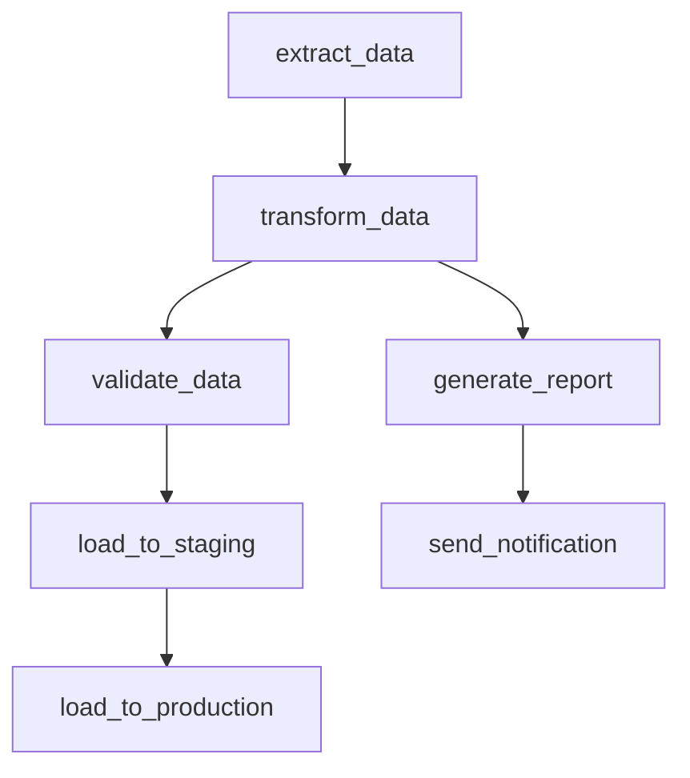
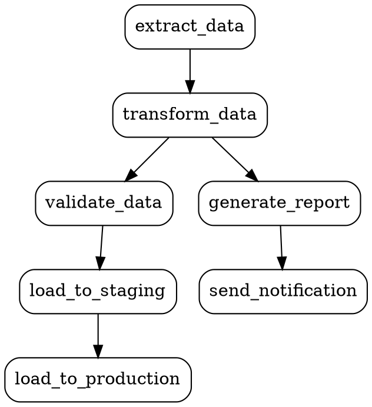

# Airflow DAG Visualizer

## Purpose

Create visual representations of DAG structure. Useful for thinking through workflows with peers before committing to code - solves the chicken-and-egg problem of needing code to see Airflow's graph view.

---

## Four Output Formats

| Format | Use Case | Best For |
|--------|----------|----------|
| **Mermaid** | Markdown/docs, GitHub rendering | Documentation, PRs |
| **ASCII** | Plain text, terminal, lightweight | Quick sketches, chat |
| **Graphviz** | Complex graphs, professional rendering | Presentations, detailed analysis |
| **Skeleton DAGs** | Actual Airflow code structure | Starting implementation |

---

## User Controls Format

Always ask or let user specify:

```
"Which format would you prefer?
- A) Mermaid (renders in GitHub/docs)
- B) ASCII (plain text)
- C) Graphviz (professional diagrams)
- D) Skeleton DAG (code template)
- E) Other"
```

---

## Mermaid Output



**Reference:** See `references/mermaid_reference.md` for best practices.

---

## ASCII Output

```
    ┌──────────────┐
    │ extract_data │
    └──────┬───────┘
           │
    ┌──────▼───────┐
    │transform_data│
    └──────┬───────┘
           │
     ┌─────┴─────┐
     │           │
┌────▼────┐ ┌────▼────────┐
│validate │ │generate_    │
│  _data  │ │   report    │
└────┬────┘ └────┬────────┘
     │           │
┌────▼────────┐  │
│load_to_     │  │
│  staging    │  │
└────┬────────┘  │
     │           │
┌────▼────────┐ ┌▼───────────┐
│load_to_     │ │send_       │
│ production  │ │notification│
└─────────────┘ └────────────┘
```

---

## Graphviz Output



**Reference:** See `references/graphviz_reference.md` for best practices.

---

## Skeleton DAG Output

```python
from airflow.sdk import dag, task
from datetime import datetime, timedelta

default_args = {
    "owner": "team",
    "retries": 3,
    "retry_delay": timedelta(minutes=5),
}

@dag(
    dag_id="example_pipeline",
    description="TODO: Add description",
    schedule="@daily",
    start_date=datetime(2026, 1, 1),
    catchup=False,
    tags=["TODO"],
    default_args=default_args,
)
def example_pipeline():

    @task
    def extract_data():
        """TODO: Implement extraction logic."""
        pass

    @task
    def transform_data(data):
        """TODO: Implement transformation logic."""
        pass

    @task
    def validate_data(data):
        """TODO: Implement validation logic."""
        pass

    @task
    def load_to_staging(data):
        """TODO: Implement staging load."""
        pass

    @task
    def load_to_production(data):
        """TODO: Implement production load."""
        pass

    @task
    def generate_report(data):
        """TODO: Implement report generation."""
        pass

    @task
    def send_notification(report):
        """TODO: Implement notification."""
        pass

    # Define dependencies
    extracted = extract_data()
    transformed = transform_data(extracted)
    validated = validate_data(transformed)
    staged = load_to_staging(validated)
    load_to_production(staged)

    report = generate_report(transformed)
    send_notification(report)

example_pipeline()
```

---

## Workflow

```
1. User describes workflow
         ↓
2. Ask format preference
         ↓
3. Generate visualization
         ↓
4. Iterate if needed
```

---

## Notes

- Sonnet model for pattern-based generation
- Interactive - asks about format preference
- Supports design phase before implementation
- Can work from descriptions, requirements, or existing code
