# Graphviz (DOT Language) Reference for Airflow DAG Visualization

**Generated:** 2026-01-29
**Research Date:** 2026-01-29
**Purpose:** Comprehensive reference for generating Graphviz diagrams for Apache Airflow DAGs

---

## Table of Contents

1. [DOT Language Basics](#dot-language-basics)
2. [Node Shapes and Styling](#node-shapes-and-styling)
3. [Edge Styling (Arrows, Labels)](#edge-styling-arrows-labels)
4. [Subgraphs and Clusters](#subgraphs-and-clusters)
5. [Layout Engines](#layout-engines)
6. [Rank and Ordering Control](#rank-and-ordering-control)
7. [Color Schemes](#color-schemes)
8. [Rendering to PNG/SVG](#rendering-to-pngsvg)
9. [Common Pitfalls to Avoid](#common-pitfalls-to-avoid)
10. [Graphviz vs Mermaid](#graphviz-vs-mermaid)
11. [Airflow-Specific Patterns](#airflow-specific-patterns)
12. [Complete Examples](#complete-examples)

---

## DOT Language Basics

### Graph Types

Every graph must be specified as either **directed** (`digraph`) or **undirected** (`graph`).

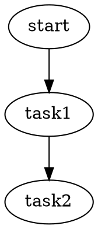

**For Airflow DAGs:** Always use `digraph` since task dependencies are directional.

### Syntax Rules

- **Semicolons:** Aid readability but are not required
- **Comments:** C++-style comments supported
  ```dot
  // Single line comment
  /* Multi-line
     comment */
  ```
- **String literals:** Double-quoted strings can span multiple lines using backslash
  ```dot
  node1 [label="This is a very long label \
  that spans multiple lines"]
  ```
- **String concatenation:** Use `+` operator
  ```dot
  node1 [label="Part 1" + "Part 2"]
  ```
- **Character encoding:** UTF-8 by default (can specify Latin1 with `charset` attribute)

### Basic Structure

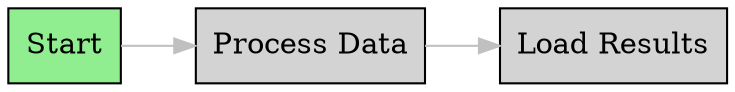

**Source:** [DOT Language Documentation](https://graphviz.org/doc/info/lang.html)

---

## Node Shapes and Styling

### Available Shapes

Graphviz supports three main categories of shapes:

#### 1. Polygon-Based Shapes (Most Common)

| Shape | Use Case | Example |
|-------|----------|---------|
| `box` / `rectangle` | Standard tasks | Generic operations |
| `ellipse` / `oval` | Start/end nodes | DAG entry/exit points |
| `circle` | Simple markers | Status indicators |
| `diamond` | Decision points | Conditional branching |
| `parallelogram` | Input/output | Data sources/sinks |
| `trapezium` | Filters | Data transformation |
| `cylinder` | Databases | Database operations |
| `folder` | File operations | File I/O tasks |
| `note` | Documentation | Comments/notes |
| `component` | Services | External services |
| `hexagon` | Processing | ETL operations |
| `octagon` | Stop/warning | Error handlers |
| `doublecircle` | Final states | Success/failure |

**Complete list:** [Node Shapes Documentation](https://graphviz.org/doc/info/shapes.html)

#### 2. Record-Based Shapes (Deprecated)

⚠️ **Note:** Record-based shapes are largely superseded by HTML-like labels. Use `shape=none` with HTML labels instead.

#### 3. HTML-Like Labels (Modern Approach)

```dot
node1 [shape=none, margin=0, label=<
    <table border="0" cellborder="1" cellspacing="0">
        <tr><td><b>Task Name</b></td></tr>
        <tr><td>Details here</td></tr>
    </table>
>];
```

### Node Style Attributes

The `style` attribute accepts these values (comma-separated):

| Style | Effect |
|-------|--------|
| `filled` | Fill node interior with `fillcolor` or `color` |
| `solid` | Solid border (default) |
| `dashed` | Dashed border |
| `dotted` | Dotted border |
| `bold` | Bold border |
| `rounded` | Rounded corners (polygon shapes only) |
| `invisible` | Hide node but maintain layout position |
| `diagonals` | Add diagonal lines |

```dot
// Multiple styles
node1 [shape=box, style="filled,rounded", fillcolor=lightblue];
```

### Node Attributes

Key attributes for node customization:

| Attribute | Type | Description | Default |
|-----------|------|-------------|---------|
| `label` | string | Node text | Node name |
| `shape` | string | Node shape | `ellipse` |
| `color` | color | Border color | `black` |
| `fillcolor` | color | Fill color (when style=filled) | `lightgrey` |
| `style` | string | Style values | - |
| `fontname` | string | Font family | `Times-Roman` |
| `fontsize` | float | Font size in points | `14.0` |
| `fontcolor` | color | Text color | `black` |
| `width` | float | Minimum width in inches | `0.75` |
| `height` | float | Minimum height in inches | `0.5` |
| `fixedsize` | bool | Use exact dimensions | `false` |
| `penwidth` | float | Border width | `1.0` |

**Airflow Task Example:**

```dot
// Different task types with appropriate shapes
extract_task [shape=cylinder, label="Extract\nFrom DB", style=filled, fillcolor="#e1f5ff"];
transform_task [shape=hexagon, label="Transform\nData", style=filled, fillcolor="#fff3e0"];
load_task [shape=folder, label="Load\nTo S3", style=filled, fillcolor="#f1f8e9"];
sensor_task [shape=diamond, label="Wait for\nFile", style=filled, fillcolor="#fce4ec"];
```

**Source:** [Node Shapes](https://graphviz.org/doc/info/shapes.html), [Attributes](https://graphviz.org/doc/info/attrs.html)

---

## Edge Styling (Arrows, Labels)

### Arrow Shapes

Graphviz provides a grammar for composing arrow shapes from primitives:

**Primitives:** `box`, `crow`, `curve`, `icurve`, `diamond`, `dot`, `inv`, `none`, `normal`, `tee`, `vee`

**Modifiers:**
- `o` - Open (non-filled) version
- `l` - Clip to left side
- `r` - Clip to right side

```dot
// Arrow examples
a -> b [arrowhead=normal];     // Default arrow
a -> b [arrowhead=vee];        // V-shaped arrow
a -> b [arrowhead=diamond];    // Diamond arrow
a -> b [arrowhead=dot];        // Dot arrow
a -> b [arrowhead=odiamond];   // Open diamond
a -> b [arrowhead=lvee];       // Left-clipped vee
a -> b [arrowhead=none];       // No arrow
```

**Composition:** Combine primitives for complex arrows (3,111,696 possible combinations!)

```dot
a -> b [arrowhead=odotodiamond];  // Composite arrow
```

**Source:** [Arrow Shapes Documentation](https://graphviz.org/doc/info/arrows.html)

### Edge Attributes

| Attribute | Type | Description | Default |
|-----------|------|-------------|---------|
| `label` | string | Edge label text | - |
| `arrowhead` | arrowType | Head arrow style | `normal` |
| `arrowtail` | arrowType | Tail arrow style | `normal` |
| `dir` | string | Arrow direction: `forward`, `back`, `both`, `none` | `forward` |
| `color` | color | Edge color | `black` |
| `style` | string | Edge style: `solid`, `dashed`, `dotted`, `bold` | `solid` |
| `penwidth` | float | Line width | `1.0` |
| `weight` | int | Edge weight (affects layout) | `1` |
| `constraint` | bool | Use edge in ranking nodes | `true` |

### Edge Labels

```dot
// Basic edge label
task1 -> task2 [label="success"];

// Head and tail labels
task1 -> task2 [
    label="main flow",
    headlabel="input",
    taillabel="output"
];

// Label positioning
task1 -> task2 [
    label="process",
    labeldistance=2.5,    // Distance from node
    labelangle=45         // Angle in degrees
];

// Label font styling
task1 -> task2 [
    label="important",
    fontcolor=red,
    fontsize=12,
    fontname="Arial Bold"
];
```

### Airflow Dependency Examples

```dot
// Normal dependency
extract -> transform [color=blue, penwidth=2];

// Conditional dependency
check -> process_a [label="if success", style=dashed, color=green];
check -> process_b [label="if fail", style=dashed, color=red];

// Trigger rule indication
task1 -> final [label="all_success", fontsize=10, fontcolor=gray];
task2 -> final [label="all_success", fontsize=10, fontcolor=gray];

// External trigger
sensor -> process [
    label="trigger",
    style=bold,
    color=orange,
    arrowhead=diamond
];
```

**Source:** [Edge Attributes](https://graphviz.org/docs/edges/), [Arrow Shapes](https://graphviz.org/doc/info/arrows.html)

---

## Subgraphs and Clusters

### Subgraph Roles

Subgraphs serve three purposes in Graphviz:

1. **Structural grouping:** Organize related nodes and edges
2. **Attribute context:** Set default attributes for contained elements
3. **Visual clustering:** Draw bounding boxes around groups (with `cluster` prefix)

### Basic Subgraphs

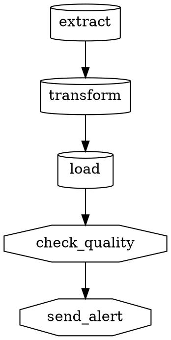

### Cluster Subgraphs

**Critical:** Name must begin with `cluster` (lowercase) for visual grouping.

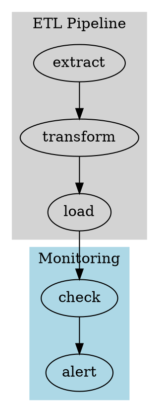

### Cluster Attributes

| Attribute | Description | Example |
|-----------|-------------|---------|
| `label` | Cluster title | `label="Data Processing"` |
| `style` | Box style | `style=filled` or `style=rounded` |
| `color` | Border color | `color=blue` |
| `fillcolor` | Background color | `fillcolor=lightgrey` |
| `pencolor` | Border line color | `pencolor=black` |
| `penwidth` | Border width | `penwidth=2.0` |
| `peripheries` | Number of borders | `peripheries=2` |
| `bgcolor` | Background color | `bgcolor="#f0f0f0"` |

### Important Rules

1. **Unique names:** Each subgraph must have a unique name
2. **Strict hierarchy:** Clusters should form a strict hierarchy (no overlapping)
3. **Layout engine support:** Only `dot` and `fdp` layout engines support cluster visualization
4. **Naming convention:** Must use `cluster_` prefix for visual grouping

### Advanced Cluster Example

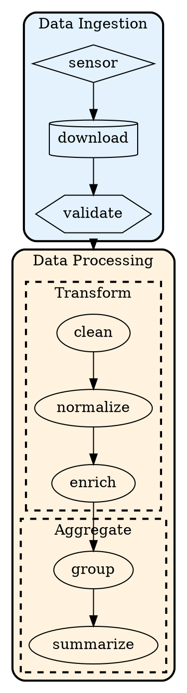

### Cluster Rank Control

```dot
subgraph cluster_parallel {
    label="Parallel Tasks";

    // Put nodes on same rank within cluster
    {rank=same; task1; task2; task3;}
}
```

**Source:** [Subgraphs & Clusters Documentation](https://graphviz.readthedocs.io/en/stable/subgraphs_and_clusters.html), [Cluster Attributes](https://graphviz.org/docs/clusters/)

---

## Layout Engines

Graphviz provides multiple layout engines, each optimized for different graph types.

### Layout Engine Comparison

| Engine | Graph Type | Algorithm | Best For | Speed | Max Nodes |
|--------|------------|-----------|----------|-------|-----------|
| **dot** | Directed | Hierarchical/ranked | DAGs, flowcharts, trees | Fast | Large |
| **neato** | Undirected | Spring model (energy) | Networks, social graphs | Medium | ~1000 |
| **fdp** | Undirected | Spring model (force) | Large graphs with clusters | Medium | Large |
| **sfdp** | Undirected | Multiscale force-directed | Very large graphs | Fast | Very large |
| **circo** | Undirected | Circular | Cyclic structures | Fast | Medium |
| **twopi** | Undirected | Radial | Tree-like radial layouts | Fast | Medium |
| **osage** | Undirected | Array-based | Clustered graphs | Fast | Large |
| **patchwork** | Undirected | Squarified treemap | Hierarchical data | Fast | Large |

### dot - Hierarchical Layout (DEFAULT for Airflow DAGs)

**Use for:**
- Directed Acyclic Graphs (DAGs) ✅
- Flowcharts
- Organizational charts
- Dependency trees
- Any hierarchical structure

**Algorithm:** Ranks nodes by edge direction, creating layered layouts

**Example:**
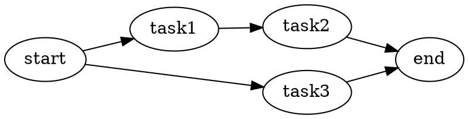

**Direction control:**
- `rankdir=TB` - Top to bottom (default)
- `rankdir=LR` - Left to right
- `rankdir=BT` - Bottom to top
- `rankdir=RL` - Right to left

### neato - Spring Model (Energy Minimization)

**Use for:**
- Undirected graphs
- Network diagrams
- Social graphs
- Relationship maps

**Algorithm:** Virtual spring between every node pair, length = shortest path distance

**Example:**
```bash
neato -Tpng input.dot -o output.png
```

### fdp - Force-Directed Layout

**Use for:**
- Large undirected graphs
- Clustered graphs
- Complex network structures

**Algorithm:** Fruchterman-Reingold force-directed placement, minimizes forces

**Example:**
```bash
fdp -Tsvg input.dot -o output.svg
```

### Choosing the Right Engine

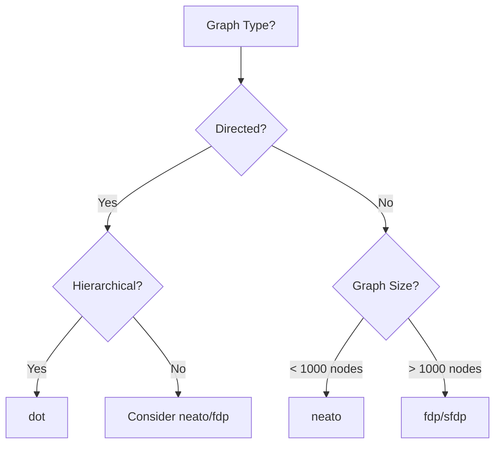

**For Airflow DAGs:** Always use `dot` engine (default)

**Source:** [Layout Engines Documentation](https://graphviz.org/docs/layouts/), [fdp](https://graphviz.org/docs/layouts/fdp/)

---

## Rank and Ordering Control

### Rank Attribute

Control vertical positioning of nodes in `dot` layout.

**Values:**
- `rank=same` - All nodes on same horizontal level
- `rank=min` / `rank=source` - Top level (sources)
- `rank=max` / `rank=sink` - Bottom level (sinks)

**Example:**

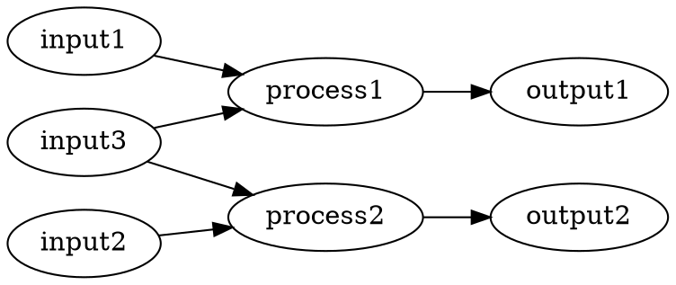

### Ordering Attribute

Control left-to-right ordering of nodes within a rank.

**Values:**
- `ordering="out"` - Order by outgoing edges (left to right)
- `ordering="in"` - Order by incoming edges (left to right)

**Example:**

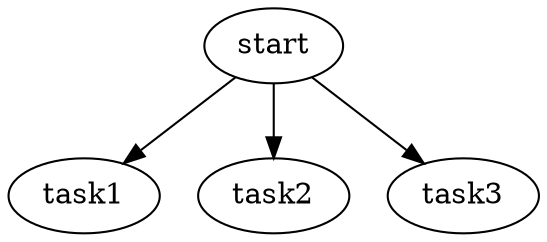

### Node-level Ordering

Apply ordering to specific subgraphs or nodes:

```dot
subgraph cluster_parallel {
    ordering="in";  // Order nodes by incoming edges

    task1; task2; task3;
}
```

### Rank Separation

Control spacing between ranks:

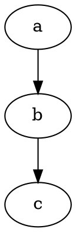

### Advanced Rank Control

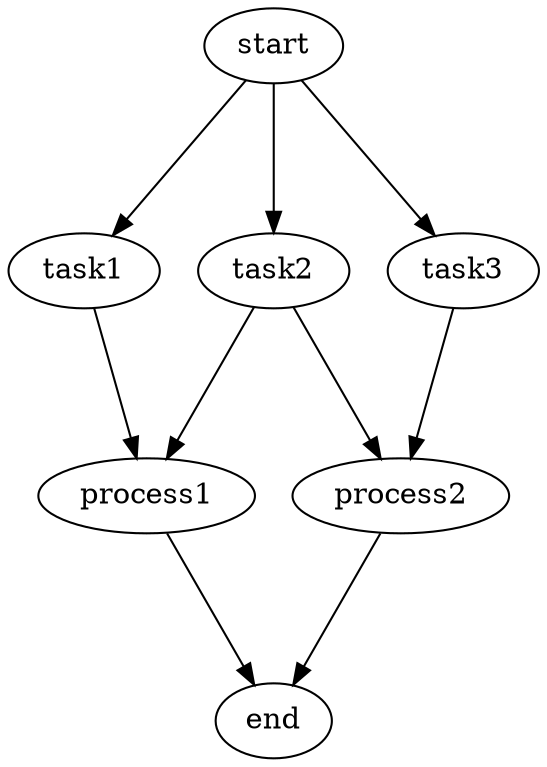

### Common Rank Pitfall

⚠️ **Warning:** With clusters, rank commands must be in reverse order (last cluster first).

```dot
// CORRECT order for clusters
{rank=same; cluster3_nodes;}
{rank=same; cluster2_nodes;}
{rank=same; cluster1_nodes;}
```

**Source:** [rank attribute](https://graphviz.org/docs/attrs/rank/), [ordering attribute](https://graphviz.org/docs/attrs/ordering/)

---

## Color Schemes

### Color Specification Methods

1. **Named colors** (X11 color names - default)
   ```dot
   node [color=red, fillcolor=lightblue];
   ```

2. **RGB hex values**
   ```dot
   node [color="#ff5733", fillcolor="#3498db"];
   ```

3. **RGB values**
   ```dot
   node [color="0.5 0.3 0.8"];  // R G B (0.0-1.0)
   ```

4. **HSV values**
   ```dot
   node [color="0.5 0.3 0.8"];  // H S V
   ```

5. **ColorBrewer schemes** (recommended for professional diagrams)

### ColorBrewer Integration

Graphviz includes professional color palettes from [ColorBrewer](https://colorbrewer2.org/).

**Available scheme types:**
- **Sequential:** blues, greens, greys, oranges, purples, reds, etc.
- **Diverging:** spectral, rdylgn, brbg, etc.
- **Qualitative:** set1, set2, set3, paired, pastel1, pastel2, dark2, etc.

**Usage:**

```dot
digraph dag {
    // Set color scheme, then use numeric indices
    node [colorscheme=oranges9, style=filled];

    task1 [color=1, fillcolor=1];
    task2 [color=3, fillcolor=3];
    task3 [color=5, fillcolor=5];
    task4 [color=7, fillcolor=7];
    task5 [color=9, fillcolor=9];
}
```

**Alternative syntax:**

```dot
task1 [color="/oranges9/5"];  // Explicit scheme reference
```

### Recommended Schemes for DAGs

#### Sequential (by intensity)

```dot
// Light to dark progression
node [colorscheme=blues9, style=filled];
low_priority [fillcolor=3];
medium_priority [fillcolor=5];
high_priority [fillcolor=7];
critical [fillcolor=9];
```

#### Qualitative (distinct categories)

```dot
// Different task types
node [colorscheme=set312, style=filled];

extract_tasks [fillcolor=1];    // Color 1
transform_tasks [fillcolor=2];  // Color 2
load_tasks [fillcolor=3];       // Color 3
monitor_tasks [fillcolor=4];    // Color 4
```

### Airflow Task Color Convention Example

```dot
digraph airflow_dag {
    node [style=filled, fontname="Arial"];

    // Sensors - Yellow
    sensor1 [fillcolor="#fff9c4", shape=diamond];

    // Extract tasks - Blue
    extract1 [fillcolor="#bbdefb", shape=cylinder];

    // Transform tasks - Orange
    transform1 [fillcolor="#ffe0b2", shape=hexagon];

    // Load tasks - Green
    load1 [fillcolor="#c8e6c9", shape=folder];

    // Operators - Gray
    operator1 [fillcolor="#eeeeee", shape=box];

    // Success - Light green
    success [fillcolor="#a5d6a7", shape=doublecircle];

    // Failure - Light red
    failure [fillcolor="#ef9a9a", shape=octagon];

    sensor1 -> extract1 -> transform1 -> load1 -> success;
    load1 -> failure [style=dashed, color=red];
}
```

### Graph Background Color

```dot
digraph dag {
    bgcolor="#f5f5f5";  // Light gray background

    // ... nodes and edges
}
```

### Transparent Background

```dot
digraph dag {
    bgcolor=transparent;

    // ... nodes and edges
}
```

**Source:** [Color Names](https://graphviz.org/doc/info/colors.html), [colorscheme attribute](https://graphviz.org/docs/attrs/colorscheme/)

---

## Rendering to PNG/SVG

### Output Format Options

Graphviz supports numerous output formats:

| Format | Extension | Description | Use Case |
|--------|-----------|-------------|----------|
| **PNG** | `.png` | Bitmap image | Documentation, web |
| **SVG** | `.svg` | Vector graphics | Interactive web, scaling |
| **PDF** | `.pdf` | Portable document | Reports, printing |
| **JPEG** | `.jpg` | Compressed bitmap | Photos, web |
| **GIF** | `.gif` | Bitmap with animation | Simple graphics |
| **PS** | `.ps` | PostScript | Professional printing |
| **DOT** | `.dot` | Source format | Version control |
| **JSON** | `.json` | Structured data | Programmatic use |
| **XDOT** | `.xdot` | Extended DOT | Interactive viewers |

### Command Line Rendering

```bash
# PNG output
dot -Tpng input.dot -o output.png

# SVG output
dot -Tsvg input.dot -o output.svg

# PDF output
dot -Tpdf input.dot -o output.pdf

# Multiple outputs in one command
dot -Tpng -o output.png -Tsvg -o output.svg input.dot
```

### Rendering Engines

Specify rendering engine after format with `:`:

```bash
# Use Cairo renderer for PNG (better quality)
dot -Tpng:cairo input.dot -o output.png

# Use GD renderer for PNG (faster)
dot -Tpng:gd input.dot -o output.png

# Use Cairo for SVG (better visuals, less readable XML)
dot -Tsvg:cairo input.dot -o output.svg
```

**Recommendation:** Use Cairo renderer for better visual quality.

### SVG Variations

```bash
# Standard SVG with header
dot -Tsvg input.dot -o output.svg

# Header-less SVG for HTML inlining (Graphviz 10.0.1+)
dot -Tsvg_inline input.dot -o output.svg

# Compressed SVG
dot -Tsvgz input.dot -o output.svgz
```

### Python graphviz Library

```python
from graphviz import Digraph

# Create graph
dot = Digraph(comment='Airflow DAG')
dot.attr(rankdir='LR')

# Add nodes
dot.node('A', 'Start')
dot.node('B', 'Process')
dot.node('C', 'End')

# Add edges
dot.edge('A', 'B')
dot.edge('B', 'C')

# Render to PNG
dot.format = 'png'
dot.render('output', view=False)  # Creates output.png

# Render to SVG
dot.format = 'svg'
dot.render('output', view=False)  # Creates output.svg

# Auto-open with system viewer
dot.render('output', view=True)

# Multiple formats
for fmt in ['png', 'svg', 'pdf']:
    dot.format = fmt
    dot.render(f'output_{fmt}')
```

### Resolution and Size Control

```dot
digraph dag {
    // DPI (dots per inch) - higher = better quality
    dpi=300;  // Default is 96

    // Graph size in inches
    size="8,6";  // width, height

    // Aspect ratio
    ratio=fill;  // fill, compress, auto

    // Nodes
    node1 [label="Task 1"];
}
```

### Optimizing Output Size

```dot
digraph dag {
    // Reduce margins
    margin=0;

    // Compact layout
    ranksep=0.3;
    nodesep=0.2;

    // Smaller fonts
    node [fontsize=10];
    edge [fontsize=8];
}
```

### Rendering in CI/CD Pipelines

```bash
#!/bin/bash
# Generate all DAG visualizations

for dotfile in dags/*.dot; do
    basename=$(basename "$dotfile" .dot)

    # Generate PNG for documentation
    dot -Tpng:cairo -Gdpi=150 "$dotfile" -o "docs/images/${basename}.png"

    # Generate SVG for web
    dot -Tsvg "$dotfile" -o "docs/images/${basename}.svg"
done
```

**Source:** [Output Formats](https://graphviz.org/docs/outputs/), [PNG](https://graphviz.org/docs/outputs/png/), [SVG](https://graphviz.org/docs/outputs/svg/)

---

## Common Pitfalls to Avoid

### 1. Wrong Attributes for Layout Size ❌

**Problem:** Using `height`/`width` to increase layout size doesn't work.

```dot
// WRONG - These control node size, not graph size
digraph bad {
    height=10;
    width=10;
}
```

**Solution:** Use `nodesep` and `ranksep` for spacing.

```dot
// CORRECT
digraph good {
    nodesep=1.0;   // Horizontal spacing between nodes
    ranksep=1.5;   // Vertical spacing between ranks
}
```

### 2. Overlapping Nodes and Edges ❌

**Problem:** Nodes and edges overlap, making diagram illegible.

**Solution:** Use `overlap` attribute.

```dot
digraph clean {
    overlap=false;      // Prevent node overlap
    splines=true;       // Curved edges to avoid nodes
    // or
    splines=ortho;      // Orthogonal (right-angle) edges
}
```

### 3. Missing Cluster Prefix ❌

**Problem:** Subgraph doesn't get visual box around it.

```dot
// WRONG - Won't render as cluster
subgraph my_group {
    a; b; c;
}
```

**Solution:** Use `cluster_` prefix.

```dot
// CORRECT
subgraph cluster_my_group {
    label="My Group";
    a; b; c;
}
```

### 4. String Escaping Issues ❌

**Problem:** Special characters break rendering.

```dot
// WRONG - Backslashes and < > have special meaning
node1 [label="C:\Users\path"];
node2 [label="<html>"];
```

**Solution:** Escape properly or use Python library's `escape()`.

```python
from graphviz import escape

dot.node('node1', escape(r'C:\Users\path'))
```

### 5. Edge Direction Confusion with Undirected Graphs ❌

**Problem:** Using directional attributes (`arrowtail`, `dir`) with undirected graphs.

**Solution:** Use `digraph` for directional graphs, or avoid directional attributes.

```dot
// Use digraph for directed edges
digraph directed {
    a -> b [dir=both, arrowtail=diamond];
}
```

### 6. PDF Links Not Working ❌

**Problem:** Hyperlinks don't work in PDF output.

**Solution:** Generate PostScript first, then convert to PDF.

```bash
# Generate PS with links
dot -Tps input.dot -o output.ps

# Convert to PDF (preserves links)
ps2pdf output.ps output.pdf
```

Or use SVG which natively supports links.

### 7. PATH Not Configured ❌

**Problem:** Command not found: `dot`

**Solution:** Ensure Graphviz `bin/` directory is on system PATH.

```bash
# Check if Graphviz is installed
which dot

# macOS
brew install graphviz

# Ubuntu/Debian
sudo apt-get install graphviz

# Add to PATH (if needed)
export PATH=$PATH:/usr/local/bin
```

### 8. Performance Issues with Large DAGs ❌

**Problem:** Rendering takes too long with 500+ nodes.

**Solution:**
1. Use `sfdp` layout engine for large graphs
2. Simplify by grouping tasks into clusters
3. Consider alternative tools (Dagre + D3) for interactive large DAGs
4. Break into multiple smaller diagrams

```bash
# Faster layout for large graphs
sfdp -Tpng large_dag.dot -o output.png
```

### 9. Rank with Clusters in Wrong Order ❌

**Problem:** Rank commands don't work with clusters.

**Solution:** Define ranks in reverse order (last cluster first).

```dot
// CORRECT order
{rank=same; cluster3_nodes;}
{rank=same; cluster2_nodes;}
{rank=same; cluster1_nodes;}
```

### 10. Using Deprecated setlinewidth ❌

**Problem:** `setlinewidth` style is deprecated.

```dot
// WRONG
edge [style="setlinewidth(3)"];
```

**Solution:** Use `penwidth` attribute.

```dot
// CORRECT
edge [penwidth=3.0];
```

### 11. Not Version Controlling DOT Files ❌

**Problem:** Diagrams out of sync with code.

**Solution:** Store `.dot` files in Git alongside code.

```
docs/
  architecture/
    dag_overview.dot
    dag_overview.png    # Generated from .dot
    dag_overview.svg    # Generated from .dot
```

Generate images in CI/CD:

```yaml
# .github/workflows/docs.yml
- name: Generate diagrams
  run: |
    find docs -name "*.dot" -exec sh -c 'dot -Tpng "$1" -o "${1%.dot}.png"' _ {} \;
```

**Source:** [Common Mistakes](https://datamastersclub.com/7-mistakes-to-avoid-using-graphviz-python-tool-for-graphs-visualization/), [Graphviz FAQ](https://graphviz.org/faq/)

---

## Graphviz vs Mermaid

### When to Use Each

| Criterion | Graphviz | Mermaid |
|-----------|----------|---------|
| **Syntax complexity** | More verbose, steeper learning curve | Simpler, Markdown-friendly |
| **Layout control** | Extensive algorithmic control | Limited control, auto-layout |
| **Graph size** | Handles very large graphs well | Better for small-medium graphs |
| **Rendering** | Server-side, requires installation | Browser-based, no install needed |
| **Output formats** | PNG, SVG, PDF, PS, many more | Primarily SVG (browser-rendered) |
| **Integration** | CI/CD pipelines, headless environments | Markdown docs, GitHub, GitLab |
| **Customization** | Highly customizable (colors, shapes, layout) | Limited customization options |
| **Documentation** | Static documentation, PDFs | Live documentation, READMEs |
| **Performance** | Better for large complex graphs | Faster for small interactive graphs |
| **Version control** | Excellent (text-based, explicit) | Excellent (inline in Markdown) |
| **Determinism** | Highly deterministic | Deterministic |
| **Learning curve** | Moderate to steep | Gentle |

### Choose Graphviz When:

✅ You need precise layout control
✅ Working with large graphs (500+ nodes)
✅ Generating diagrams in CI/CD pipelines
✅ Rendering in headless environments
✅ Multiple output formats required (PNG, PDF, SVG)
✅ Complex hierarchical structures (DAGs)
✅ Professional technical documentation
✅ Algorithmic diagram generation

### Choose Mermaid When:

✅ Quick documentation in Markdown
✅ GitHub/GitLab README diagrams
✅ Browser-based rendering
✅ Non-technical team members maintain diagrams
✅ Inline diagrams in documentation sites
✅ Simple flowcharts and sequence diagrams
✅ Faster authoring speed
✅ Interactive web-based diagrams

### Hybrid Approach

Many teams use both:
- **Mermaid** for narrative documentation, onboarding, wikis
- **Graphviz** for automated infrastructure diagrams, complex DAG visualization, CI/CD

### Example Comparison

**Mermaid:**
```mermaid
graph LR
    A[Start] --> B[Process]
    B --> C[End]
```

**Graphviz:**
```dot
digraph dag {
    rankdir=LR;
    node [shape=box, style=filled, fillcolor=lightblue];
    edge [color=gray, penwidth=2];

    Start -> Process -> End;
}
```

**Verdict for Airflow DAG Visualization:**

Use **Graphviz** for:
- Auto-generated DAG diagrams from code
- Complex multi-stage DAGs
- CI/CD diagram generation
- Detailed technical documentation

Use **Mermaid** for:
- Quick DAG sketches in documentation
- README files explaining DAG structure
- Team wikis and onboarding docs

**Source:** [Mermaid vs Graphviz Comparison](https://www.unidiagram.com/blog/mermaid-vs-graphviz-comparison), [MermaidJS and Graphviz Side-by-Side](https://www.devtoolsdaily.com/diagrams/graphviz_vs_mermaid/)

---

## Airflow-Specific Patterns

### Airflow DAG Visualization Tools

1. **Airflow UI (Built-in)**
   - Graph View: Shows DAG structure and task instance states
   - Command: `airflow dags show <dag_id>` generates static image

2. **airflow-diagrams** (GitHub project)
   - Auto-generates diagrams from Airflow DAGs
   - Uses Graphviz to visualize service-level dependencies (AWS, GCP, Azure)
   - Requires Graphviz installation
   - Repository: [feluelle/airflow-diagrams](https://github.com/feluelle/airflow-diagrams)

3. **VS Code Extension**
   - Airflow DAG Viewer extension
   - Renders Graph View within VS Code
   - Marketplace: [Airflow DAG Viewer](https://marketplace.visualstudio.com/items?itemName=WesleyBatista.airflow-dag-viewer)

### TaskGroup Visualization

Use clusters to represent Airflow TaskGroups:

```dot
digraph airflow_dag {
    rankdir=LR;
    compound=true;

    start [shape=circle, fillcolor=lightgreen, style=filled];

    subgraph cluster_etl_group {
        label="ETL TaskGroup";
        style="filled,rounded";
        fillcolor="#e3f2fd";

        extract [shape=cylinder];
        transform [shape=hexagon];
        load [shape=folder];

        extract -> transform -> load;
    }

    subgraph cluster_validation_group {
        label="Validation TaskGroup";
        style="filled,rounded";
        fillcolor="#fff3e0";

        check_schema [shape=diamond];
        check_quality [shape=diamond];

        check_schema -> check_quality;
    }

    end [shape=doublecircle, fillcolor=lightcoral, style=filled];

    start -> extract [lhead=cluster_etl_group];
    load -> check_schema [ltail=cluster_etl_group, lhead=cluster_validation_group];
    check_quality -> end [ltail=cluster_validation_group];
}
```

### Airflow Operator Type Shapes

Recommended shape conventions for different Airflow operators:

```dot
digraph operator_shapes {
    node [style=filled];

    // Sensors
    file_sensor [shape=diamond, fillcolor="#fff9c4", label="FileSensor"];
    time_sensor [shape=diamond, fillcolor="#fff9c4", label="TimeSensor"];

    // Database operators
    postgres_op [shape=cylinder, fillcolor="#bbdefb", label="PostgresOperator"];
    mysql_op [shape=cylinder, fillcolor="#bbdefb", label="MySQLOperator"];

    // Python/Bash operators
    python_op [shape=box, fillcolor="#e1bee7", label="PythonOperator"];
    bash_op [shape=box, fillcolor="#c5cae9", label="BashOperator"];

    // Data transfer
    s3_upload [shape=folder, fillcolor="#c8e6c9", label="S3Upload"];
    sftp_op [shape=parallelogram, fillcolor="#c8e6c9", label="SFTPOperator"];

    // Branching
    branch_op [shape=diamond, fillcolor="#ffccbc", label="BranchPythonOperator"];

    // External systems
    http_op [shape=component, fillcolor="#b2dfdb", label="HTTPOperator"];
    email_op [shape=note, fillcolor="#f0f4c3", label="EmailOperator"];
}
```

### Trigger Rules Visualization

Show trigger rules on edges:

```dot
digraph trigger_rules {
    rankdir=LR;

    task1 [shape=box];
    task2 [shape=box];
    task3 [shape=box];
    final [shape=box];

    task1 -> final [label="all_success", fontsize=9, color=green];
    task2 -> final [label="all_success", fontsize=9, color=green];
    task3 -> final [label="all_success", fontsize=9, color=green];
}
```

### Dynamic Task Mapping

Represent dynamically mapped tasks:

```dot
digraph dynamic_tasks {
    rankdir=TB;

    start [shape=circle, style=filled, fillcolor=lightgreen];

    subgraph cluster_mapped {
        label="Dynamic Task Mapping (expand)";
        style=dashed;
        penwidth=2;

        {rank=same; task_0; task_1; task_2; task_n;}

        task_0 [label="process[0]"];
        task_1 [label="process[1]"];
        task_2 [label="process[2]"];
        task_n [label="process[n]", style=dotted];
    }

    collect [shape=box, label="Collect Results"];

    start -> task_0 [lhead=cluster_mapped];
    start -> task_1 [lhead=cluster_mapped];
    start -> task_2 [lhead=cluster_mapped];
    start -> task_n [lhead=cluster_mapped, style=dotted];

    task_0 -> collect;
    task_1 -> collect;
    task_2 -> collect;
    task_n -> collect [style=dotted];
}
```

### DAG Dependencies (Cross-DAG)

Visualize dependencies between DAGs:

```dot
digraph dag_dependencies {
    compound=true;
    rankdir=LR;

    subgraph cluster_dag1 {
        label="daily_etl_dag";
        style=filled;
        fillcolor=lightblue;

        dag1_start -> dag1_process -> dag1_end;
    }

    subgraph cluster_dag2 {
        label="reporting_dag";
        style=filled;
        fillcolor=lightgreen;

        dag2_sensor -> dag2_report;
    }

    subgraph cluster_dag3 {
        label="cleanup_dag";
        style=filled;
        fillcolor=lightyellow;

        dag3_archive -> dag3_delete;
    }

    // Cross-DAG dependencies
    dag1_end -> dag2_sensor [
        ltail=cluster_dag1,
        lhead=cluster_dag2,
        label="ExternalTaskSensor",
        style=bold,
        color=red
    ];

    dag2_report -> dag3_archive [
        ltail=cluster_dag2,
        lhead=cluster_dag3,
        label="TriggerDagRunOperator",
        style=bold,
        color=orange
    ];
}
```

### Complete Airflow DAG Example

```dot
digraph production_etl_dag {
    // Graph attributes
    rankdir=LR;
    compound=true;
    bgcolor=transparent;
    splines=ortho;
    nodesep=0.5;
    ranksep=1.0;

    // Default node style
    node [
        shape=box,
        style="filled,rounded",
        fontname="Arial",
        fontsize=11,
        height=0.5
    ];

    // Default edge style
    edge [
        color="#666666",
        penwidth=1.5,
        arrowsize=0.8
    ];

    // Start/End
    start [
        shape=circle,
        fillcolor="#81c784",
        label="Start",
        width=0.8
    ];

    end [
        shape=doublecircle,
        fillcolor="#81c784",
        label="Success",
        width=0.8
    ];

    // Sensors
    wait_for_file [
        shape=diamond,
        fillcolor="#fff9c4",
        label="Wait for\nS3 File"
    ];

    // Ingestion cluster
    subgraph cluster_ingestion {
        label="Data Ingestion";
        style="filled,rounded";
        fillcolor="#e3f2fd";
        penwidth=2;

        download_s3 [fillcolor="#90caf9", shape=folder, label="Download\nfrom S3"];
        validate_schema [fillcolor="#64b5f6", shape=hexagon, label="Validate\nSchema"];
        store_raw [fillcolor="#42a5f5", shape=cylinder, label="Store in\nPostgres"];

        download_s3 -> validate_schema -> store_raw;
    }

    // Transformation cluster
    subgraph cluster_transform {
        label="Data Transformation";
        style="filled,rounded";
        fillcolor="#fff3e0";
        penwidth=2;

        clean_data [fillcolor="#ffcc80", shape=hexagon, label="Clean\nData"];
        normalize [fillcolor="#ffb74d", shape=hexagon, label="Normalize"];
        enrich [fillcolor="#ffa726", shape=hexagon, label="Enrich with\nExternal API"];

        clean_data -> normalize -> enrich;
    }

    // Parallel aggregations
    subgraph cluster_aggregate {
        label="Aggregations";
        style="filled,rounded";
        fillcolor="#f3e5f5";
        penwidth=2;

        {rank=same; agg_daily; agg_weekly; agg_monthly;}

        agg_daily [fillcolor="#ce93d8", label="Daily\nAggregation"];
        agg_weekly [fillcolor="#ba68c8", label="Weekly\nAggregation"];
        agg_monthly [fillcolor="#ab47bc", label="Monthly\nAggregation"];
    }

    // Quality checks
    data_quality_check [
        shape=diamond,
        fillcolor="#ffccbc",
        label="Data Quality\nCheck"
    ];

    // Notifications
    send_success_email [
        shape=note,
        fillcolor="#c5e1a5",
        label="Send Success\nEmail"
    ];

    send_failure_alert [
        shape=octagon,
        fillcolor="#ef9a9a",
        label="Send Failure\nAlert"
    ];

    // Main flow
    start -> wait_for_file;
    wait_for_file -> download_s3 [lhead=cluster_ingestion];
    store_raw -> clean_data [ltail=cluster_ingestion, lhead=cluster_transform];
    enrich -> agg_daily [ltail=cluster_transform, lhead=cluster_aggregate];
    enrich -> agg_weekly [ltail=cluster_transform];
    enrich -> agg_monthly [ltail=cluster_transform];

    agg_daily -> data_quality_check;
    agg_weekly -> data_quality_check;
    agg_monthly -> data_quality_check;

    data_quality_check -> send_success_email [label="pass", color=green];
    data_quality_check -> send_failure_alert [label="fail", color=red, style=dashed];

    send_success_email -> end;
}
```

**Source:** [Airflow DAGs Documentation](https://airflow.apache.org/docs/apache-airflow/stable/core-concepts/dags.html), [airflow-diagrams GitHub](https://github.com/feluelle/airflow-diagrams)

---

## Complete Examples

### Example 1: Simple Linear DAG

```dot
digraph simple_dag {
    rankdir=LR;

    node [shape=box, style="filled,rounded", fillcolor=lightblue];

    start -> extract -> transform -> load -> end;

    start [shape=circle, fillcolor=lightgreen];
    end [shape=doublecircle, fillcolor=lightgreen];
}
```

### Example 2: Parallel Processing

```dot
digraph parallel_dag {
    rankdir=TB;

    node [shape=box, style=filled, fillcolor=lightblue];

    start [shape=circle, fillcolor=lightgreen];
    end [shape=doublecircle, fillcolor=lightgreen];

    // Parallel tasks on same rank
    {rank=same; task_a; task_b; task_c;}

    start -> task_a;
    start -> task_b;
    start -> task_c;

    task_a -> end;
    task_b -> end;
    task_c -> end;
}
```

### Example 3: Branching with Conditions

```dot
digraph branching_dag {
    rankdir=TB;

    node [shape=box, style="filled,rounded"];

    start [shape=circle, fillcolor=lightgreen];
    check_condition [shape=diamond, fillcolor=lightyellow, label="Branch on\nCondition"];

    process_a [fillcolor=lightblue, label="Process A\n(if True)"];
    process_b [fillcolor=lightcoral, label="Process B\n(if False)"];

    merge [fillcolor=lightgray, label="Merge Results"];
    end [shape=doublecircle, fillcolor=lightgreen];

    start -> check_condition;
    check_condition -> process_a [label="True", color=green];
    check_condition -> process_b [label="False", color=red];
    process_a -> merge;
    process_b -> merge;
    merge -> end;
}
```

### Example 4: Complex Multi-Stage Pipeline

```dot
digraph complex_pipeline {
    // Graph settings
    rankdir=TB;
    compound=true;
    bgcolor="#fafafa";
    splines=ortho;

    // Node defaults
    node [
        shape=box,
        style="filled,rounded",
        fontname="Helvetica",
        fontsize=10
    ];

    // Edge defaults
    edge [color="#555555", penwidth=1.5];

    // Entry point
    start [shape=circle, fillcolor="#4caf50", fontcolor=white, label="START"];

    // Stage 1: Sensors
    subgraph cluster_sensors {
        label="Stage 1: Sensors";
        style="filled,rounded";
        fillcolor="#e8f5e9";
        penwidth=2;

        sensor_file [shape=diamond, fillcolor="#fff9c4", label="File Sensor"];
        sensor_time [shape=diamond, fillcolor="#fff9c4", label="Time Sensor"];

        {rank=same; sensor_file; sensor_time;}
    }

    gate_1 [shape=diamond, fillcolor="#90caf9", label="All Sensors\nPassed?"];

    // Stage 2: Ingestion
    subgraph cluster_ingestion {
        label="Stage 2: Ingestion";
        style="filled,rounded";
        fillcolor="#e3f2fd";
        penwidth=2;

        fetch_api [shape=component, fillcolor="#64b5f6", label="Fetch from\nExternal API"];
        fetch_db [shape=cylinder, fillcolor="#64b5f6", label="Fetch from\nDatabase"];
        fetch_s3 [shape=folder, fillcolor="#64b5f6", label="Fetch from\nS3"];

        {rank=same; fetch_api; fetch_db; fetch_s3;}
    }

    // Stage 3: Validation
    subgraph cluster_validation {
        label="Stage 3: Validation";
        style="filled,rounded";
        fillcolor="#fff3e0";
        penwidth=2;

        validate_api [shape=hexagon, fillcolor="#ffb74d", label="Validate API\nResponse"];
        validate_db [shape=hexagon, fillcolor="#ffb74d", label="Validate DB\nData"];
        validate_s3 [shape=hexagon, fillcolor="#ffb74d", label="Validate S3\nFiles"];

        {rank=same; validate_api; validate_db; validate_s3;}

        fetch_api -> validate_api;
        fetch_db -> validate_db;
        fetch_s3 -> validate_s3;
    }

    gate_2 [shape=diamond, fillcolor="#90caf9", label="All Valid?"];

    // Stage 4: Transformation
    subgraph cluster_transform {
        label="Stage 4: Transformation";
        style="filled,rounded";
        fillcolor="#f3e5f5";
        penwidth=2;

        clean [shape=hexagon, fillcolor="#ba68c8", label="Clean Data"];
        normalize [shape=hexagon, fillcolor="#ba68c8", label="Normalize"];
        join [shape=hexagon, fillcolor="#ba68c8", label="Join Sources"];
        enrich [shape=hexagon, fillcolor="#ba68c8", label="Enrich"];

        clean -> normalize -> join -> enrich;
    }

    // Stage 5: Load
    subgraph cluster_load {
        label="Stage 5: Load";
        style="filled,rounded";
        fillcolor="#c8e6c9";
        penwidth=2;

        load_warehouse [shape=cylinder, fillcolor="#66bb6a", label="Load to\nWarehouse"];
        load_cache [shape=cylinder, fillcolor="#66bb6a", label="Update\nCache"];

        {rank=same; load_warehouse; load_cache;}
    }

    // Stage 6: Quality & Reporting
    subgraph cluster_quality {
        label="Stage 6: Quality & Reporting";
        style="filled,rounded";
        fillcolor="#ffe0b2";
        penwidth=2;

        data_quality [shape=diamond, fillcolor="#ff9800", label="Data Quality\nChecks"];
        generate_report [shape=note, fillcolor="#ffb74d", label="Generate\nReport"];

        data_quality -> generate_report;
    }

    // Notifications
    notify_success [shape=note, fillcolor="#81c784", label="Send Success\nNotification"];
    notify_failure [shape=octagon, fillcolor="#e57373", label="Send Failure\nAlert"];

    // End
    end [shape=doublecircle, fillcolor="#4caf50", fontcolor=white, label="END"];

    // Flow connections
    start -> sensor_file [lhead=cluster_sensors];
    start -> sensor_time [lhead=cluster_sensors];

    sensor_file -> gate_1;
    sensor_time -> gate_1;

    gate_1 -> fetch_api [lhead=cluster_ingestion, label="yes", color=green];
    gate_1 -> notify_failure [label="no", color=red, style=dashed];

    validate_api -> gate_2 [ltail=cluster_validation];
    validate_db -> gate_2 [ltail=cluster_validation];
    validate_s3 -> gate_2 [ltail=cluster_validation];

    gate_2 -> clean [lhead=cluster_transform, label="yes", color=green];
    gate_2 -> notify_failure [label="no", color=red, style=dashed];

    enrich -> load_warehouse [ltail=cluster_transform, lhead=cluster_load];
    enrich -> load_cache [ltail=cluster_transform];

    load_warehouse -> data_quality [ltail=cluster_load, lhead=cluster_quality];
    load_cache -> data_quality [ltail=cluster_load];

    generate_report -> notify_success [ltail=cluster_quality];
    notify_success -> end;
    notify_failure -> end [color=red];
}
```

### Example 5: Using ColorBrewer Schemes

```dot
digraph colorbrewer_example {
    rankdir=LR;

    // Use ColorBrewer scheme
    node [colorscheme=set39, style=filled, shape=box];
    edge [colorscheme=set39];

    // Each task type gets a different color
    sensor [color=1, fillcolor=1, fontcolor=white, label="Sensor"];
    extract [color=2, fillcolor=2, fontcolor=white, label="Extract"];
    transform [color=3, fillcolor=3, fontcolor=white, label="Transform"];
    load [color=4, fillcolor=4, fontcolor=white, label="Load"];
    validate [color=5, fillcolor=5, fontcolor=white, label="Validate"];

    // Edges also use scheme colors
    sensor -> extract [color=1];
    extract -> transform [color=2];
    transform -> load [color=3];
    load -> validate [color=4];
}
```

### Example 6: HTML-Like Labels

```dot
digraph html_labels {
    node [shape=none, margin=0];

    task1 [label=<
        <table border="1" cellborder="0" cellspacing="0" cellpadding="4">
            <tr><td bgcolor="lightblue"><b>PythonOperator</b></td></tr>
            <tr><td>process_data</td></tr>
            <tr><td><font point-size="9">Duration: 5m</font></td></tr>
        </table>
    >];

    task2 [label=<
        <table border="1" cellborder="0" cellspacing="0" cellpadding="4">
            <tr><td bgcolor="lightgreen"><b>BashOperator</b></td></tr>
            <tr><td>run_script.sh</td></tr>
            <tr><td><font point-size="9">Retries: 3</font></td></tr>
        </table>
    >];

    task1 -> task2;
}
```

---

## Summary: Quick Reference

### Essential Attributes

| Scope | Common Attributes |
|-------|-------------------|
| **Graph** | `rankdir`, `splines`, `bgcolor`, `nodesep`, `ranksep`, `compound` |
| **Node** | `shape`, `label`, `style`, `fillcolor`, `color`, `fontname`, `fontsize` |
| **Edge** | `label`, `color`, `style`, `penwidth`, `arrowhead`, `weight` |
| **Cluster** | `label`, `style`, `fillcolor`, `pencolor`, `penwidth` |

### Best Practices Checklist

✅ Use `digraph` for DAGs (directed acyclic graphs)
✅ Set `rankdir=LR` or `rankdir=TB` based on preferred flow direction
✅ Use `cluster_` prefix for visual grouping
✅ Apply consistent color schemes (ColorBrewer recommended)
✅ Use appropriate shapes for task types
✅ Add labels to edges for clarity
✅ Control spacing with `nodesep` and `ranksep`
✅ Use `splines=ortho` for cleaner orthogonal edges
✅ Version control `.dot` files alongside code
✅ Generate images in CI/CD pipeline

### Common Patterns

**Linear flow:**
```dot
A -> B -> C -> D;
```

**Parallel tasks:**
```dot
{rank=same; B; C; D;}
A -> B; A -> C; A -> D;
```

**Branching:**
```dot
A -> B [label="condition=true"];
A -> C [label="condition=false"];
```

**Clusters:**
```dot
subgraph cluster_name {
    label="Group Label";
    style=filled;
    // nodes here
}
```

---

## Sources

### Official Graphviz Documentation
- [DOT Language](https://graphviz.org/doc/info/lang.html)
- [Node Shapes](https://graphviz.org/doc/info/shapes.html)
- [Attributes](https://graphviz.org/doc/info/attrs.html)
- [Arrow Shapes](https://graphviz.org/doc/info/arrows.html)
- [Layout Engines](https://graphviz.org/docs/layouts/)
- [Color Names](https://graphviz.org/doc/info/colors.html)
- [Output Formats](https://graphviz.org/docs/outputs/)
- [Edge Attributes](https://graphviz.org/docs/edges/)
- [Cluster Attributes](https://graphviz.org/docs/clusters/)

### Tutorials and Guides
- [Drawing graphs with dot (PDF Guide)](https://www.graphviz.org/pdf/dotguide.pdf)
- [Practical Guide to DOT Language](https://www.danieleteti.it/post/dot-language-guide-for-devs-and-analysts-en/)
- [GraphViz Examples and Tutorial](https://graphs.grevian.org/example)
- [Making Pretty Diagrams with GraphViz](https://steveliles.github.io/making_pretty_diagrams_with_graphviz.html)
- [Guide to Flowcharts in Graphviz](https://sketchviz.com/flowcharts-in-graphviz)

### Python Library
- [graphviz Python library documentation](https://graphviz.readthedocs.io/en/stable/manual.html)
- [Subgraphs & Clusters](https://graphviz.readthedocs.io/en/stable/subgraphs_and_clusters.html)

### Comparisons
- [Mermaid vs Graphviz Comparison](https://www.unidiagram.com/blog/mermaid-vs-graphviz-comparison)
- [MermaidJS and Graphviz Side-by-Side](https://www.devtoolsdaily.com/diagrams/graphviz_vs_mermaid/)

### Common Pitfalls
- [7 Mistakes to Avoid Using Graphviz](https://datamastersclub.com/7-mistakes-to-avoid-using-graphviz-python-tool-for-graphs-visualization/)
- [Graphviz FAQ](https://graphviz.org/faq/)

### Airflow-Specific
- [Airflow DAGs Documentation](https://airflow.apache.org/docs/apache-airflow/stable/core-concepts/dags.html)
- [airflow-diagrams GitHub](https://github.com/feluelle/airflow-diagrams)
- [Airflow DAG Viewer VS Code Extension](https://marketplace.visualstudio.com/items?itemName=WesleyBatista.airflow-dag-viewer)

---

## Conclusion

This reference provides comprehensive guidance for creating Graphviz diagrams for Airflow DAG visualization. Key takeaways:

1. **Use `digraph` with `dot` layout engine** for Airflow DAGs
2. **Leverage clusters** (`cluster_` prefix) to represent TaskGroups
3. **Apply consistent color schemes** (ColorBrewer recommended)
4. **Use appropriate shapes** for different operator types
5. **Control layout** with `rankdir`, `rank=same`, `nodesep`, `ranksep`
6. **Version control** `.dot` files and generate images in CI/CD
7. **Avoid common pitfalls** (overlaps, missing cluster prefix, wrong attributes)
8. **Choose Graphviz over Mermaid** for complex, auto-generated DAG diagrams

For Airflow DAG visualization agents, this reference enables generation of professional, consistent, and maintainable diagram code that can be automatically rendered to PNG/SVG for documentation purposes.
