# Mermaid Diagram Best Practices for Airflow DAG Visualization (2026)

**Generated:** 2026-01-29
**Purpose:** Reference guide for agents generating Mermaid diagrams for Apache Airflow DAGs
**Mermaid Version Context:** 11.x+ (with 30 new shapes, edge IDs, and advanced features)

## Table of Contents

1. [Overview](#overview)
2. [Basic Syntax](#basic-syntax)
3. [Node Shapes and Naming](#node-shapes-and-naming)
4. [Edge Types and Styling](#edge-types-and-styling)
5. [Direction Options](#direction-options)
6. [Subgraphs for Task Grouping](#subgraphs-for-task-grouping)
7. [Styling and Color Conventions](#styling-and-color-conventions)
8. [GitHub/Markdown Rendering](#githubmarkdown-rendering)
9. [Common Pitfalls and How to Avoid Them](#common-pitfalls-and-how-to-avoid-them)
10. [Airflow-Specific Patterns](#airflow-specific-patterns)
11. [Complete Examples](#complete-examples)

---

## Overview

Mermaid is a JavaScript-based diagramming tool that uses Markdown-inspired text syntax to create diagrams dynamically in the browser. For Airflow DAG visualization, Mermaid flowcharts provide a text-based, version-controllable way to document pipeline structure.

### Why Mermaid for Airflow DAGs?

- **Version Control**: Text-based diagrams can be committed to Git
- **Auto-generation**: Easily generated programmatically from DAG definitions
- **GitHub Native**: Renders directly in GitHub markdown files, PRs, and issues
- **No External Tools**: No need for separate diagram editors
- **Maintenance**: Easier to keep in sync with code using the same tools and workflows

### Key Principle: "Lagom"

> "Not too much and not too little" - Swedish concept meaning balance

Apply this to Mermaid syntax: use expressive features to improve clarity, but avoid overloading diagrams with excessive styling that makes the source harder to read.

---

## Basic Syntax

### Declaring a Flowchart

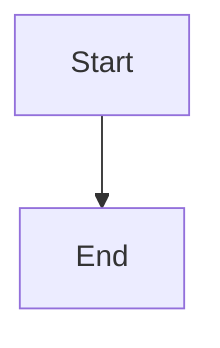

**Syntax:** `flowchart [DIRECTION]`

The `flowchart` keyword declares the diagram type. Direction follows immediately after (see [Direction Options](#direction-options)).

### Node Declaration

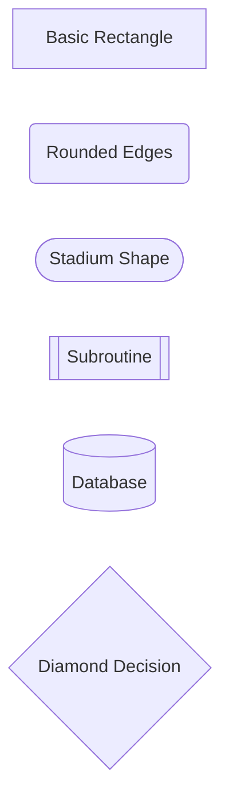

**Format:** `nodeId[Text]` or `nodeId(Text)` or `nodeId{Text}`

- **Node ID** (left of brackets): Internal reference, must be unique, used for linking
- **Text** (inside brackets): Display label, what users see
- **Brackets** (type and position): Determines node shape

### Connecting Nodes (Edges)

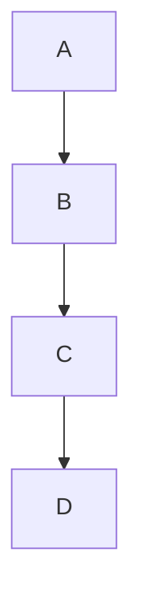

**Format:** `nodeId1 --> nodeId2`

The arrow syntax creates directed edges between nodes.

### Full Basic Example


---

## Node Shapes and Naming

### Available Node Shapes (Mermaid 11.x+)

Mermaid 11.3.0+ introduces **30 new shapes** with both traditional bracket notation and modern `@{ shape: name }` syntax.

#### Traditional Bracket Notation (Most Common)

| Shape | Syntax | Example | Use Case |
|-------|--------|---------|----------|
| Rectangle | `A[text]` | `task[Run ETL]` | Standard tasks |
| Rounded | `A(text)` | `start(Begin)` | Start/end nodes |
| Stadium | `A([text])` | `sensor([Wait for File])` | Sensors, waiters |
| Subroutine | `A[[text]]` | `sub[[Call API]]` | Subprocess, functions |
| Database | `A[(text)]` | `db[(PostgreSQL)]` | Database operations |
| Circle | `A((text))` | `branch((Split))` | Branch points |
| Diamond | `A{text}` | `check{Data Valid?}` | Decision points, branches |
| Hexagon | `A{{text}}` | `queue{{Kafka Topic}}` | Queues, events |
| Parallelogram | `A[/text/]` | `input[/User Input/]` | Input/output |
| Trapezoid | `A[\text\]` | `output[\File Output\]` | Output operations |

#### Modern Shape Syntax (v11.3.0+)

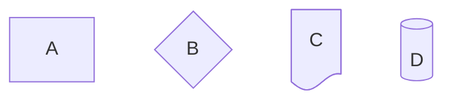

**Extended Shapes Include:**
- `process`, `decision`, `document`, `event`
- `fork`, `cloud`, `hourglass`
- And 20+ more specialized shapes

### Node Naming Best Practices

#### 1. Use Descriptive IDs

**Bad:**
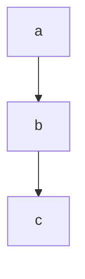

**Good:**
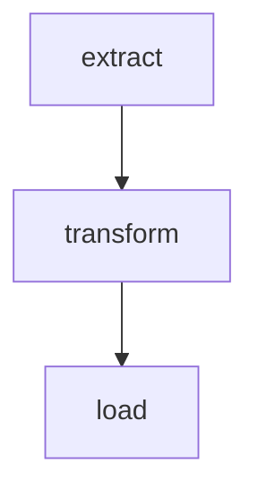

**Why:** Clear IDs make the diagram source readable and maintainable.

#### 2. Keep Display Text Concise

**Bad:**
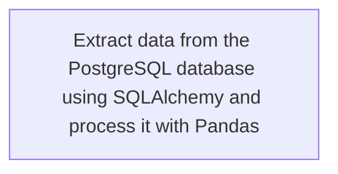

**Good:**
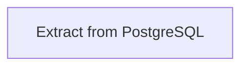

**Why:** Long text creates layout issues. Add details in documentation, not the diagram.

#### 3. Avoid Reserved Words

**Critical:** The word `end` (lowercase) is reserved in Mermaid and will break parsing.

**Bad:**
```mermaid
flowchart TD
    start --> end
```

**Good:**
```mermaid
flowchart TD
    start --> finish
    # Or: start --> End (capitalized works)
```

#### 4. Handle Special Characters

If node text contains `[]`, `{}`, `()`, or other special characters, wrap in double quotes:

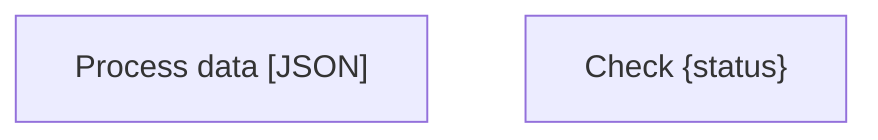

#### 5. Markdown Support in Labels

Mermaid supports **bold** and *italic* text in node labels:

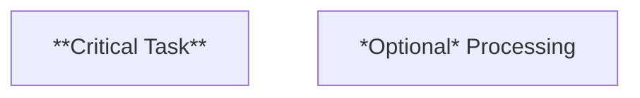

---

## Edge Types and Styling

### Arrow Types

| Type | Syntax | Example | Use Case |
|------|--------|---------|----------|
| Solid arrow | `A-->B` | `extract-->transform` | Standard flow |
| Open link | `A---B` | `task1---task2` | Non-directional relation |
| Dotted arrow | `A-.->B` | `sensor-.->task` | Optional/conditional |
| Thick arrow | `A==>B` | `critical==>next` | Emphasis, critical path |

### Edge Labels

Add text labels to edges to describe the relationship:

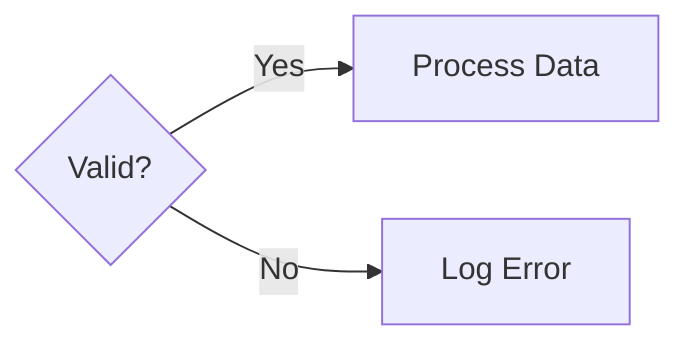

**Syntax:**
- `A -->|label| B` (inline)
- `A -- label --> B` (spaced)

Both are equivalent. Use inline for consistency.

### Special Edge Endings

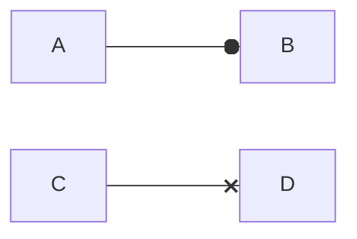

- `---o`: Circle ending (composition relationship)
- `---x`: Cross ending (termination/cancellation)

### Multi-directional Arrows

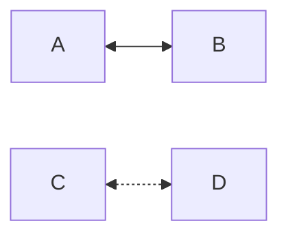

Useful for bidirectional dependencies or feedback loops (rare in DAGs but possible in complex workflows).

### Link Length Control

Add extra dashes to span multiple ranks:

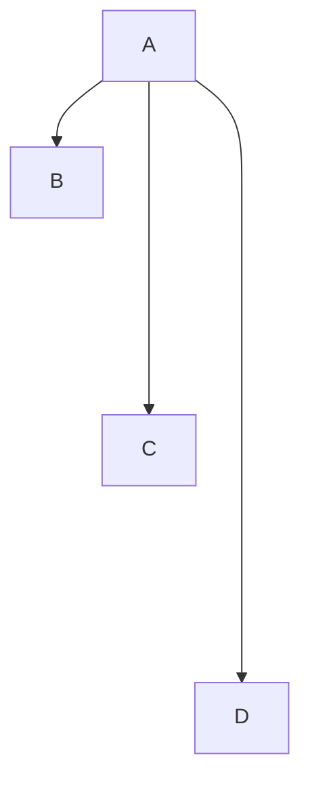

Longer links help with visual spacing when you have parallel branches.

### Edge Styling (Advanced)

Style individual edges by index (0-based):

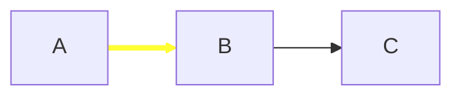

Style multiple edges at once:

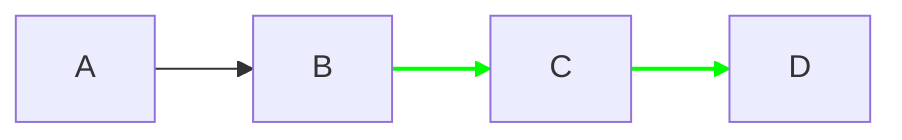

### Edge IDs and Animation (v11.10.0+)

Assign IDs to edges for targeted styling or animation:

```mermaid
flowchart LR
    e1@-->A[Task]
    A --> B
    linkStyle e1 stroke:#f66,stroke-width:3px
```

**Note:** This is an advanced feature. Use sparingly in documentation diagrams.

---

## Direction Options

### Available Directions

| Direction | Abbreviation | Description |
|-----------|--------------|-------------|
| Top to Bottom | `TD` or `TB` | Vertical flow downward (default) |
| Bottom to Top | `BT` | Vertical flow upward |
| Left to Right | `LR` | Horizontal flow rightward |
| Right to Left | `RL` | Horizontal flow leftward |

### When to Use Each Direction

#### TD/TB (Top-Down) - **Most Common for DAGs**

```mermaid
flowchart TD
    start[Start] --> extract[Extract]
    extract --> transform[Transform]
    transform --> load[Load]
```

**Use when:**
- Representing hierarchical processes
- Showing workflow progression
- Decision trees with branches
- Standard ETL pipelines

**Advantages:**
- Traditional flow direction
- Natural reading order (top to bottom)
- Works well for most Airflow DAGs

#### LR (Left-to-Right)

```mermaid
flowchart LR
    stage1[Stage 1] --> stage2[Stage 2] --> stage3[Stage 3]
```

**Use when:**
- Representing pipelines or stages
- Timelines or sequential processes
- Many parallel branches that would look cramped vertically
- Wide diagrams that benefit from horizontal space

**Advantages:**
- Better for wide, shallow DAGs
- Mimics timeline progression
- Reduces vertical scrolling

#### BT (Bottom-to-Top) and RL (Right-to-Left)

**Use when:**
- Specific domain conventions require reverse flow
- Showing "bubbling up" of data
- Artistic/presentation reasons

**Note:** These are rare in practice. Stick with TD or LR for Airflow DAGs.

### Recommendation for Airflow DAGs

**Default to `TD` (Top-Down)** unless:
- The DAG is very wide with many parallel tasks → Use `LR`
- The DAG has a clear pipeline/stage structure → Consider `LR`

---

## Subgraphs for Task Grouping

Subgraphs group related nodes together, improving readability and organization. This is ideal for representing Airflow TaskGroups.

### Basic Subgraph Syntax

```mermaid
flowchart TD
    start[Start]

    subgraph extraction
        extract1[Extract Source 1]
        extract2[Extract Source 2]
    end

    subgraph transformation
        transform1[Clean Data]
        transform2[Enrich Data]
    end

    start --> extraction
    extraction --> transformation
```

**Syntax:**
```
subgraph title
    nodes...
end
```

### Subgraph with Explicit ID

```mermaid
flowchart TD
    subgraph etl_group[ETL Process]
        extract --> transform --> load
    end
```

**Syntax:** `subgraph id[title]`

Use IDs to reference subgraphs in edges or styling.

### Subgraph Direction

Set independent direction for subgraphs:

```mermaid
flowchart TD
    start[Start]

    subgraph horizontal_tasks
        direction LR
        task1 --> task2 --> task3
    end

    start --> horizontal_tasks
```

**Important:** If a subgraph node links to outside nodes, the subgraph direction is ignored and inherits the parent direction.

### Nested Subgraphs

```mermaid
flowchart TD
    subgraph pipeline[Data Pipeline]
        subgraph ingestion[Ingestion]
            extract1[Extract API]
            extract2[Extract DB]
        end

        subgraph processing[Processing]
            transform[Transform]
            validate[Validate]
        end
    end
```

Nesting helps organize complex DAGs with multiple layers of task groups.

### Styling Subgraphs

Use `classDef` to style subgraph backgrounds:

```mermaid
flowchart TD
    subgraph critical[Critical Path]
        task1 --> task2
    end

    subgraph optional[Optional Tasks]
        task3 --> task4
    end

    classDef criticalStyle fill:#ffcccc,stroke:#ff0000,stroke-width:2px
    class critical criticalStyle
```

**Note:** Subgraph styling is more limited than node styling. Use background colors sparingly.

---

## Styling and Color Conventions

### Individual Node Styling

Apply styles directly to specific nodes:

```mermaid
flowchart TD
    task1[Normal Task]
    task2[Critical Task]
    task3[Failed Task]

    style task2 fill:#ffd700,stroke:#ff8c00,stroke-width:3px
    style task3 fill:#ff6b6b,stroke:#c92a2a,stroke-width:2px
```

**Syntax:** `style nodeId property:value,property:value`

**Common Properties:**
- `fill`: Background color
- `stroke`: Border color
- `stroke-width`: Border thickness
- `color`: Text color

### Class Definitions (Recommended)

Define reusable style classes:

```mermaid
flowchart TD
    start[Start] --> extract[Extract]
    extract --> transform[Transform]
    transform --> load[Load]

    classDef startEnd fill:#90EE90,stroke:#228B22,stroke-width:2px
    classDef processing fill:#ADD8E6,stroke:#4682B4,stroke-width:2px

    class start,load startEnd
    class extract,transform,load processing
```

**Advantages:**
- Reusability across multiple nodes
- Easier to maintain consistent styling
- Cleaner diagram source

### Shorthand Class Assignment

Use `:::className` notation:

```mermaid
flowchart TD
    start[Start]:::startEnd
    extract[Extract]:::processing

    classDef startEnd fill:#90EE90,stroke:#228B22
    classDef processing fill:#ADD8E6,stroke:#4682B4
```

### Color Conventions for Airflow DAGs

Establish semantic color coding:

| State/Type | Color | Hex | Usage |
|------------|-------|-----|-------|
| Start/End | Light Green | `#90EE90` | Entry/exit points |
| Sensor | Light Yellow | `#FFFFE0` | Waiting tasks |
| Extract | Light Blue | `#ADD8E6` | Data extraction |
| Transform | Light Coral | `#F08080` | Data transformation |
| Load | Light Purple | `#DDA0DD` | Data loading |
| Validation | Light Orange | `#FFDAB9` | Data quality checks |
| Critical Path | Gold | `#FFD700` | High priority tasks |
| Error/Failure | Light Red | `#FF6B6B` | Failed states |
| Optional | Light Gray | `#D3D3D3` | Optional branches |

**Example:**

```mermaid
flowchart TD
    start[Start]
    sensor([File Sensor])
    extract[Extract Data]
    transform[Transform Data]
    validate{Validate}
    load[Load to DB]
    error[Handle Error]
    finish[End]

    start --> sensor
    sensor --> extract
    extract --> transform
    transform --> validate
    validate -->|Valid| load
    validate -->|Invalid| error
    load --> finish

    classDef startEnd fill:#90EE90,stroke:#228B22,stroke-width:2px
    classDef sensorStyle fill:#FFFFE0,stroke:#DAA520,stroke-width:2px
    classDef extractStyle fill:#ADD8E6,stroke:#4682B4,stroke-width:2px
    classDef transformStyle fill:#F08080,stroke:#CD5C5C,stroke-width:2px
    classDef loadStyle fill:#DDA0DD,stroke:#BA55D3,stroke-width:2px
    classDef errorStyle fill:#FF6B6B,stroke:#C92A2A,stroke-width:2px

    class start,finish startEnd
    class sensor sensorStyle
    class extract extractStyle
    class transform transformStyle
    class load loadStyle
    class error errorStyle
```

### Theme Configuration

Configure global theme at diagram level:

```mermaid
%%{init: {'theme':'base', 'themeVariables': {'primaryColor':'#ffdead'}}}%%
flowchart TD
    A --> B
```

**Available Themes:**
- `default`: Default theme
- `neutral`: Black and white (good for printing)
- `dark`: Dark mode compatible
- `forest`: Green tones
- `base`: Customizable base theme

**Note:** Theme configuration should go at the very top of the diagram, before `flowchart`.

---

## GitHub/Markdown Rendering

### How It Works

GitHub natively supports Mermaid diagram rendering. When GitHub encounters a code block marked as `mermaid`, it generates an iframe that passes the syntax to Mermaid.js for client-side rendering.

### Basic Usage in GitHub Markdown

````markdown
```mermaid
flowchart TD
    A[Start] --> B[End]
```
````

Renders as an inline diagram in:
- README.md files
- Issues
- Pull requests
- Discussions
- Wikis

### Supported Features

GitHub supports most Mermaid flowchart features as of 2026:
- All node shapes
- All edge types
- Subgraphs
- Styling and classes
- Themes

### Known Limitations

1. **Interactive Features Not Supported**
   - Hyperlinks in nodes (`click nodeId "url"`)
   - JavaScript callbacks (`click nodeId callback`)
   - Tooltips

2. **Special Characters**
   - Emoji rendering can be inconsistent
   - Some Unicode symbols may break rendering
   - MathJax/LaTeX not supported in labels

3. **Third-Party Conflicts**
   - If you have browser extensions or third-party Mermaid plugins, they may conflict with GitHub's renderer
   - Recommendation: Disable conflicting extensions when viewing GitHub diagrams

### Checking Mermaid Version on GitHub

GitHub's Mermaid version can be checked with:

````markdown
```mermaid
info
```
````

This renders a diagram showing the current Mermaid version in use.

### Testing Before Committing

**Use [Mermaid Live Editor](https://mermaid.live)** to test diagrams before committing:
1. Paste your Mermaid syntax
2. See real-time rendering
3. Export as PNG/SVG if needed (backup for compatibility)
4. Validate syntax errors

### Best Practices for GitHub

1. **Keep Diagrams Simple**
   - GitHub rendering may have performance limits
   - Very large diagrams (50+ nodes) may render slowly
   - Break complex diagrams into multiple smaller ones

2. **Use Standard Features**
   - Avoid bleeding-edge Mermaid features that may not be supported yet
   - Stick to core flowchart syntax for maximum compatibility

3. **Test in Multiple Browsers**
   - Chrome, Firefox, Edge all render slightly differently
   - If issues persist, export to PNG/SVG and embed as image

4. **Avoid Sensitive Information**
   - Diagram rendering happens client-side
   - Never include API keys, passwords, or secrets in diagram labels

5. **Comments for Maintainability**
   - Use `%% comment` syntax to document complex diagrams

```mermaid
%% This diagram shows the ETL pipeline for customer data
flowchart TD
    %% Extraction phase
    extract[Extract from API]

    %% Transformation phase
    transform[Transform Data]

    extract --> transform
```

---

## Common Pitfalls and How to Avoid Them

### 1. Using Reserved Word "end"

**Problem:**
```mermaid
flowchart TD
    start --> end
    %% BREAKS: "end" is a reserved keyword
```

**Solution:**
```mermaid
flowchart TD
    start --> finish
    %% Or: start --> End (capitalized)
```

**Why:** The word `end` (lowercase) terminates subgraph blocks and other constructs.

### 2. Special Characters in Node Text

**Problem:**
```mermaid
flowchart TD
    task[Process data [JSON] with {params}]
    %% BREAKS: Brackets and braces are special characters
```

**Solution:**
```mermaid
flowchart TD
    task["Process data [JSON] with {params}"]
```

**Why:** Characters like `[]`, `{}`, `()` define node shapes. Wrap text in double quotes to escape.

### 3. Incorrect Linking Syntax

**Problem:**
```mermaid
flowchart TD
    A -> B
    %% BREAKS: Single dash arrow is not valid
```

**Solution:**
```mermaid
flowchart TD
    A --> B
    %% Use double dash for arrows
```

**Why:** Mermaid uses specific arrow syntax: `-->`, `---`, `-.->`, `==>`.

### 4. Spurious Whitespace

**Problem:**
```mermaid
flowchart TD
    class task1, task2 myClass
    %% BREAKS: Space after comma
```

**Solution:**
```mermaid
flowchart TD
    class task1,task2 myClass
    %% No spaces in comma-separated lists
```

**Why:** Mermaid parser is sensitive to unexpected whitespace in certain contexts.

### 5. Overloading Diagrams with Detail

**Problem:**
- Too many nodes (50+)
- Excessive styling
- Too much text in labels
- Overly complex connections

**Solution:**
- Break into multiple smaller diagrams
- Group related tasks in subgraphs
- Keep labels concise (3-5 words max)
- Use documentation for details, not the diagram

**Why:** Complex diagrams are hard to read and maintain. The automatic layout may produce poor results.

### 6. Inconsistent Node IDs

**Problem:**
```mermaid
flowchart TD
    extractData --> transform_data --> LOADDB
    %% Inconsistent naming: camelCase, snake_case, UPPERCASE
```

**Solution:**
```mermaid
flowchart TD
    extract_data --> transform_data --> load_db
    %% Consistent snake_case
```

**Why:** Consistency improves readability and reduces errors.

### 7. Forgetting to Define Classes Before Using

**Problem:**
```mermaid
flowchart TD
    task1[Task]:::myClass
    classDef myClass fill:#f9f
    %% Works, but better to define classes first
```

**Solution:**
```mermaid
flowchart TD
    classDef myClass fill:#f9f,stroke:#333
    task1[Task]:::myClass
```

**Why:** Defining classes at the top makes the diagram more maintainable.

### 8. Unknown Words and Typos

**Problem:**
```mermaid
flowchart TD
    A --> B
    linkStile 0 stroke:#f00
    %% BREAKS: "linkStile" is misspelled
```

**Solution:**
```mermaid
flowchart TD
    A --> B
    linkStyle 0 stroke:#f00
```

**Why:** Mermaid won't error on unknown keywords but will silently fail to apply styles.

### 9. Security Risk: User-Generated Diagrams

**Problem:** Allowing untrusted users to submit Mermaid syntax that gets rendered on public sites.

**Solution:**
- Sanitize user input
- Use Mermaid's built-in DOMPurify integration
- Limit allowed syntax features
- Render in sandboxed iframes

**Why:** Malicious users could embed scripts or attempts at XSS attacks.

### 10. Layout Fighting

**Problem:** Trying to force specific node positions with excessive styling or link length manipulation.

**Solution:**
- Let the automatic layout (dagre) do its job
- For complex diagrams, consider using the `elk` layout engine
- Restructure the diagram logic instead of fighting the layout

```mermaid
%%{init: {'flowchart': {'defaultRenderer': 'elk'}}}%%
flowchart TD
    A --> B --> C
```

**Why:** Manual layout tweaking makes diagrams brittle and hard to maintain.

---

## Airflow-Specific Patterns

### Representing Airflow Task Types

Map Airflow operators to appropriate Mermaid node shapes:

| Airflow Operator | Mermaid Shape | Syntax | Visual |
|------------------|---------------|--------|--------|
| PythonOperator | Rectangle | `task[Task Name]` | Standard box |
| Sensor (any) | Stadium | `sensor([Wait for X])` | Rounded ends |
| BranchOperator | Diamond | `branch{Condition}` | Decision diamond |
| SubDagOperator / TaskGroup | Subgraph | `subgraph group[]...end` | Grouped box |
| DummyOperator | Circle | `dummy((Marker))` | Small circle |
| SQL Operators | Database | `query[(Run Query)]` | Cylinder |

### Example: Branching DAG

```mermaid
flowchart TD
    start[Start]
    check_data{Data Available?}
    process_new[Process New Data]
    process_old[Process Old Data]
    merge[Merge Results]
    finish[End]

    start --> check_data
    check_data -->|Yes| process_new
    check_data -->|No| process_old
    process_new --> merge
    process_old --> merge
    merge --> finish

    classDef decision fill:#FFD700,stroke:#FF8C00,stroke-width:2px
    class check_data decision
```

### Example: Parallel Task Execution

```mermaid
flowchart TD
    start[Start]

    subgraph parallel[Parallel Processing]
        direction LR
        task1[Extract Source 1]
        task2[Extract Source 2]
        task3[Extract Source 3]
    end

    merge[Merge Data]
    finish[End]

    start --> parallel
    parallel --> merge
    merge --> finish
```

### Example: TaskGroup Representation

```mermaid
flowchart TD
    start[Start DAG]

    subgraph ingestion_group[Ingestion TaskGroup]
        sensor([File Sensor])
        validate{Validate File}
        extract[Extract Data]

        sensor --> validate
        validate -->|Valid| extract
    end

    subgraph processing_group[Processing TaskGroup]
        transform[Transform]
        enrich[Enrich]

        transform --> enrich
    end

    load[Load to Warehouse]
    finish[End DAG]

    start --> ingestion_group
    ingestion_group --> processing_group
    processing_group --> load
    load --> finish

    classDef taskGroup fill:#E6F3FF,stroke:#4682B4,stroke-width:2px
    class ingestion_group,processing_group taskGroup
```

### Example: Error Handling

```mermaid
flowchart TD
    start[Start]
    extract[Extract Data]
    transform[Transform Data]
    validate{Data Quality Check}
    load[Load to DB]
    error_handler[Log Error & Alert]
    retry[Retry Task]
    finish[End]

    start --> extract
    extract --> transform
    transform --> validate
    validate -->|Pass| load
    validate -->|Fail| error_handler
    error_handler --> retry
    retry -.->|Retry| extract
    load --> finish

    classDef errorStyle fill:#FF6B6B,stroke:#C92A2A,stroke-width:2px
    class error_handler,retry errorStyle
```

### Example: Sensor with Timeout

```mermaid
flowchart TD
    start[Start]
    sensor([Wait for File])
    timeout{Timeout?}
    process[Process Data]
    skip[Skip Processing]
    finish[End]

    start --> sensor
    sensor --> timeout
    timeout -->|No| process
    timeout -->|Yes| skip
    process --> finish
    skip --> finish

    style sensor fill:#FFFFE0,stroke:#DAA520,stroke-width:2px
```

### Dynamic Task Generation (Representation)

For dynamically generated tasks, use descriptive labels:

```mermaid
flowchart TD
    start[Start]
    generate[Generate Tasks Dynamically]

    subgraph dynamic[Dynamic Tasks: process_file_*]
        task1[Process File 1]
        task2[Process File 2]
        task3[Process File 3]
        taskN[Process File N]
    end

    merge[Merge Results]
    finish[End]

    start --> generate
    generate --> dynamic
    dynamic --> merge
    merge --> finish
```

---

## Complete Examples

### Example 1: Simple ETL Pipeline

```mermaid
flowchart TD
    start[Start DAG]
    sensor([Wait for Data])
    extract[Extract from API]
    transform[Transform Data]
    validate{Quality Check}
    load[Load to PostgreSQL]
    notify[Send Notification]
    finish[End DAG]

    start --> sensor
    sensor --> extract
    extract --> transform
    transform --> validate
    validate -->|Pass| load
    validate -->|Fail| notify
    load --> notify
    notify --> finish

    classDef startEnd fill:#90EE90,stroke:#228B22,stroke-width:2px
    classDef sensorStyle fill:#FFFFE0,stroke:#DAA520,stroke-width:2px
    classDef processing fill:#ADD8E6,stroke:#4682B4,stroke-width:2px
    classDef decision fill:#FFD700,stroke:#FF8C00,stroke-width:2px

    class start,finish startEnd
    class sensor sensorStyle
    class extract,transform,load processing
    class validate decision
```

### Example 2: Multi-Source Data Pipeline

```mermaid
flowchart TD
    start[Start DAG]

    subgraph sources[Data Sources]
        direction LR
        api[Extract API]
        db[(Extract PostgreSQL)]
        file[Extract S3 Files]
    end

    subgraph transform_layer[Transformation Layer]
        clean[Clean Data]
        dedupe[Deduplicate]
        enrich[Enrich with Lookup]
    end

    merge[Merge Sources]
    validate{Quality Check}

    subgraph load_layer[Load Layer]
        warehouse[(Load to Warehouse)]
        cache[(Update Redis Cache)]
    end

    notify[Send Success Email]
    error[Send Error Alert]
    finish[End DAG]

    start --> sources
    sources --> merge
    merge --> transform_layer
    transform_layer --> validate
    validate -->|Pass| load_layer
    validate -->|Fail| error
    load_layer --> notify
    notify --> finish
    error --> finish

    classDef startEnd fill:#90EE90,stroke:#228B22,stroke-width:2px
    classDef extractStyle fill:#ADD8E6,stroke:#4682B4,stroke-width:2px
    classDef transformStyle fill:#F08080,stroke:#CD5C5C,stroke-width:2px
    classDef loadStyle fill:#DDA0DD,stroke:#BA55D3,stroke-width:2px
    classDef decision fill:#FFD700,stroke:#FF8C00,stroke-width:2px
    classDef errorStyle fill:#FF6B6B,stroke:#C92A2A,stroke-width:2px

    class start,finish startEnd
    class api,db,file extractStyle
    class clean,dedupe,enrich,merge transformStyle
    class warehouse,cache loadStyle
    class validate decision
    class error errorStyle
```

### Example 3: ML Pipeline with Branching

```mermaid
flowchart TD
    start[Start DAG]
    check{New Model Needed?}

    subgraph training[Model Training Branch]
        prepare[Prepare Training Data]
        train[Train Model]
        evaluate{Model Accuracy > 0.9?}
        deploy[Deploy Model]
        rollback[Keep Old Model]
    end

    subgraph inference[Inference Branch]
        load_model[Load Current Model]
        predict[Generate Predictions]
        store[Store Results]
    end

    notify[Send Notification]
    finish[End DAG]

    start --> check
    check -->|Yes| training
    check -->|No| inference

    prepare --> train
    train --> evaluate
    evaluate -->|Pass| deploy
    evaluate -->|Fail| rollback
    deploy --> notify
    rollback --> notify

    load_model --> predict
    predict --> store
    store --> notify

    notify --> finish

    classDef decision fill:#FFD700,stroke:#FF8C00,stroke-width:2px
    classDef training fill:#FFB6C1,stroke:#DC143C,stroke-width:2px
    classDef inference fill:#B0E0E6,stroke:#4682B4,stroke-width:2px

    class check,evaluate decision
    class prepare,train,deploy,rollback training
    class load_model,predict,store inference
```

### Example 4: Complex DAG with Error Handling

```mermaid
flowchart TD
    start[Start DAG]

    sensor([Wait for Upstream DAG])

    subgraph extraction[Extraction]
        extract1[Extract Source A]
        extract2[Extract Source B]
        extract3[Extract Source C]
    end

    check_extract{All Extracts OK?}

    subgraph transformation[Transformation]
        standardize[Standardize Formats]
        validate_data{Validate Data}
        transform[Apply Business Rules]
        aggregate[Aggregate Metrics]
    end

    subgraph loading[Loading]
        stage[(Stage to Temp Table)]
        swap{Swap Successful?}
        production[(Swap to Production)]
        rollback_load[Rollback Changes]
    end

    error_extract[Handle Extract Error]
    error_transform[Handle Transform Error]
    error_load[Handle Load Error]

    notify_success[Send Success Notification]
    notify_failure[Send Failure Alert]

    finish[End DAG]

    start --> sensor
    sensor --> extraction
    extraction --> check_extract

    check_extract -->|Success| transformation
    check_extract -->|Failure| error_extract

    standardize --> validate_data
    validate_data -->|Valid| transform
    validate_data -->|Invalid| error_transform
    transform --> aggregate

    aggregate --> loading
    stage --> swap
    swap -->|Success| production
    swap -->|Failure| rollback_load

    rollback_load --> error_load

    production --> notify_success
    error_extract --> notify_failure
    error_transform --> notify_failure
    error_load --> notify_failure

    notify_success --> finish
    notify_failure --> finish

    classDef startEnd fill:#90EE90,stroke:#228B22,stroke-width:2px
    classDef sensorStyle fill:#FFFFE0,stroke:#DAA520,stroke-width:2px
    classDef extractStyle fill:#ADD8E6,stroke:#4682B4,stroke-width:2px
    classDef transformStyle fill:#F08080,stroke:#CD5C5C,stroke-width:2px
    classDef loadStyle fill:#DDA0DD,stroke:#BA55D3,stroke-width:2px
    classDef decision fill:#FFD700,stroke:#FF8C00,stroke-width:2px
    classDef errorStyle fill:#FF6B6B,stroke:#C92A2A,stroke-width:2px

    class start,finish startEnd
    class sensor sensorStyle
    class extract1,extract2,extract3 extractStyle
    class standardize,transform,aggregate transformStyle
    class stage,production loadStyle
    class check_extract,validate_data,swap decision
    class error_extract,error_transform,error_load,rollback_load errorStyle
```

---

## Quick Reference: Syntax Cheat Sheet

### Basic Structure

```mermaid
flowchart TD
    %% Comments start with %%

    %% Node declarations
    A[Rectangle]
    B(Rounded)
    C([Stadium])
    D{Diamond}
    E[(Database)]

    %% Connections
    A --> B
    B -->|Label| C
    C -.-> D
    D ==> E

    %% Styling
    classDef myClass fill:#f9f,stroke:#333,stroke-width:2px
    class A,B myClass

    %% Or shorthand
    F[Node]:::myClass
```

### Common Node Shapes

- `[text]` - Rectangle
- `(text)` - Rounded
- `([text])` - Stadium
- `{text}` - Diamond
- `[(text)]` - Database
- `[[text]]` - Subroutine
- `((text))` - Circle

### Common Arrow Types

- `-->` - Solid arrow
- `---` - Solid line
- `-.->` - Dotted arrow
- `==>` - Thick arrow
- `-->|text|` - Labeled arrow

### Styling

```
%% Individual node
style nodeId fill:#f9f,stroke:#333

%% Class definition
classDef className fill:#f9f,stroke:#333
class node1,node2 className

%% Shorthand
node[Text]:::className
```

### Subgraph

```
subgraph title
    nodes...
end

%% With ID
subgraph id[title]
    nodes...
end
```

---

## Additional Resources

### Official Documentation

- **Mermaid Documentation**: https://mermaid.js.org/
- **Flowchart Syntax**: https://mermaid.js.org/syntax/flowchart.html
- **Mermaid Live Editor**: https://mermaid.live
- **GitHub Diagrams Guide**: https://docs.github.com/en/get-started/writing-on-github/working-with-advanced-formatting/creating-diagrams

### Tools and Integrations

- **Mermaid CLI**: Command-line tool for generating diagrams
- **VS Code Extensions**: Mermaid Preview, Markdown Preview Mermaid Support
- **Airflow Diagrams Tool**: https://github.com/feluelle/airflow-diagrams (auto-generate from Airflow DAGs)

### Layout Engines

- **Dagre** (default): Good balance of simplicity and quality
- **ELK** (v9.4+): Better for larger/complex diagrams

To use ELK:
```mermaid
%%{init: {'flowchart': {'defaultRenderer': 'elk'}}}%%
flowchart TD
    A --> B
```

---

## Appendix: Color Reference

### Web-Safe Colors for Diagrams

| Color Name | Hex | RGB | Use Case |
|------------|-----|-----|----------|
| Light Green | `#90EE90` | (144, 238, 144) | Start/End |
| Light Blue | `#ADD8E6` | (173, 216, 230) | Extract |
| Light Coral | `#F08080` | (240, 128, 128) | Transform |
| Light Purple | `#DDA0DD` | (221, 160, 221) | Load |
| Light Yellow | `#FFFFE0` | (255, 255, 224) | Sensors |
| Gold | `#FFD700` | (255, 215, 0) | Critical/Decision |
| Light Red | `#FF6B6B` | (255, 107, 107) | Error |
| Light Orange | `#FFDAB9` | (255, 218, 185) | Validation |
| Light Gray | `#D3D3D3` | (211, 211, 211) | Optional |

Use these colors consistently across diagrams for semantic clarity.

---

## Sources

This document was compiled from current best practices as of January 2026. Key sources include:

- [How to Create Stunning Mermaid Diagrams (With Examples) - ClickUp](https://clickup.com/blog/mermaid-diagram-examples/)
- [Diagram Syntax | Mermaid](https://mermaid.js.org/intro/syntax-reference.html)
- [Flowcharts Syntax | Mermaid](https://mermaid.ai/open-source/syntax/flowchart.html)
- [Creating Mermaid Diagrams - ReadMe](https://docs.readme.com/main/docs/creating-mermaid-diagrams)
- [GitHub - mermaid-js/mermaid](https://github.com/mermaid-js/mermaid)
- [Mermaid FlowChart Basic Syntax](https://docs.mermaidchart.com/mermaid-oss/syntax/flowchart.html)
- [Mermaid Diagrams: A Guide with Miro](https://miro.com/diagramming/what-is-mermaid/)
- [Mermaid diagram: Create text-based flow charts | Tempo](https://www.tempo.io/blog/mermaid-diagram)
- [Styling MermaidJS | Heaton.dev](https://www.heaton.dev/2022/05/styling-mermaidjs/)
- [Theme Configuration | Mermaid](https://mermaid.js.org/config/theming.html)
- [Include diagrams in your Markdown files with Mermaid - GitHub Blog](https://github.blog/developer-skills/github/include-diagrams-markdown-files-mermaid/)
- [Creating diagrams - GitHub Docs](https://docs.github.com/en/get-started/writing-on-github/working-with-advanced-formatting/creating-diagrams)
- [GitHub - feluelle/airflow-diagrams](https://github.com/feluelle/airflow-diagrams)
- [Flowchart shapes | Mermaid Chart](https://docs.mermaidchart.com/mermaid/flowchart/shapes)
- [A Beginner's Guide to Mermaid - Boardmix](https://boardmix.com/articles/what-is-mermaid/)
- [Mastering Mermaid: A Comprehensive Cheat Sheet - DEV](https://dev.to/nagasuresh_dondapati_d5df/mastering-mermaid-a-comprehensive-cheat-sheet-45mi)

---

**Document Version:** 1.0
**Last Updated:** 2026-01-29
**Maintained by:** Research Agent (django-forge skill)
