# Mermaid Flowchart Learnings

**Date:** 2026-04-14
**Context:** Building an architecture diagram for the Sephora QE preliminary approach document. Multiple iterations required to get a professional, readable result.
**Final working file:** `deliverables/architecture_diagram_experiments/04_flowchart.html`

---

## What We Were Building

A vertical layered architecture diagram showing 6 components (Configuration Layer + 5 numbered layers) stacked top-to-bottom, with a feedback arrow from Layer 3 back to Layer 2. Each node contains a title with an icon and 3-4 bullet items. Intended for embedding in a BayOne design system HTML deliverable, printed on 8.5x11 portrait paper.

---

## Failed Approaches and Why They Failed

### 1. Subgraphs with `direction LR` inside a `graph TB`

**What we tried:** Each layer as a subgraph containing 3 nodes arranged left-to-right, with the overall graph flowing top-to-bottom.

**What happened:** The cross-connection (dashed arrow from a node in Layer 3 back to a node in Layer 2) caused mermaid's layout engine to place Layer 1 and Layer 3 side by side instead of stacked vertically. The diagram became extremely wide and the intended vertical stack was destroyed.

**Lesson:** Cross-subgraph connections in mermaid flowcharts break the expected layout. If you have a feedback arrow between layers, subgraphs with internal nodes will produce unpredictable layouts. The layout engine optimizes for edge routing, not for the visual hierarchy you intended.

### 2. Subgraphs with many individually styled nodes

**What we tried:** Individual `style` statements for every node and every subgraph (20+ style lines).

**What happened:** Verbose, hard to maintain, and produced the same layout problems as approach 1.

**Lesson:** Use `classDef` with `:::className` syntax instead of individual style lines. Cleaner code, same visual result, and easier to maintain.

### 3. `useMaxWidth: true` expecting nodes to expand

**What we tried:** Setting `useMaxWidth: true` in the flowchart config hoping nodes would expand to fill available width.

**What happened:** Nodes did not meaningfully expand. Content was still truncated.

**Lesson:** `useMaxWidth: true` controls the overall SVG width relative to its container, not individual node sizing. It does not solve content clipping inside nodes.

### 4. `wrappingWidth` expecting text to wrap properly

**What we tried:** Setting `wrappingWidth: 500` or `wrappingWidth: 600`.

**What happened:** Minimal visible effect on node sizing.

**Lesson:** `wrappingWidth` has limited practical impact on node dimensions when using `htmlLabels: true` with `<br/>` line breaks. The explicit `<br/>` tags already control line breaks; wrappingWidth is more relevant for auto-wrapping long single-line labels.

### 5. JavaScript `requestAnimationFrame` to resize nodes after render

**What we tried:** Using `requestAnimationFrame` to measure `scrollHeight` after applying CSS changes, then resizing the SVG rect.

**What happened:** Nothing changed. The measurements inside SVG foreignObject do not behave the same as regular HTML DOM measurements.

**Lesson:** `requestAnimationFrame` and `scrollHeight`-based measurement approaches are unreliable inside SVG foreignObject elements. Direct attribute manipulation works; measurement-then-resize does not.

---

## What Actually Works

### The Winning Pattern: Single Node Per Layer + Post-Render Styling

**Diagram structure:** One `graph TB` flowchart. Each layer is a single node (not a subgraph) with all content inside the node label using the `<b>` + `<br/>▸` pattern. Connections between nodes are simple arrows between node IDs.

```
graph TB
    classDef foundation fill:#dbeafe,stroke:#2563eb,stroke-width:2px,color:#1e3a5f

    L1["<b>fa:fa-server Layer 1: Deterministic Automation</b><br/>▸ Playwright browser automation<br/>▸ Codebase mapping and dependency analysis<br/>▸ Isolated execution (Docker / Azure Container Apps)<br/> "]:::foundation
```

**Key details:**

1. **`<pre class="mermaid">` not `<div class="mermaid">`** — Use the `<pre>` tag for the mermaid source. Combined with `startOnLoad: false` and `mermaid.run()` async rendering, this produces more reliable results.

2. **`startOnLoad: false` with async `mermaid.run()`** — Required for post-render JavaScript to work. The pattern:
   ```javascript
   mermaid.initialize({ startOnLoad: false, ... });
   async function renderDiagram() {
     await mermaid.run({ querySelector: '.mermaid' });
     // post-render fixes go here
   }
   renderDiagram();
   ```

3. **`classDef` with `:::className`** — Define styles once, apply to many nodes. Far cleaner than individual style statements.

4. **FontAwesome icons in labels** — Use `fa:fa-icon-name` syntax inside node labels. Requires `htmlLabels: true` in the flowchart config AND the FontAwesome CSS loaded in the page `<head>`.

5. **Bold + bullet pattern** — `<b>Title</b><br/>▸ Item 1<br/>▸ Item 2<br/>▸ Item 3<br/> ` — The trailing `<br/> ` (with a space) adds a blank line at the end for bottom spacing inside the node.

6. **Every bullet on its own line** — Never put two bullets on the same line (e.g., `▸ Item A ▸ Item B`). Each `▸` must be preceded by `<br/>`.

### Critical CSS Overrides

These are mandatory for content to not be clipped:

```css
.mermaid .node rect, .mermaid .node polygon { rx: 8 !important; ry: 8 !important; }
.mermaid .node foreignObject { overflow: visible !important; }
.mermaid .node foreignObject div { overflow: visible !important; }
.mermaid .edgeLabel rect { fill: #ede9fe !important; fill-opacity: 1 !important; stroke: none !important; }
```

The two `overflow: visible !important` rules are the most important. Without them, mermaid's default foreignObject sizing clips multi-line content. The reference file `v5_mermaid11_icons.html` uses exactly these rules and renders full content without truncation.

Also on the container:

```css
.diagram-box { overflow: visible; }
.diagram-box svg { overflow: visible !important; }
```

Without these, the last node in a tall diagram gets clipped by the HTML container even though the SVG content renders correctly. Add extra `padding-bottom` to the container as well.

### Post-Render JavaScript: Title Bar Styling

To give each node's title (the `<b>` tag) a boxed background that visually separates it from the bullet content:

```javascript
svg.querySelectorAll('.node').forEach(nodeGroup => {
  const fo = nodeGroup.querySelector('foreignObject');
  const rect = nodeGroup.querySelector('rect');
  if (!fo || !rect) return;

  let strokeColor = rect.getAttribute('stroke') || '#94a3b8';
  fo.querySelectorAll('b').forEach(b => {
    b.style.display = 'block';
    b.style.background = 'rgba(255,255,255,0.85)';
    b.style.border = '1px solid ' + strokeColor;
    b.style.borderRadius = '4px';
    b.style.padding = '4px 10px';
    b.style.marginBottom = '6px';
    b.style.fontSize = '13px';
    b.style.letterSpacing = '0.3px';
  });
```

This finds each node, gets its stroke color from the rect, and applies that as the border color on the title bar. The result is a white boxed title that matches the node's color scheme.

### Post-Render JavaScript: Bottom Padding Fix

Mermaid calculates node rect height before any post-render styling. The title bar styling adds margin and padding that the rect does not account for. Fix by directly increasing the rect and foreignObject height:

```javascript
  const currentHeight = parseFloat(rect.getAttribute('height'));
  const pad = 12;
  rect.setAttribute('height', currentHeight + pad);
  fo.setAttribute('height', currentHeight + pad);
});
```

Use a small pad value (12px). Too much (24px) creates excessive internal spacing. The visual balance is: title bar with its own padding, bullet items with line-height spacing, and 12px of breathing room at the bottom.

### Flowchart Config That Works

```javascript
flowchart: {
  curve: 'basis',
  nodeSpacing: 30,
  rankSpacing: 70,
  htmlLabels: true,
  useMaxWidth: true,
  padding: 40,
  wrappingWidth: 600
}
```

- **`rankSpacing: 70`** — This is the vertical space between nodes. 40 is too tight when there are edge labels (like "Validated workflows") between nodes. 70 gives labels room to breathe without overlapping the nodes above or below.
- **`nodeSpacing: 30`** — Horizontal space between nodes at the same rank. Less important for a single-column vertical layout but keeps things compact if nodes end up side by side.
- **`padding: 40`** — Internal padding within nodes. Higher values give more room for content but mermaid still clips; the CSS overflow fixes are what actually solve clipping.
- **`htmlLabels: true`** — Required for FontAwesome icons and `<b>`/`<br/>` HTML formatting.

### Edge Labels Need Space

When using labeled edges like `L3 -.->|"Validated workflows"| L2`, the label text renders as a box between the two nodes. If `rankSpacing` is too small, this label box overlaps with the nodes above and below it. 70px rankSpacing provides enough room. If you have many labeled edges, consider increasing to 80-90.

---

## Diagram Types That Did Not Work for This Use Case

| Type | Result |
|------|--------|
| **Mindmap** | Rendered but is horizontal/radial, not suitable for a vertical layered architecture on portrait paper |
| **Architecture (`architecture-beta`)** | Syntax error, did not render. This diagram type may not be stable in the CDN version of mermaid 11 |
| **Git graph** | Rendered but is a poor conceptual fit for layers. It implies chronological progression, not architectural stacking |
| **Block (`block-beta`)** | Rendered but lacks the styling flexibility of flowcharts. Cannot apply classDef, limited node content formatting |

**Flowchart (`graph TB`) remains the best option** for layered architecture diagrams with styled nodes, icons, and bullet content.

---

## Complete Working Mermaid Code

```mermaid
graph TB
    classDef foundation fill:#dbeafe,stroke:#2563eb,stroke-width:2px,color:#1e3a5f
    classDef playbooks fill:#dcfce7,stroke:#16a34a,stroke-width:2px,color:#14532d
    classDef agentic fill:#ede9fe,stroke:#7c3aed,stroke-width:2px,color:#3b0764
    classDef review fill:#ffedd5,stroke:#ea580c,stroke-width:2px,color:#7c2d12
    classDef observe fill:#fef9c3,stroke:#ca8a04,stroke-width:2px,color:#713f12
    classDef config fill:#f8fafc,stroke:#94a3b8,stroke-width:2px,color:#475569

    CONFIG["<b>fa:fa-plug Configuration Layer</b><br/>▸ Baseline references<br/>▸ Tolerance settings<br/>▸ Workflow integration<br/>▸ MCP connectors<br/> "]:::config

    L1["<b>fa:fa-server Layer 1: Deterministic Automation</b><br/>▸ Playwright browser automation<br/>▸ Codebase mapping and dependency analysis<br/>▸ Isolated execution (Docker / Azure Container Apps)<br/> "]:::foundation

    L2["<b>fa:fa-list-check Layer 2: Saved Playbooks</b><br/>▸ AI-discovered workflows saved as deterministic assets<br/>▸ CI/CD triggers via GitHub Actions<br/>▸ Scheduled execution via Apache Airflow<br/> "]:::playbooks

    L3["<b>fa:fa-brain Layer 3: Agentic Exploration</b><br/>▸ Exploratory testing of unfamiliar application states<br/>▸ Visual understanding (intentional changes vs. defects)<br/>▸ New workflow discovery for validation and save<br/> "]:::agentic

    L4["<b>fa:fa-shield-halved Layer 4: Review and Confidence</b><br/>▸ Review agent filters noise before human review<br/>▸ Confidence scoring from human-validated track records<br/>▸ Bidirectional feedback (approvals and corrections)<br/> "]:::review

    L5["<b>fa:fa-eye Layer 5: Observability</b><br/>▸ Full action traceability and audit trail<br/>▸ Performance metrics and coverage trends<br/>▸ Edge case learning and diagnostic insights<br/> "]:::observe

    CONFIG -.-> L1
    L1 --> L2
    L2 --> L3
    L3 -.->|"Validated workflows"| L2
    L3 --> L4
    L4 --> L5
```



---

## Checklist for Future Mermaid Flowchart Diagrams

1. Use `<pre class="mermaid">` with `startOnLoad: false` and async `mermaid.run()`
2. Load FontAwesome CSS in `<head>` for icon support
3. Set `htmlLabels: true` in flowchart config
4. Add `overflow: visible !important` CSS on `.node foreignObject` and `.node foreignObject div`
5. Add `overflow: visible` on the HTML container and `svg { overflow: visible !important }`
6. Use `classDef` for styling, not individual `style` lines
7. Use the `<b>fa:fa-icon Title</b><br/>▸ Item<br/>` pattern for node content
8. End every node label with `<br/> ` for bottom spacing
9. Every bullet on its own `<br/>` line, never two on one line
10. Post-render: style `<b>` tags as title bars (white background, matching border)
11. Post-render: add 12px to each node's rect and foreignObject height for bottom padding
12. Set `rankSpacing: 70` or higher when edge labels exist between nodes
13. Add extra `padding-bottom` on the HTML container so the last node is not clipped
14. For a vertical layered architecture, use single nodes per layer (not subgraphs with internal nodes) to avoid layout breakage from cross-layer connections
