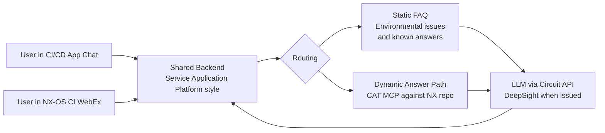

# Cisco CI/CD AI Engagement — Weekly Status

**Week of:** April 27 through May 1, 2026

---

## Status by item

### Delivered to date

| Item | Detail |
|------|--------|
| Issue categorization skill and dashboard | Built, on the main CI/CD repository |
| Build log commit attribution at the single-commit level | Working |
| WebEx bot | Complete on the webex-skills branch; deployable on temporary ADS via Podman container |
| CAT MCP installation | Installed in VS Code with four tools identified; OAuth resolved |
| NX repository access path | User identifiers posted in the engagement chat; first sign-on prerequisite communicated to the team |
| Permanent ADS standalone provisioning request | Submitted Friday April 24 |
| CN-SJC-STANDALONE bundle membership request | Submitted Friday April 24 |
| Deployment architecture decided | On-demand pull plus low-frequency dashboard refresh; user-session personalization with group concept; no central poller |
| Repository destination clarified | All skills target the main CI/CD repository; SME-KB is a separate scope |

### In progress this week

| Item | Detail |
|------|--------|
| CI/CD application stand-up on ADS | Cisco-side deployment is targeted to land Monday; BayOne is ready to fall back to direct stand-up on temporary ADS if needed |
| Service Application Platform style backend | Architecture work underway |
| Skills committed to the main CI/CD repository with the ds agent init pattern | Three skills identified for inventory documentation; commitment to repository and ds agent init validation underway |

### Planned to start this week

| Item | Detail |
|------|--------|
| Static FAQ extraction and chat wiring | Source data already exists in the prior answer corpus |
| CAT MCP integration as the dynamic answer path | Execution begins after the NX repository sign-on prerequisite is cleared |
| WebEx bot deployment on temporary ADS via Podman container | Container build and deployment to temporary ADS |
| End-to-end demonstration on ADS | Final dry run earlier in the week so any gaps surface before Friday |

---

## Open items and access

| Item | Status |
|------|--------|
| NX repository lead-only access for the team | User identifiers posted last Friday. Each team member completing the first sign-on to the NX GitHub server is the gating step before access can be granted. |
| Permanent ADS provisioning | Standard onboarding request submitted Friday April 24. Tenant reflection follow-up open with the Cisco access owner. |
| CN-SJC-STANDALONE bundle membership | Submitted Friday April 24; in the standard provisioning window. |
| Main CI/CD repository as destination for all skills | Confirmed last Friday. SME-KB is a separate repository and not the destination for skill commits. |
| MCP viewer playground | Coming soon per the Cisco team; awaiting availability for external MCP validation. |
| DeepSight credentials | Targeted for issuance after the working demonstration. |
| Asynchronous unblocking via the engagement chat | Active. Either side may post blockers between meetings. |

---

## Recent closures

- ~~NX repository access path defined and committed~~ (resolved last Friday; user identifiers posted; sign-on prerequisite communicated to the team)
- ~~CI/CD repository destination clarified between main and SME-KB~~ (resolved last Friday)
- ~~Deployment form decided: on-demand pull plus low-frequency dashboard refresh, no central poller, user-session personalization with the group concept for managers~~ (resolved last Friday)
- ~~Next-week target defined~~ (resolved last Friday)
- ~~Friday-versus-Monday delivery cadence and format decided: Monday GitHub markdown summary, weekly issues tracked in the CI/CD repository~~ (resolved last Friday)

---

## New items added this week

No new scope items being added by BayOne this week. The plan above reflects the deliverable defined last Friday.

---

## Future pipeline

The CI/CD AI Assistant application will be deployed on ADS with the CAT MCP plugged into the backend. Static FAQ entries will cover environmental issues and recurring questions for which the answers are already known. Dynamic answers will be handled by the CAT MCP, which will query the NX repository at request time. Both routes will feed the same chat user interface. A WebEx bot deployed on the NX-OS CI pipeline will share the same backend so users can ask the same questions from either surface. Initial LLM access will run through the circuit API. DeepSight credentials will migrate in once issued.

---

*Open items, in-flight items, and recent closures will be reflected in the GitHub issues list on the CI/CD repository as work progresses through the week.*
