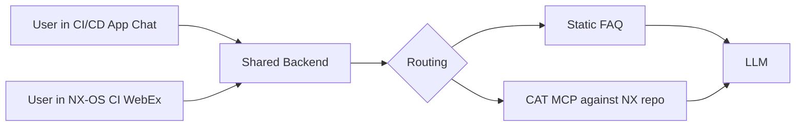

# Cisco CI/CD AI Engagement Weekly Status

**Week of April 27 to May 1, 2026**

---

## Current work

| Workstream | Status | Dependencies |
|---|---|---|
| CI/CD application on ADS | Cisco-side deployment in flight per Friday's discussion. BayOne fallback on Temp ADS ready. | Cisco platform team deployment. Temp ADS provisioning if fallback path. |
| Backend (Service Application Platform style, two pluggable frontends) | Architecture in flight. Backend designed to feed the chat in the CI/CD application and the WebEx bot on the NX-OS CI pipeline from one shared source. | None blocking. |
| Static FAQ wiring | Source corpus identified. Extraction starts this week. | Backend availability. |
| CAT MCP dynamic answer path | Installed. Four tools identified. OAuth resolved. Live execution begins after team sign-on completes. | Each BayOne team member completes first sign-on to the NX GitHub server. |
| WebEx bot deployment on the NX-OS CI pipeline | Bot built and validated locally. Cisco IT registration approved. Deployment to Temp ADS this week. Podman container build and LLM credential wiring are the remaining deployment steps. | ADS environment access. LLM credential path through DeepSight. |
| Skills on main CI/CD repository | Three skills committed: NxOS-Issue-Categorizer, WebEx-Bot-Builder, WebEx-Solution-Architect. Inventory documentation and ds agent init pattern validation this week. | None blocking. |
| Build dependency graph for commits and PRs | Current approach understood and documented from Justin last week. Deeper mapping framework being finalized and shared this week. | None blocking. |

---

## Friday May 1 deployment target

The CI/CD application will run on ADS with a chat interface that handles both static and dynamic question paths. Static FAQ entries will cover environmental issues and recurring questions for which answers already exist. Dynamic answers will be handled by the CAT MCP, which will query the NX repository at request time. Both routes will feed the same chat interface. A WebEx bot deployed on the NX-OS CI pipeline will share the same backend so users can ask the same questions from either surface. LLM access will run through DeepSight credentials once issued.

---

## New items added this week

Regression protection framework. UI automation (Playwright-based) plus backend validation of the pipeline and business logic. Modular and adapter-based so the core is reusable across other Cisco applications. Framework derived from prior BayOne work, with an adapter layer built specifically for the CI/CD application.

---

## Open items and access

| Item | Status | Dependency or Unblock |
|---|---|---|
| NX repository lead-only access for the team | User identifiers posted last Friday. First sign-on to the NX GitHub server is the gating step before access can be granted. | Each BayOne team member completes first sign-on. |
| Permanent ADS provisioning | Standard onboarding request submitted Friday April 24. Escalation in flight. | Cisco access provisioning workflow. |
| CN-SJC-STANDALONE bundle membership | Submitted Friday April 24. In the standard provisioning window. | Cisco provisioning. |
| MCP viewer playground | Coming soon per the Cisco team. Will be used for external MCP validation before integration. | Cisco platform team launch. |
| DeepSight credentials | Issuance gated on the team operating from an ADS environment. | ADS environment access (Permanent or Temp). |
| Asynchronous unblocking via the engagement chat | Active. Either side may post blockers between meetings. | None. |

---

## Architecture overview

---

## Recent closures

Items resolved between the Friday April 24 sync and this update.

- ~~NX repository access path defined~~
- ~~CI/CD repository destination clarified between main and SME-KB~~
- ~~Deployment form decided~~
- ~~Friday May 1 deployment target defined~~
- ~~Monday weekly cadence and format decided~~
