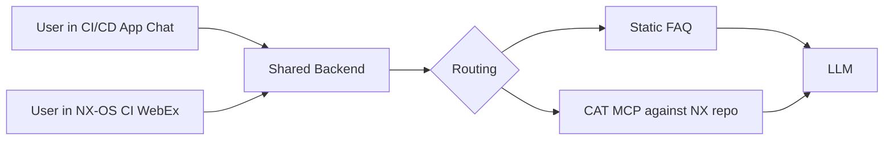

# Cisco CI/CD AI Engagement Weekly Status

**Week of April 27 to May 1, 2026**

---

## Current work

| Workstream | Status | Dependencies |
|---|---|---|
| Backend (Service Application Platform style, two pluggable frontends) | Architecture in flight. Backend designed to feed the chat in the CI/CD application and the WebEx bot on the NX-OS CI pipeline from one shared source. | None blocking. |
| Static FAQ wiring | NxOS-Issue-Categorizer skill built. FAQ content already extracted and mapped automatically by the skill. Wiring the static answer path into the CI/CD application chat interface this week. | CI/CD application deployment. |
| CAT MCP integration (dynamic answer path) | CAT MCP installed with four tools identified; OAuth resolved. Wiring the dynamic answer path into the CI/CD application chat interface this week, with live execution after team sign-on completes. | CI/CD application deployment. NX repository sign-on by each team member. |
| WebEx bot deployment on the NX-OS CI pipeline | Bot backend built and validated locally. Deployment requires a Cisco-side service account or centralized deployment ID, bot name and bot ID, access token, WebEx bot compliance criteria, and IT audit and approval (current bot was flagged as non-compliant April 27). See Critical path blockers and clarifications needed. | ADS environment access. LLM credential path. Cisco-side deployment infrastructure for the bot. |
| Skills on main CI/CD repository | Eight skills currently committed on the `skills/webex` branch of the DeepSight CI/CD repository (see Skills currently committed below). Documentation and ds agent init pattern validation this week. | None blocking. |
| Build dependency graph for commits and PRs | Current approach understood and documented from Justin last week. Deeper mapping framework being finalized and shared this week. | None blocking. |

---

## Open items and access

| Item | Status | Dependency or Unblock |
|---|---|---|
| NX repository lead-only access for the team | User identifiers posted last Friday. First sign-on to the NX GitHub server is the gating step before access can be granted. | Each BayOne team member completes first sign-on. |
| Cisco-side CI/CD application deployment | Cisco platform team deployment in flight per Friday's discussion. BayOne plugs business logic in once it is live. BayOne is ready to stand up directly on Temp ADS as a fallback if needed. | Cisco platform team deployment. ADS environment available. |
| MCP viewer playground | Coming soon per the Cisco team. Will be used for external MCP validation before integration. | Cisco platform team launch. |
| Asynchronous unblocking via the engagement chat | Active. Either side may post blockers between meetings. | None. |

The major access blockers (Permanent ADS availability, language model credentials path) are tracked in Critical path blockers and clarifications needed below.

---

## Critical path blockers and clarifications needed

The items below are on the critical path for Friday's first deployment. Each needs clarification or unblocking from the Cisco side so the team can complete the work in the available window.

1. **Permanent ADS availability.** The team has been requesting Permanent ADS access since April 14, with follow-up on April 21. On April 24, Permanent ADS resources were noted as currently constrained on the Cisco side.
   - **Who is responsible for Permanent ADS provisioning, and is that even possible given the current resource constraints?**
   - **If no Permanent ADS servers are currently available on the Cisco side, how could one be provisioned for this engagement?**
   - **Caveat on the Friday deliverable:** If a Permanent ADS is not available, the only possible path forward for Friday is to deploy on the Temporary ADS server, which is now connected and ready.
2. **Language model access path.** Language model features require credentials. Circuit API was indicated as not the appropriate production path. DeepSight credentials are gated on the team operating from an ADS environment. Even with ADS and DeepSight in place, the language model access path is not yet confirmed.
   - **What is the language model access path for the Friday deployment, and is interim Circuit API use acceptable until the production path is in place?**
3. **WebEx bot deployment infrastructure.** The bot backend is built. Going live requires meeting WebEx bot compliance criteria and completing IT audit and approval, which issues the bot name, ID, and access token. The current bot was flagged as non-compliant on April 27.
   - **Can you point us to the WebEx bot compliance criteria so the rebuild can meet them on resubmission?**
   - **What is the Friday expectation for the WebEx bot, given that audit and approval timing is outside BayOne's control?**
     - Prior turnaround was more than a week.
     - BayOne can resubmit on Wednesday once the criteria are in hand.
   - **Caveat on the deployment ID:** BayOne can deploy the bot under one of our Cisco-issued user IDs to meet the Friday timeline. The proper pattern would be a service account or centralized deployment ID if one is available, since deployment under a personal user account ties the bot's lifecycle to that individual. Flagging as a caveat, not a blocker.
4. **CAT MCP querying mechanism.** Chat issues arrive with PR IDs. The CAT MCP requires CAT IDs to query. A PR-to-CAT mapping is required for the dynamic answer path to function end to end.
   - **Does this mapping exist on the Cisco side, or is BayOne expected to construct it as part of the integration?**
5. **Skills repository destination.** Earlier guidance pointed to two destinations (the main CI/CD repository and the master skills repository).
   - Working approach is to keep skills on the CI/CD repository during development and promote to the master skills repository after testing and verification.
     - **Will skills stay on the CI/CD repository during development, with promotion to the master skills repository after testing and verification?**

---

## Skills currently committed

The following skills are currently committed on the `skills/webex` branch of the DeepSight CI/CD repository. Final repository destination is tracked in Critical path blockers and clarifications needed item 5.

| Skill |
|---|
| build-issue-responder |
| cat-issue-responder |
| codenet-issue-responder |
| issue-response-router |
| nxos-issue-categorizer |
| sanity-issue-responder |
| webex-bot-builder |
| webex-solution-architect |

---

## Friday May 1 deployment target

This is the first deployment of the chat-based assistance in the CI/CD application, with a paired WebEx bot on the NX-OS CI pipeline. The initial release is a static and dynamic FAQ. Static entries cover environmental issues and recurring questions for which answers already exist. Dynamic answers come through the CAT MCP, which queries the NX repository at request time. Both surfaces share the same backend so users can ask the same questions from either the chat in the application or the WebEx bot.

This is a first pass, with incremental improvement to follow as the team uses it and as feedback from team usage and internal testing comes in.

Pre-deployment internal testing has been limited by access constraints (see Critical path blockers and clarifications needed above). Validation will continue post-deployment as access is established and feedback comes in.

---

## Architecture overview

---

## Recent closures

Items resolved between the Friday April 24 sync and this update.

- ~~NX repository access path defined~~
- ~~CI/CD repository destination clarified between main and SME-KB~~
- ~~Deployment form decided~~
- ~~Friday May 1 deployment target defined~~
- ~~Monday weekly cadence and format decided~~
- ~~CN-SJC-STANDALONE bundle membership granted; Temp ADS connected and ready~~
