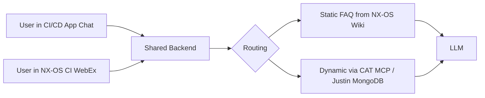

# Cisco CI/CD AI Engagement Weekly Status

**Week of April 27 to May 1, 2026**
**Last updated:** Wednesday April 29, 2026

---

## Accomplished this week

- **ADS machines provisioned by Divakar.** Two machines, `divvenka-qa-1` and `divvenka-qa-2`, 16 cores and 32 GB each, on the `CN-SJC-STANDALONE` bundle. Spec confirmed live during the Monday sync.
- **CAT MCP PR-mapping resolved end to end.** Anupma's walkthrough confirmed the cache request data path provides the full PR mapping plus rich metadata (branch, submitter, bug ID, SHA, sub-initiator, all checks). The mapping table BayOne expected to construct is not needed.
- **Skills repository destination confirmed.** Develop on the CI/CD repository `skills/webex` branch and promote to the master skills repository (SME KB) once production grade. Confirmed verbatim by Srinivas.
- **WebEx bot deployment identity resolved.** Bot will deploy under the existing `DSA Atlas` / `DSR Class` generic user ID. Anupma to fill the form on BayOne's behalf using BayOne's prior submission as the template.
- **Static FAQ source path agreed.** Bot will scrape the existing NX-OS wiki for static answers, with a chat-to-wiki feedback loop proposed and accepted for surfacing chat-resolved fixes back into the wiki.
- **Justin's GitHub-event MongoDB endpoint shared.** A working endpoint that returns PR status with all checks. Concrete data source for the dynamic answer path; either complementary to or substitutable for direct CAT MCP queries.
- **PR-to-commit mapping documentation, implementation, and rollback flow diagram delivered.** Generic documentation, working `pr_to_commit_mapping.py` against CI build logs and CD diffs with high-confidence mappings and evidence trails per commit, plus a 10-step rollback analysis flow diagram covering the release-lead PR backout use case.
- **Nine skills committed on `skills/webex`** including the new `wiki-issue-responder` and updated `issue-response-router` (now supports static-vs-dynamic routing with regex-based PR/CAT/job identifier detection).

---

## Current work

| | Workstream | Status | Dependencies |
|---|---|---|---|
| **Friday May 1 integrated delivery: CI/CD application chat plus WebEx bot on the NX-OS pipeline** | | | |
| | Backend (Service Application Platform style, two pluggable frontends) | Architecture in flight. Backend feeds both the chat in the CI/CD application and the WebEx bot from one shared source. | None blocking. |
| | Static FAQ wiring | NX-OS wiki as source of truth. Wiki content extraction and bot wiring this week. | NX-OS wiki link from Divakar. |
| | CAT MCP integration (dynamic answer path) | Cache request data path identified Monday; mapping table not required. Justin's MongoDB endpoint also available as a parallel data source. Wiring this week. | ADS user-group access for live execution. |
| | WebEx bot deployment on NX-OS CI pipeline | Bot backend built and validated locally. Deployment under `DSA Atlas` / `DSR Class` generic user ID confirmed Monday. | WebEx bot compliance criteria from Cisco IT. |
| **Static-vs-dynamic intersection analysis (Srinivas request from Monday)** | | | |
| | Six-month classification of unanswered NX-OS chat questions on the existing `nxos-issue-categorizer` dashboard, with a six-month toggle | In flight, landing today. | None blocking. |
| **Skills on the main CI/CD repository** | | | |
| | Nine skills committed on `skills/webex` (see Skills currently committed below) | Documentation and `ds agent init` pattern validation this week. | None blocking. |
| **Build dependency graph and PR-to-commit mapping (Namita's track)** | | | |
| | Generic PR-to-commit mapping documentation | Committed at `build-issue-responder/PR_to_commit_mapping_generic/`. | None blocking. |
| | `pr_to_commit_mapping.py` working implementation | Reads CI build logs and CD diffs; produces structured JSON with high-confidence mappings and per-commit evidence trails. | None blocking. |
| | Rollback flow diagram | 10-step incident-analysis-to-rollback flow capturing the release-lead PR backout use case. | None blocking. |

---

## Open items and access

| | Item | Status | Dependency or Unblock |
|---|---|---|---|
| **ADS host access for the team** | | | |
| | Machines provisioned and reachable | Hosts are gated by REALM user-group membership in `oneaccess.cisco.com` (`CN-ACI-HOSTBUNDLE-GROUP-ACCESS`) or `myid-groups.cisco.com` (`DEVXADS-GROUP`, `NGDEVX-DEV`, `WIT-REALM-GROUP`). Realm Request Access submitted Tuesday. | User-group owner names and approvals. |
| **NX-OS wiki link for static FAQ extraction** | | | |
| | Pending share in the engagement chat | Awaiting | Divakar to share the link. |
| **WebEx bot compliance criteria** | | | |
| | Non-compliance flag from Cisco IT did not include the criteria | Resubmission under `DSA Atlas` is ready when the criteria arrive | Cisco IT to share compliance criteria. |
| **Asynchronous unblocking via the engagement chat** | | | |
| | Active. Either side may post blockers between meetings. | Active | None. |

The major access blockers (ADS user-group access, wiki link, bot compliance criteria) are tracked in Critical path blockers and clarifications needed below.

---

## Critical path blockers and clarifications needed

The items below are on the critical path for Friday's first deployment. Each needs clarification or unblocking from the Cisco side so the team can complete the work in the available window.

1. **ADS user-group access ownership.** The team has been blocked from logging into the provisioned hosts since Tuesday morning despite submitting Realm requests.
   - **Who owns the user groups `CN-ACI-HOSTBUNDLE-GROUP-ACCESS`, `DEVXADS-GROUP`, `NGDEVX-DEV`, and `WIT-REALM-GROUP`?**
   - **Can those memberships be approved today so the team can use the ADS provisioned Monday?**
2. **NX-OS wiki link.** The static FAQ wiring is the source-of-truth pivot from chat scraping to wiki scraping. The work is queued; the link unblocks it.
   - **Can Divakar share the wiki link in the engagement chat?**
3. **WebEx bot compliance criteria.** Resubmission under `DSA Atlas` is ready; the criteria are not.
   - **Can Cisco IT share the compliance criteria so the rebuild can meet them on resubmission?**
4. **PR Apollo and Builder Triaging scope alignment.** Justin's existing MongoDB and the Builder Triaging tool overlap with parts of BayOne's planned work.
   - **Confirm BayOne builds the dynamic answer path on top of Justin's MongoDB plus the CAT MCP, rather than constructing a parallel system.**

---

## Skills currently committed

The following skills are currently committed on the `skills/webex` branch of the DeepSight CI/CD repository. Final repository destination per Skills repository destination decision: develop here, promote to the master skills repository (SME KB) once production grade.

| Skill |
|---|
| build-issue-responder |
| cat-issue-responder |
| codenet-issue-responder |
| issue-response-router (updated this week with static-vs-dynamic routing) |
| nxos-issue-categorizer |
| sanity-issue-responder |
| webex-bot-builder |
| webex-solution-architect |
| wiki-issue-responder (new this week) |

---

## Friday May 1 deployment target

This is the first deployment of the chat-based assistance in the CI/CD application, with a paired WebEx bot on the NX-OS CI pipeline. The initial release is a static and dynamic FAQ. Static entries come from the NX-OS wiki via scrape and indexing. Dynamic answers come through the CAT MCP cache request data or Justin's MongoDB at request time. Both surfaces share the same backend so users can ask the same questions from either the chat in the application or the WebEx bot.

This is a first pass, with incremental improvement to follow as the team uses it and as feedback from team usage and internal testing comes in.

Pre-deployment internal testing is gated on ADS user-group access landing this week.

---

## Architecture overview

---

## Recent closures

Items resolved between the Monday April 27 sync and this update.

- ~~ADS machines provisioned with the agreed 16 core / 32 GB spec~~
- ~~CAT MCP PR-mapping path identified via cache request structure (no mapping table needed)~~
- ~~Skills repository destination confirmed (CI/CD `skills/webex` to SME KB)~~
- ~~WebEx bot deployment identity resolved (DSA Atlas / DSR Class)~~
- ~~Static FAQ source path pivoted to NX-OS wiki~~
- ~~Justin's GitHub-event MongoDB endpoint shared~~
- ~~PR-to-commit mapping documentation, implementation, and rollback flow diagram landed on `skills/webex`~~
- ~~`wiki-issue-responder` skill added; `issue-response-router` extended with static-vs-dynamic routing~~
