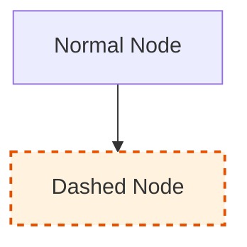
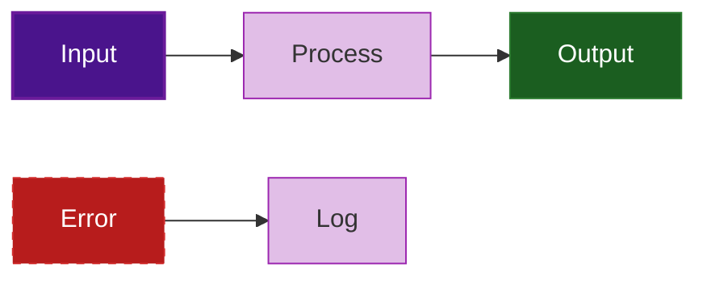
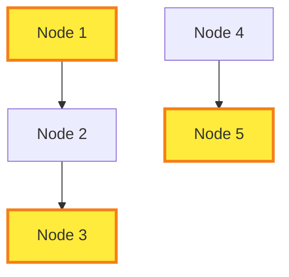
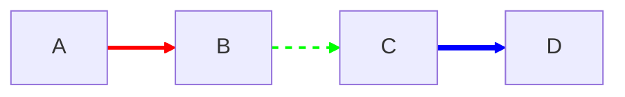
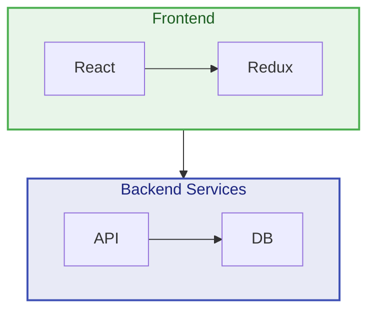
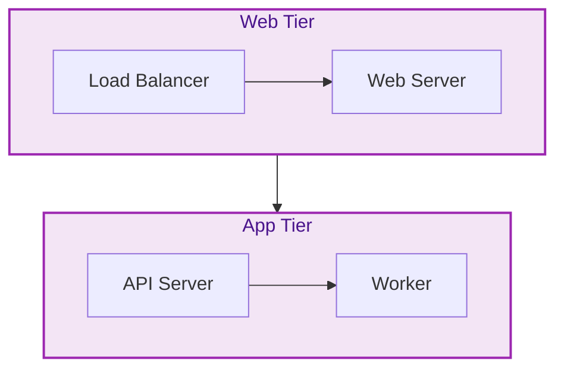
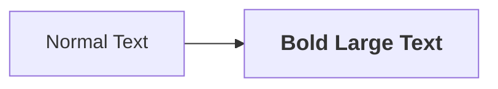
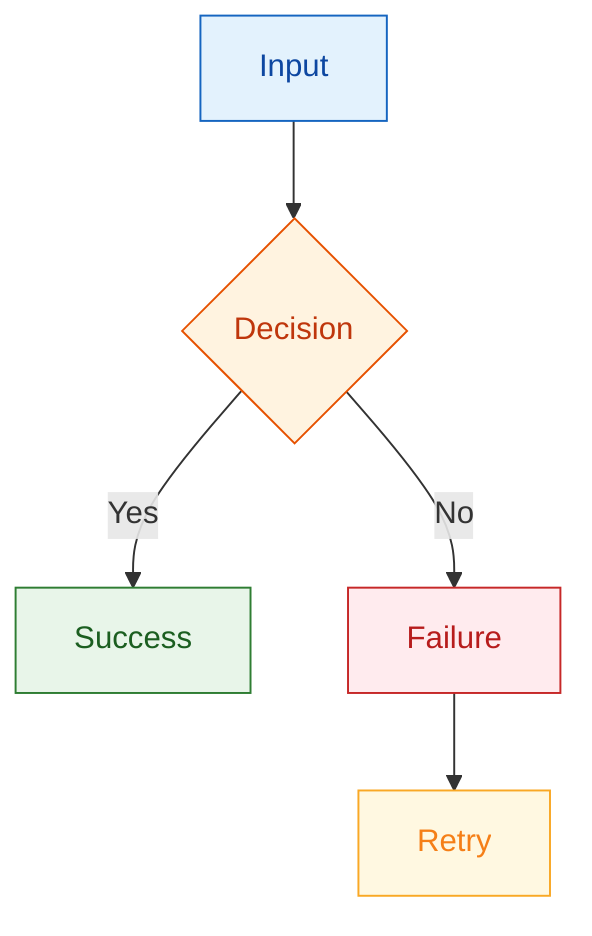

# Mermaid.js Styling, Theming, and Visual Customization -- Comprehensive Reference

**Source:** Official mermaid.js documentation + web research
**Date:** 2026-04-13
**Focus:** All styling, theming, and visual customization options

---

## Table of Contents

1. [Configuration Methods](#1-configuration-methods)
2. [Built-in Themes](#2-built-in-themes)
3. [Theme Variables (themeVariables)](#3-theme-variables-themevariables)
4. [Per-Node Styling (style Directive)](#4-per-node-styling-style-directive)
5. [Per-Class Styling (classDef and class)](#5-per-class-styling-classdef-and-class)
6. [Edge and Link Styling](#6-edge-and-link-styling)
7. [Subgraph and Cluster Styling](#7-subgraph-and-cluster-styling)
8. [CSS Overrides (External Stylesheet)](#8-css-overrides-external-stylesheet)
9. [Font Customization](#9-font-customization)
10. [Diagram Look (v11+)](#10-diagram-look-v11)
11. [Dark Mode and Light Mode](#11-dark-mode-and-light-mode)
12. [Professional Color Palette Best Practices](#12-professional-color-palette-best-practices)
13. [SVG CSS Properties Reference](#13-svg-css-properties-reference)
14. [Version Differences and Notes](#14-version-differences-and-notes)
15. [Sources](#15-sources)

---

## 1. Configuration Methods

There are three ways to apply styling and theming in mermaid.js, each with different scope:

### 1a. Site-Wide: JavaScript initialize Call

Used when embedding mermaid on a web page. Applies to all diagrams on the page.

```javascript
mermaid.initialize({
  theme: 'base',
  themeVariables: {
    primaryColor: '#4a148c',
    primaryTextColor: '#ffffff',
    primaryBorderColor: '#6a1b9a',
    lineColor: '#7e57c2',
    secondaryColor: '#e1bee7',
    tertiaryColor: '#f3e5f5'
  }
});
```

### 1b. Per-Diagram: Frontmatter (Recommended in v10.5+)

YAML block at the top of the diagram code, delimited by `---`. This is the modern, recommended approach.

```
---
config:
  theme: base
  themeVariables:
    primaryColor: "#4a148c"
    primaryTextColor: "#ffffff"
    primaryBorderColor: "#6a1b9a"
    lineColor: "#7e57c2"
    secondaryColor: "#e1bee7"
    tertiaryColor: "#f3e5f5"
---
flowchart LR
  A --> B --> C
```

**Important:** Frontmatter uses YAML syntax. Indentation must be consistent. Keys are case-sensitive.

### 1c. Per-Diagram: Init Directive (Deprecated from v10.5.0, Still Functional)

Placed at the very beginning of the diagram code. Both `init` and `initialize` are accepted.

```
%%{init: {'theme': 'base', 'themeVariables': {'primaryColor': '#4a148c', 'primaryTextColor': '#ffffff', 'lineColor': '#7e57c2'}}}%%
flowchart LR
  A --> B --> C
```

**Critical rule:** The theming engine only recognizes **hex colors** (e.g., `#ff0000`), not color names (e.g., `red`). Always use hex values.

### Configuration Priority (Highest to Lowest)

1. Frontmatter configuration (per-diagram)
2. Init directive (per-diagram, deprecated)
3. `mermaid.initialize()` call (site-wide)
4. Built-in theme defaults

---

## 2. Built-in Themes

Mermaid provides five built-in themes. Only the **base** theme supports themeVariables customization.

### 2a. default

- **Appearance:** Mermaid's standard look. Blue-tinted nodes with clear contrast.
- **When to use:** General-purpose diagrams, quick prototyping, documentation where no specific branding is needed.
- **Background:** Light/white.
- **Node colors:** Blues and grays with good contrast.

```
---
config:
  theme: default
---
```

### 2b. dark

- **Appearance:** Dark background with light-colored elements. Designed for dark-mode contexts.
- **When to use:** Dark-themed websites, dark IDE environments, presentations with dark backgrounds.
- **Background:** Dark gray/near-black.
- **Node colors:** Muted blues/greens with light text.

```
---
config:
  theme: dark
---
```

### 2c. forest

- **Appearance:** Green-tinted palette. Organic, natural feel.
- **When to use:** Environmental topics, lighter-background contexts, diagrams where green is thematically appropriate.
- **Background:** Light/white.
- **Node colors:** Various greens with good contrast.

```
---
config:
  theme: forest
---
```

### 2d. neutral

- **Appearance:** Grayscale/minimal color palette. Clean and professional.
- **When to use:** Documents intended for black-and-white printing. Formal reports. Contexts where color should not convey meaning.
- **Background:** Light/white.
- **Node colors:** Grays, blacks, and whites.

```
---
config:
  theme: neutral
---
```

### 2e. base

- **Appearance:** Similar to default, but this is the **only theme that can be customized** via themeVariables.
- **When to use:** Any time you need custom colors or branding. Always use base when setting themeVariables.
- **Background:** Determined by your variable settings.
- **Node colors:** Fully customizable.

```
---
config:
  theme: base
  themeVariables:
    primaryColor: "#6a1b9a"
---
```

**Critical:** If you set themeVariables with any theme other than `base`, the variables will be ignored. The base theme is the only modifiable theme.

---

## 3. Theme Variables (themeVariables)

Theme variables control the color scheme and visual appearance of all diagram elements. They are organized into core variables (which drive many derived values) and diagram-specific variables.

### 3a. Core / Global Variables

These are the primary variables from which many others are derived. Changing these has cascading effects.

| Variable | Description | Default (base) | Notes |
|---|---|---|---|
| `primaryColor` | Main node background color | `#4a148c` (varies) | Drives `primaryBorderColor`, `primaryTextColor` derivation |
| `primaryTextColor` | Text color on primary-colored elements | Calculated | Derived from primaryColor for contrast |
| `primaryBorderColor` | Border color of primary elements | Calculated | Derived from primaryColor (inverted/darkened ~10%) |
| `secondaryColor` | Background for secondary elements | Calculated | Derived from primaryColor |
| `secondaryTextColor` | Text on secondary elements | Calculated | Derived from secondaryColor |
| `secondaryBorderColor` | Border of secondary elements | Calculated | Derived from secondaryColor |
| `tertiaryColor` | Background for tertiary elements (clusters, etc.) | Calculated | Derived from primaryColor |
| `tertiaryTextColor` | Text on tertiary elements | Calculated | Derived from tertiaryColor |
| `tertiaryBorderColor` | Border of tertiary elements | Calculated | Derived from tertiaryColor |
| `lineColor` | Color of connecting lines/edges | Varies | Controls all connection lines |
| `textColor` | General text color | Varies | Fallback text color |
| `background` | Diagram background color | `#ffffff` | Overall diagram background |
| `fontFamily` | Font family for all text | `"Open Sans", sans-serif` | Applied globally |
| `fontSize` | Base font size | `14px` | Applied globally |
| `darkMode` | Enable dark mode calculations | `false` | Changes how derived colors are calculated |

### 3b. Flowchart-Specific Variables

| Variable | Description | Default Derivation |
|---|---|---|
| `nodeBkg` | Node background color | Based on `primaryColor` |
| `nodeBorder` | Node border color | Based on `primaryBorderColor` |
| `nodeTextColor` | Node text color | Based on `primaryTextColor` |
| `mainBkg` | Main background | Based on `primaryColor` |
| `clusterBkg` | Cluster/subgraph background | Based on `tertiaryColor` |
| `clusterBorder` | Cluster/subgraph border | Based on `tertiaryBorderColor` |
| `defaultLinkColor` | Default link/edge color | Based on `lineColor` |
| `titleColor` | Title text color | Based on `tertiaryTextColor` |
| `edgeLabelBackground` | Background behind edge labels | Based on `secondaryColor` |
| `arrowheadColor` | Color of arrowheads | Based on `lineColor` |

### 3c. Sequence Diagram Variables

| Variable | Description | Default Derivation |
|---|---|---|
| `actorBkg` | Actor box background | Based on `primaryColor` |
| `actorBorder` | Actor box border | Based on `primaryBorderColor` |
| `actorTextColor` | Actor text color | Based on `primaryTextColor` |
| `actorLineColor` | Actor lifeline color | Based on `lineColor` |
| `signalColor` | Signal/message line color | Based on `lineColor` |
| `signalTextColor` | Signal/message text color | Based on `textColor` |
| `labelBoxBkgColor` | Label box background | Based on `primaryColor` |
| `labelBoxBorderColor` | Label box border | Based on `primaryBorderColor` |
| `labelTextColor` | Label text color | Based on `primaryTextColor` |
| `loopTextColor` | Loop text color | Based on `textColor` |
| `noteBkgColor` | Note background color | Based on `secondaryColor` |
| `noteBorderColor` | Note border color | Based on `secondaryBorderColor` |
| `noteTextColor` | Note text color | Based on `secondaryTextColor` |
| `activationBkgColor` | Activation box background | Based on `secondaryColor` |
| `activationBorderColor` | Activation box border | Based on `primaryBorderColor` |
| `sequenceNumberColor` | Sequence number text color | Calculated |

### 3d. Gantt Chart Variables

| Variable | Description | Default Derivation |
|---|---|---|
| `sectionBkgColor` | Section background (even rows) | Based on `primaryColor` |
| `altSectionBkgColor` | Alternating section background (odd rows) | Calculated |
| `sectionBkgColor2` | Secondary section background | Calculated |
| `taskBkgColor` | Task bar background | Based on `primaryColor` |
| `taskBorderColor` | Task bar border | Based on `primaryBorderColor` |
| `taskTextColor` | Task text color | Based on `primaryTextColor` |
| `taskTextLightColor` | Light task text color | Calculated |
| `taskTextOutsideColor` | Text outside tasks | Calculated |
| `taskTextClickableColor` | Clickable task text color | Calculated |
| `activeTaskBkgColor` | Active task background | Calculated |
| `activeTaskBorderColor` | Active task border | Calculated |
| `gridColor` | Grid line color | Based on `lineColor` |
| `doneTaskBkgColor` | Completed task background | Based on `secondaryColor` |
| `doneTaskBorderColor` | Completed task border | Calculated |
| `critBkgColor` | Critical task background | Calculated |
| `critBorderColor` | Critical task border | Calculated |
| `todayLineColor` | Today marker line color | Calculated |

### 3e. Pie Chart Variables

| Variable | Description |
|---|---|
| `pie1` through `pie12` | Colors for pie slices 1-12 (in declaration order) |
| `pieTitleTextSize` | Title text size |
| `pieTitleTextColor` | Title text color |
| `pieSectionTextSize` | Section label text size |
| `pieSectionTextColor` | Section label text color |
| `pieStrokeColor` | Stroke color between slices |
| `pieStrokeWidth` | Stroke width between slices |
| `pieOuterStrokeWidth` | Outer border stroke width |
| `pieOuterStrokeColor` | Outer border stroke color |
| `pieOpacity` | Opacity of pie slices |

### 3f. GitGraph Variables

| Variable | Description |
|---|---|
| `git0` through `git7` | Branch colors (up to 8 branches) |
| `gitBranchLabel0` through `gitBranchLabel7` | Branch label colors (up to 8) |
| `gitInv0` through `gitInv7` | Inverse branch colors |
| `tagLabelColor` | Tag label text color |
| `tagLabelBackground` | Tag label background |
| `tagLabelBorder` | Tag label border color |
| `tagLabelFontSize` | Tag label font size |
| `commitLabelColor` | Commit label text color |
| `commitLabelBackground` | Commit label background |
| `commitLabelFontSize` | Commit label font size |

### 3g. Timeline / Journey Variables

| Variable | Description |
|---|---|
| `cScale0` through `cScale11` | Section background colors (up to 12 sections) |
| `cScaleLabel0` through `cScaleLabel11` | Section foreground/text colors (up to 12) |
| `cScalePeer1` through `cScalePeer11` | Peer section colors |

### 3h. State Diagram Variables

| Variable | Description | Default Derivation |
|---|---|---|
| `labelColor` | State label color | Based on `primaryTextColor` |
| `altBackground` | Composite state background | Based on `tertiaryColor` |
| `compositeBackground` | Composite state fill | Calculated |
| `compositeBorder` | Composite state border | Calculated |
| `compositeTitleBackground` | Composite title background | Calculated |
| `innerEndBackground` | Inner end state fill | Calculated |
| `specialStateColor` | Special state (fork/join) color | Based on `lineColor` |

### 3i. Class Diagram Variables

| Variable | Description | Default Derivation |
|---|---|---|
| `classText` | Class text color | Based on `primaryTextColor` |
| `relationColor` | Relationship line color | Based on `lineColor` |
| `relationLabelColor` | Relationship label color | Calculated |
| `relationLabelBackground` | Relationship label background | Calculated |

### 3j. Entity Relationship Diagram Variables

| Variable | Description | Default Derivation |
|---|---|---|
| `entityBkg` | Entity background | Based on `primaryColor` |
| `entityBorder` | Entity border | Based on `primaryBorderColor` |
| `attributeBackgroundColorOdd` | Odd attribute row background | Calculated |
| `attributeBackgroundColorEven` | Even attribute row background | Calculated |

### 3k. Derived Color Behavior

Mermaid automatically derives many variables from core variables to ensure readability:

- **`primaryBorderColor`** = derived from `primaryColor` via color inversion, hue shift, or darkening/lightening by ~10%
- **`secondaryColor`** = derived from `primaryColor`
- **`tertiaryColor`** = derived from `primaryColor`
- All text colors attempt to maintain sufficient contrast with their background
- In **darkMode**, derived colors are lightened instead of darkened

This means setting just `primaryColor` will cascade to update dozens of related variables automatically.

---

## 4. Per-Node Styling (style Directive)

The `style` directive applies inline styles to individual nodes by their ID.

### Syntax

```
style <nodeID> <property1>:<value1>,<property2>:<value2>,...
```

### Supported Properties

| Property | Description | Example |
|---|---|---|
| `fill` | Node background color | `fill:#10b981` |
| `stroke` | Node border color | `stroke:#059669` |
| `stroke-width` | Border thickness | `stroke-width:3px` |
| `stroke-dasharray` | Dashed border pattern | `stroke-dasharray:5 5` |
| `color` | Text color | `color:#ffffff` |
| `rx` | Horizontal corner radius | `rx:10` |
| `ry` | Vertical corner radius | `ry:10` |
| `opacity` | Element opacity | `opacity:0.8` |
| `font-size` | Text size | `font-size:16px` |
| `font-weight` | Text weight | `font-weight:bold` |

### Examples


**Per-node styling with dashed border:**



### Important Notes

- When using `stroke-dasharray`, escape commas within the value since commas are delimiters in mermaid style syntax. Use spaces instead: `stroke-dasharray:5 5` (not `stroke-dasharray:5,5`).
- Multiple style statements can target different nodes.
- Style statements go at the end of the diagram definition.

---

## 5. Per-Class Styling (classDef and class)

For reusable styles across multiple nodes, use `classDef` to define a class and `class` or `:::` to apply it.

### Defining a Class

```
classDef <className> <property1>:<value1>,<property2>:<value2>,...
```

### Applying a Class -- Method 1: class Statement

```
class <nodeID1>,<nodeID2>,... <className>
```

### Applying a Class -- Method 2: Triple-Colon (:::) Operator

Applied inline when defining the node:

```
A[My Node]:::myClass
```

### Complete Example



### Applying a Class to Multiple Nodes



### Default Class

Apply a class to all nodes that do not have an explicit class:

```
classDef default fill:#f9f9f9,stroke:#333,stroke-width:1px,color:#333
```

### Properties Supported in classDef

All the same CSS/SVG properties that work with the `style` directive work with `classDef`:

- `fill`, `stroke`, `stroke-width`, `stroke-dasharray`
- `color`, `font-size`, `font-weight`, `font-family`
- `rx`, `ry` (rounded corners)
- `opacity`

---

## 6. Edge and Link Styling

### 6a. linkStyle Directive

Edges/links are styled by their **index** (order of appearance in the diagram definition, starting from 0), not by ID.

**Syntax:**

```
linkStyle <index> <property1>:<value1>,<property2>:<value2>,...
```

**Supported Properties:**

| Property | Description | Example |
|---|---|---|
| `stroke` | Line color | `stroke:#ff3` |
| `stroke-width` | Line thickness | `stroke-width:4px` |
| `stroke-dasharray` | Dashed pattern | `stroke-dasharray:5 5` |
| `color` | Label text color | `color:red` |
| `fill` | Not typically visible on paths | `fill:none` |

**Example:**



### 6b. Styling Multiple Links

Separate link indices with commas:

```
linkStyle 0,1,2 stroke:#7e57c2,stroke-width:2px
```

### 6c. Default Link Style

Apply a style to all links:

```
linkStyle default stroke:#7e57c2,stroke-width:2px
```

### 6d. Edge Label Styling

Edge labels cannot be styled individually with linkStyle. The only way to control edge label backgrounds is through the `edgeLabelBackground` themeVariable:

```
---
config:
  theme: base
  themeVariables:
    edgeLabelBackground: "#ffffff"
---
```

**Known limitation:** The `background-color` attribute in linkStyle is applied to the connector path node as an inline style, but SVG `<path>` elements do not support `background-color` -- only `fill`. This means you cannot set per-link label background colors through linkStyle.

### 6e. Arrow/Arrowhead Styling

Arrowhead colors are controlled by the `arrowheadColor` themeVariable or by the `lineColor` variable. Styling individual arrowheads via CSS requires using attribute selectors:

```css
/* Use attribute-ending selectors (not exact ID selectors) */
[id$="-arrowhead"] {
  fill: #7e57c2;
}
```

**Note:** Directly coloring individual arrowheads via mermaid syntax is not practically supported.

---

## 7. Subgraph and Cluster Styling

### 7a. Using the style Directive on Subgraphs

Subgraphs can be styled using their ID (the name you give the subgraph):



### 7b. Using classDef on Subgraphs

classDef styling works on subgraphs **only if the subgraph is also referenced as a node** in the diagram (i.e., has edges connecting to/from it):



**Important limitation:** If the subgraph is not also used as a node (connected with edges), classDef will not apply. Use the `style` directive instead for disconnected subgraphs.

### 7c. Theme Variables for Clusters

The following themeVariables control cluster/subgraph appearance globally:

- `clusterBkg` -- Background color of all clusters
- `clusterBorder` -- Border color of all clusters
- `titleColor` -- Title text color for clusters

```
---
config:
  theme: base
  themeVariables:
    clusterBkg: "#f5f5f5"
    clusterBorder: "#9e9e9e"
    titleColor: "#333333"
---
```

### 7d. Subgraph Title Styling

To style a subgraph title, you can target it via the style directive with `color`:

```
style SubgraphID color:#4a148c
```

---

## 8. CSS Overrides (External Stylesheet)

Mermaid diagrams render as SVG, so they can be styled with CSS targeting SVG elements and mermaid-specific classes.

### 8a. Common CSS Selectors

| Selector | Targets |
|---|---|
| `.mermaid` | The mermaid container |
| `.node rect` | Rectangle nodes |
| `.node circle` | Circle nodes |
| `.node ellipse` | Ellipse nodes |
| `.node polygon` | Diamond/polygon nodes |
| `.node .label` | Node label text |
| `.edgeLabel` | Edge/link label containers |
| `.edgeLabel .label` | Edge label text |
| `.labelBkg` | Edge label background |
| `.edgePath path` | Edge/link paths (lines) |
| `.cluster rect` | Cluster/subgraph rectangles |
| `.cluster text` | Cluster/subgraph title text |
| `.marker` | Arrow markers |
| `.arrowheadPath` | Arrowhead path elements |

### 8b. Sequence Diagram CSS Selectors

| Selector | Targets |
|---|---|
| `.actor` | Actor boxes |
| `.actor-line` | Actor lifelines |
| `.messageLine0` | Solid message lines |
| `.messageLine1` | Dashed message lines |
| `.messageText` | Message label text |
| `.labelBox` | Loop/alt label boxes |
| `.labelText` | Loop/alt label text |
| `.loopText` | Loop condition text |
| `.loopLine` | Loop boundary lines |
| `.note` | Note boxes |
| `.noteText` | Note text |
| `.activation` | Activation bars |

### 8c. Example: External CSS Override

```css
/* Node styling */
.mermaid .node rect {
  fill: #4a148c !important;
  stroke: #6a1b9a !important;
  stroke-width: 2px !important;
  rx: 8px;
  ry: 8px;
}

.mermaid .node .label {
  color: #ffffff !important;
  font-family: 'Inter', sans-serif !important;
  font-size: 14px !important;
  font-weight: 600 !important;
}

/* Edge styling */
.mermaid .edgePath path {
  stroke: #7e57c2 !important;
  stroke-width: 2px !important;
}

/* Edge label styling */
.mermaid .edgeLabel {
  background-color: transparent !important;
}

.mermaid .edgeLabel .label {
  font-size: 12px !important;
  color: #666666 !important;
}

/* Cluster/subgraph styling */
.mermaid .cluster rect {
  fill: #f3e5f5 !important;
  stroke: #ce93d8 !important;
  stroke-width: 1.5px !important;
  rx: 4px;
  ry: 4px;
}

.mermaid .cluster text {
  fill: #4a148c !important;
  font-weight: 700 !important;
}

/* Arrowhead styling - use attribute selectors */
[id$="-arrowhead"] {
  fill: #7e57c2 !important;
}
```

### 8d. Important Notes on CSS Overrides

- **Use `!important`** to override mermaid's inline styles.
- **ID selectors changed in v10+**: Do not use exact ID selectors like `#arrowhead`. Instead use attribute-ending selectors: `[id$="-arrowhead"]`. Mermaid adds prefixes to internal element IDs to prevent conflicts.
- **SVG vs HTML properties**: SVG elements use `fill` instead of `background-color`, `stroke` instead of `border-color`. Standard CSS box-model properties (margin, padding, border) do not apply to SVG elements.
- **Edge labels use `<foreignObject>`**: Edge labels are rendered inside `foreignObject` elements, so they can accept some HTML CSS properties.

---

## 9. Font Customization

### 9a. Global Font Settings

Set globally via themeVariables or mermaid.initialize():

```
---
config:
  theme: base
  themeVariables:
    fontFamily: '"Inter", "Segoe UI", sans-serif'
    fontSize: 14px
---
```

Or via JavaScript:

```javascript
mermaid.initialize({
  theme: 'base',
  themeVariables: {
    fontFamily: '"Inter", "Segoe UI", sans-serif',
    fontSize: '14px'
  }
});
```

**Default font:** `"Open Sans", sans-serif`
**Default size:** `14px`

### 9b. Font Configuration Object

Mermaid supports a FontConfig structure for more granular control:

```javascript
{
  fontFamily: '"Inter", sans-serif',
  fontSize: '14px',
  fontWeight: '400'
}
```

### 9c. Per-Node Font Overrides

Use the `style` directive or `classDef`:



### 9d. CSS Font Overrides

```css
.mermaid .node .label {
  font-family: 'Inter', sans-serif !important;
  font-size: 14px !important;
  font-weight: 600 !important;
}

.mermaid .edgeLabel .label {
  font-family: 'Inter', sans-serif !important;
  font-size: 12px !important;
  font-weight: 400 !important;
}

.mermaid .cluster text {
  font-family: 'Inter', sans-serif !important;
  font-size: 13px !important;
  font-weight: 700 !important;
}
```

### 9e. Diagram-Specific Font Sizes

Some diagram types have their own font size overrides in the configuration:

```javascript
mermaid.initialize({
  sequence: {
    actorFontSize: '14px',
    actorFontFamily: '"Inter", sans-serif',
    actorFontWeight: '600',
    noteFontSize: '12px',
    noteFontFamily: '"Inter", sans-serif',
    messageFontSize: '13px',
    messageFontFamily: '"Inter", sans-serif'
  }
});
```

**Note:** There is a known issue where the global `fontSize` default can override diagram-specific font size values set for sequence and C4 diagrams (GitHub issue #3990).

---

## 10. Diagram Look (v11+)

Mermaid v11 introduced three visual "look" options that change the rendering style of diagrams.

### 10a. Classic Look (Default)

The traditional mermaid appearance. Clean geometric shapes with solid fills and strokes.

```
---
config:
  look: classic
---
```

### 10b. Neo Look

A sleek, modern style. More refined and polished. Best for professional presentations.

```
---
config:
  look: neo
---
```

### 10c. Hand-Drawn Look

Uses RoughJS to render a sketch-like, organic aesthetic. Informal, creative feel.

```
---
config:
  look: handDrawn
---
```

### 10d. Combining Look with Themes

The look and theme are independent settings that can be combined:

```
---
config:
  look: handDrawn
  theme: forest
---
flowchart LR
  A --> B --> C
```

```
---
config:
  look: neo
  theme: neutral
---
flowchart LR
  A --> B --> C
```

**Current support:** Look options are currently supported for flowcharts and state diagrams, with plans to extend to all diagram types.

---

## 11. Dark Mode and Light Mode

### 11a. Built-in Dark Theme

The simplest approach for dark mode:

```
---
config:
  theme: dark
---
```

### 11b. Custom Dark Theme via base

For branded dark themes, use base with dark-appropriate variables:

```
---
config:
  theme: base
  themeVariables:
    darkMode: true
    background: "#1a1a2e"
    primaryColor: "#7c3aed"
    primaryTextColor: "#e2e8f0"
    primaryBorderColor: "#8b5cf6"
    secondaryColor: "#312e81"
    tertiaryColor: "#1e1b4b"
    lineColor: "#a78bfa"
    textColor: "#e2e8f0"
    edgeLabelBackground: "#1e1b4b"
---
```

### 11c. Responsive Dark/Light Mode with CSS

**Approach 1: CSS prefers-color-scheme**

You cannot dynamically change a mermaid diagram's theme after rendering. However, you can detect the system preference and initialize accordingly:

```javascript
const isDark = window.matchMedia('(prefers-color-scheme: dark)').matches;
mermaid.initialize({
  theme: isDark ? 'dark' : 'default'
});
```

**Approach 2: Re-render on Theme Change**

Disable `startOnLoad`, store original diagram source, and re-render when the theme changes:

```javascript
// Disable auto-start
mermaid.initialize({ startOnLoad: false });

// Listen for theme changes
window.matchMedia('(prefers-color-scheme: dark)')
  .addEventListener('change', (e) => {
    const theme = e.matches ? 'dark' : 'default';
    mermaid.initialize({ theme });
    // Re-render all diagrams from stored source
    rerenderDiagrams();
  });
```

**Approach 3: Pre-render Both Themes**

Generate both light and dark SVGs, then use HTML `<picture>` with `<source>` media selectors:

```html
<picture>
  <source srcset="diagram-dark.svg" media="(prefers-color-scheme: dark)">
  
</picture>
```

**Approach 4: CSS Overrides for Both Modes**

```css
/* Light mode defaults (inherits mermaid theme) */

/* Dark mode overrides */
@media (prefers-color-scheme: dark) {
  .mermaid {
    background: #1a1a2e;
  }
  .mermaid .node rect {
    fill: #312e81 !important;
    stroke: #7c3aed !important;
  }
  .mermaid .node .label {
    color: #e2e8f0 !important;
  }
  .mermaid .edgePath path {
    stroke: #a78bfa !important;
  }
  .mermaid .cluster rect {
    fill: #1e1b4b !important;
    stroke: #4c1d95 !important;
  }
}
```

### 11d. Diagrams That Work in Both Contexts

Design principles for dual-mode compatibility:

- Use **medium-saturation colors** that have sufficient contrast on both light and dark backgrounds
- Avoid pure white (`#ffffff`) or pure black (`#000000`) as fill colors
- Use borders/strokes to define shapes rather than relying solely on fill contrast with background
- Set explicit `color` (text) values rather than relying on inherited defaults
- Test in both modes using the Mermaid Live Editor

---

## 12. Professional Color Palette Best Practices

### 12a. General Principles

1. **Limit your palette:** Use 3-5 colors maximum. Too many colors create visual noise.
2. **Maintain contrast:** Ensure text is readable against its background (WCAG AA minimum: 4.5:1 ratio).
3. **Use color meaningfully:** Assign colors to represent categories, status, or hierarchy -- not decoration.
4. **Be consistent:** Use the same color scheme across all diagrams in a document or presentation.
5. **Avoid over-styling:** Clean, minimal styling communicates professionalism better than heavy decoration.

### 12b. Corporate / Consulting Palette Examples

**Purple Corporate (BayOne-style):**
```
primaryColor: "#4a148c"
primaryTextColor: "#ffffff"
primaryBorderColor: "#6a1b9a"
secondaryColor: "#e1bee7"
tertiaryColor: "#f3e5f5"
lineColor: "#7e57c2"
```

**Blue Professional:**
```
primaryColor: "#1565c0"
primaryTextColor: "#ffffff"
primaryBorderColor: "#1976d2"
secondaryColor: "#bbdefb"
tertiaryColor: "#e3f2fd"
lineColor: "#42a5f5"
```

**Slate / Neutral Executive:**
```
primaryColor: "#37474f"
primaryTextColor: "#ffffff"
primaryBorderColor: "#455a64"
secondaryColor: "#cfd8dc"
tertiaryColor: "#eceff1"
lineColor: "#78909c"
```

**Dark Mode Professional:**
```
darkMode: true
background: "#0f172a"
primaryColor: "#3b82f6"
primaryTextColor: "#f1f5f9"
primaryBorderColor: "#60a5fa"
secondaryColor: "#1e293b"
tertiaryColor: "#1e293b"
lineColor: "#60a5fa"
textColor: "#e2e8f0"
```

### 12c. Semantic Color Mapping

For flowcharts with semantic meaning:



### 12d. Accessibility Considerations

- Do not use color as the **only** means of conveying information
- Ensure at least 3:1 contrast ratio for non-text elements (borders, icons)
- Ensure at least 4.5:1 contrast ratio for text
- Test with colorblindness simulators -- avoid red/green only distinctions
- Use patterns (dashed lines, different shapes) in addition to color to differentiate elements

---

## 13. SVG CSS Properties Reference

Since mermaid renders to SVG, understanding which CSS properties apply to SVG elements is essential.

### 13a. Properties That Work on SVG Elements

| Property | SVG Element(s) | Description |
|---|---|---|
| `fill` | rect, circle, ellipse, path, polygon | Background/fill color |
| `fill-opacity` | All shape elements | Opacity of fill (0-1) |
| `stroke` | All shape elements | Border/outline color |
| `stroke-width` | All shape elements | Border thickness |
| `stroke-opacity` | All shape elements | Opacity of stroke (0-1) |
| `stroke-dasharray` | All shape elements | Dash pattern (e.g., `5 5`, `10 5 5 5`) |
| `stroke-dashoffset` | All shape elements | Offset for dash pattern |
| `stroke-linecap` | path, line | Line end style: butt, round, square |
| `stroke-linejoin` | path, polyline, polygon | Line join style: miter, round, bevel |
| `opacity` | All elements | Overall element opacity (0-1) |
| `font-family` | text, tspan | Font family |
| `font-size` | text, tspan | Font size |
| `font-weight` | text, tspan | Font weight (normal, bold, 100-900) |
| `font-style` | text, tspan | Font style (normal, italic) |
| `text-anchor` | text | Horizontal alignment: start, middle, end |
| `dominant-baseline` | text | Vertical alignment |
| `text-decoration` | text | Underline, overline, line-through |
| `rx` | rect | Horizontal corner radius |
| `ry` | rect | Vertical corner radius |
| `visibility` | All elements | visible, hidden |
| `cursor` | All elements | Cursor style on hover |
| `filter` | All elements | SVG filter effects (drop-shadow, etc.) |
| `transform` | All elements | SVG transforms (translate, rotate, scale) |

### 13b. Properties That Do NOT Work on SVG Elements

| Property | Why Not |
|---|---|
| `background-color` | SVG uses `fill` instead |
| `border` | SVG uses `stroke` / `stroke-width` |
| `border-radius` | SVG uses `rx` / `ry` on `<rect>` only |
| `padding` | SVG elements have no box model |
| `margin` | SVG elements have no box model |
| `box-shadow` | Use SVG `filter: drop-shadow()` instead |
| `width` / `height` (via CSS) | Must be set as SVG attributes, not CSS |

### 13c. SVG Filter Effects (Advanced)

For drop shadows and glow effects via CSS on SVG:

```css
.mermaid .node rect {
  filter: drop-shadow(2px 2px 4px rgba(0,0,0,0.2));
}
```

---

## 14. Version Differences and Notes

### Mermaid v11 (Current: v11.14.0, April 2026)

- **New look options:** `classic`, `neo`, `handDrawn` (currently flowcharts and state diagrams)
- **30 new flowchart shapes** for enhanced clarity and customization
- **New diagram types:** Kanban, Treemap (beta), Radar (v11.6.0+), Architecture diagrams
- **Layout engine options:** Support for ELK layout in addition to dagre
- **Visual Editor** for ER diagrams

### Mermaid v10.5+ (Frontmatter)

- **Frontmatter config** introduced as the recommended configuration method
- **Init directives deprecated** (still functional, but frontmatter preferred)
- Syntax: YAML block between `---` delimiters at the top of diagram code

### Mermaid v10+ (Breaking Changes)

- **ID selector change:** Internal element IDs now have prefixes. Use attribute-ending selectors `[id$="-arrowhead"]` instead of exact ID selectors `#arrowhead`
- **SecurityLevel:** `securityLevel: 'loose'` required for click events and some HTML features

### Mermaid v9 to v10 Migration

- Theme configuration API remained largely stable
- Some CSS class names may have changed -- test external CSS after upgrading

### General Notes

- **Color format:** Always use hex colors (`#ff0000`), never color names (`red`)
- **Only base theme is customizable:** themeVariables are ignored with any other theme
- **Derived variables:** Many variables auto-calculate from core variables -- you often only need to set 3-5 core variables
- **Font default:** "Open Sans", sans-serif at 14px
- **themeCSS:** An underdocumented option that allows injecting raw CSS into the diagram's SVG

---

## 15. Sources

### Official Documentation
- [Theme Configuration | Mermaid](https://mermaid.js.org/config/theming.html)
- [Flowcharts Syntax | Mermaid](https://mermaid.js.org/syntax/flowchart.html)
- [Directives | Mermaid](https://mermaid.js.org/config/directives.html)
- [Configuration | Mermaid](https://mermaid.js.org/config/configuration.html)
- [Diagram Syntax Reference | Mermaid](https://mermaid.js.org/intro/syntax-reference.html)
- [Mermaid Config Schema | Mermaid](https://mermaid.js.org/config/schema-docs/config.html)
- [Font Config Schema | Mermaid](https://mermaid.js.org/config/schema-docs/config-defs-font-config.html)
- [Sequence Diagrams | Mermaid](https://mermaid.js.org/syntax/sequenceDiagram.html)
- [GitGraph Diagrams | Mermaid](https://mermaid.js.org/syntax/gitgraph.html)
- [Timeline Diagram | Mermaid](https://mermaid.js.org/syntax/timeline.html)
- [Pie Chart Diagrams | Mermaid](https://mermaid.js.org/syntax/pie.html)
- [Gantt Diagrams | Mermaid](https://mermaid.js.org/syntax/gantt.html)
- [Entity Relationship Diagrams | Mermaid](https://mermaid.js.org/syntax/entityRelationshipDiagram.html)
- [Class Diagrams | Mermaid](https://mermaid.js.org/syntax/classDiagram.html)
- [ThemeVariables Schema | Mermaid](https://mermaid.js.org/config/schema-docs/config-properties-themevariables.html)

### Source Code References
- [theme-base.js (develop branch)](https://github.com/mermaid-js/mermaid/blob/develop/packages/mermaid/src/themes/theme-base.js)
- [theme-default.js (develop branch)](https://github.com/mermaid-js/mermaid/blob/develop/packages/mermaid/src/themes/theme-default.js)
- [theme-neutral.js (develop branch)](https://github.com/mermaid-js/mermaid/blob/develop/packages/mermaid/src/themes/theme-neutral.js)
- [theming.md source (develop branch)](https://github.com/mermaid-js/mermaid/blob/develop/docs/config/theming.md)

### Community Resources and Guides
- [Mermaid v11 Release Blog](https://docs.mermaidchart.com/blog/posts/mermaid-v11)
- [Introducing New Looks for Mermaid Diagrams](https://docs.mermaidchart.com/blog/posts/mermaid-innovation-introducing-new-looks-for-mermaid-diagrams)
- [Gordonby/MermaidTheming - GitHub](https://github.com/Gordonby/MermaidTheming)
- [Customising Mermaid Diagram Font and Colors - DEV Community](https://dev.to/leonards/customising-mermaid-diagram-font-and-colors-4pm9)
- [Colouring Arrows with linkStyle - DEV Community](https://dev.to/ranggakd/coloring-your-arrow-link-with-linkstyle-in-mermaid-markdown-39kk)
- [Making Mermaid Sequence Diagrams Prettier](https://notepad.onghu.com/2024/making-mermaid-sequence-diagrams-prettier-part1/)
- [Styling MermaidJS | Heaton.dev](https://www.heaton.dev/2022/05/styling-mermaidjs/)
- [Making Edge Labels Readable](https://stephenkernan.com/blog/how-to-style-mermaid-edge-labels)
- [Integrating Dark Mode with Mermaid Diagrams](https://herczegzsolt.hu/posts/integrating-dark-mode-with-mermaid-diagrams/)
- [Dark Mode Responsive Mermaid Diagrams](https://kian.org.uk/dark-mode-responsive-mermaid-diagrams-with-mutation-observer/)
- [Mermaid Dark/Light Theme CSS Snippet - Obsidian Forum](https://forum.obsidian.md/t/mermaid-dark-light-theme-css-snippet-adding-contrast-providing-template/73147)
- [Revisiting Mermaid.js for Simple Diagrams (2025)](https://blog.korny.info/2025/03/14/mermaid-js-revisited)
- [v11.0.0 Breaking Changes Discussion](https://github.com/orgs/mermaid-js/discussions/4710)
- [Theme Variables Missing in Docs - Issue #4931](https://github.com/mermaid-js/mermaid/issues/4931)
- [Styling Subgraph - Issue #391](https://github.com/mermaid-js/mermaid/issues/391)

### SVG/CSS References
- [SVG Fills and Strokes - MDN](https://developer.mozilla.org/en-US/docs/Web/SVG/Tutorials/SVG_from_scratch/Fills_and_strokes)
- [SVG Stroke Attributes - W3Schools](https://www.w3schools.com/graphics/svg_stroking.asp)
