# Mermaid.js Advanced Features — Comprehensive Reference

**Source:** Official mermaid.js documentation + web research
**Date:** 2026-04-13
**Focus:** Advanced features: interactivity, icons, accessibility, configuration, integration

---

## Table of Contents

1. [Click Events and Links](#1-click-events-and-links)
2. [Tooltips](#2-tooltips)
3. [Icons and FontAwesome Integration](#3-icons-and-fontawesome-integration)
4. [Icon and Image Shapes (New v11+)](#4-icon-and-image-shapes-new-v11)
5. [Markdown in Nodes](#5-markdown-in-nodes)
6. [Multi-line Labels](#6-multi-line-labels)
7. [Subgraph Nesting and Direction Control](#7-subgraph-nesting-and-direction-control)
8. [Node Styling: classDef and CSS Classes](#8-node-styling-classdef-and-css-classes)
9. [Link/Edge Styling](#9-linkedge-styling)
10. [Accessibility](#10-accessibility)
11. [Configuration API](#11-configuration-api)
12. [Directives and Frontmatter](#12-directives-and-frontmatter)
13. [Theming](#13-theming)
14. [Error Handling](#14-error-handling)
15. [Performance](#15-performance)
16. [Integration Patterns](#16-integration-patterns)
17. [Export: SVG, PNG, PDF](#17-export-svg-png-pdf)
18. [Architecture Diagrams (v11.1.0+)](#18-architecture-diagrams-v1110)
19. [New Shape Syntax (v11+)](#19-new-shape-syntax-v11)

---

## 1. Click Events and Links

Nodes can be made interactive with click bindings that trigger JavaScript callbacks or open URLs. This feature requires `securityLevel` to be set to `loose` or `antiscript` (disabled under `strict`).

### JavaScript Callback Syntax

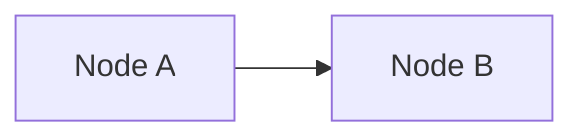

- `callback` is a JavaScript function defined on the hosting page
- The function receives the `nodeId` as its parameter
- The `call` keyword variant explicitly invokes the function

### URL/Href Syntax

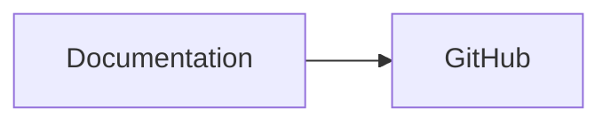

- URLs open in the same tab by default
- Supported link targets: `_self`, `_blank`, `_parent`, `_top`
- Tooltip text is optional, placed in double quotes after the URL

### Event Binding with the API

When using `mermaid.render()` programmatically, the returned `bindFunctions` callback must be called after inserting the SVG into the DOM to activate click events:

```javascript
const { svg, bindFunctions } = await mermaid.render('graphDiv', graphDefinition);
element.innerHTML = svg;
if (bindFunctions) {
    bindFunctions(element);
}
```

**Source:** [Flowcharts Syntax | Mermaid](https://mermaid.js.org/syntax/flowchart.html), [Usage | Mermaid](https://mermaid.js.org/config/usage.html)

---

## 2. Tooltips

Tooltips display hover text over nodes. They are specified as part of click definitions.

### Syntax

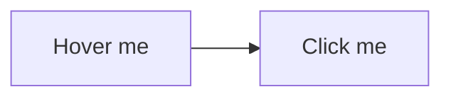

- Tooltip text is enclosed in double quotes
- Tooltips work with both callback and href click bindings
- The tooltip styles are controlled by the CSS class `.mermaidTooltip`

### Styling Tooltips

```css
.mermaidTooltip {
    background-color: #333;
    color: #fff;
    border-radius: 4px;
    padding: 6px 10px;
    font-size: 12px;
}
```

**Limitation:** Standalone tooltips (without a click binding) are not natively supported. Tooltips always accompany a click event declaration.

**Source:** [Flowcharts Syntax | Mermaid](https://mermaid.js.org/syntax/flowchart.html)

---

## 3. Icons and FontAwesome Integration

Mermaid supports FontAwesome icons inside node labels using the `fa:` prefix syntax.

### Basic Syntax

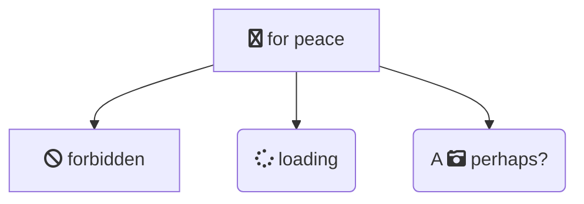

### Supported Icon Prefixes

| Prefix | FontAwesome Style |
|--------|-------------------|
| `fa`   | Solid (default/legacy) |
| `fas`  | Solid |
| `far`  | Regular |
| `fab`  | Brands |
| `fal`  | Light |
| `fad`  | Duotone |

### Requirements

- FontAwesome CSS must be loaded on the hosting page
- Mermaid does not bundle FontAwesome; it only renders the `<i>` tags
- No restriction on FontAwesome version, but the CSS must be included

### Registering Custom Icon Packs (v11+)

Mermaid v11 introduced `registerIconPacks()` for using Iconify or other icon sets:

```javascript
import mermaid from 'mermaid';

// Using CDN fetch
mermaid.registerIconPacks([
    {
        name: 'logos',
        loader: () =>
            fetch('https://unpkg.com/@iconify-json/logos@1/icons.json')
                .then((res) => res.json()),
    },
]);

// Using ES module import
import { icons } from '@iconify-json/logos';
mermaid.registerIconPacks([
    { name: icons.prefix, icons },
]);
```

After registration, use icons as `name:icon-name` in diagram definitions.

**Source:** [Flowcharts Syntax | Mermaid](https://mermaid.js.org/syntax/flowchart.html), [Registering Icon Packs | Mermaid](https://mermaid.js.org/config/icons.html)

---

## 4. Icon and Image Shapes (New v11+)

Mermaid v11 introduced dedicated `icon` and `image` shape types using the `@{ }` syntax.

### Icon Shape

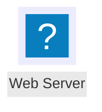

Parameters:
- `icon` — Icon name (requires registered icon pack)
- `form` — Background shape (`square`, `circle`, etc.). If omitted, no background is rendered
- `label` — Text label for the node
- `pos` — Label position: `t` (top), `b` (bottom). Defaults to bottom

### Image Shape

```mermaid
flowchart TD
    A@{ img: "https://example.com/logo.png", label: "Logo", pos: "t", w: 60, h: 60 }
```

Parameters:
- `img` — URL of the image
- `label` — Text label
- `pos` — Label position (`t` top, `b` bottom)
- `w` — Width in pixels
- `h` — Height in pixels

**Source:** [Flowcharts Syntax | Mermaid](https://mermaid.js.org/syntax/flowchart.html), [Registering Icon Packs | Mermaid](https://mermaid.js.org/config/icons.html)

---

## 5. Markdown in Nodes

Mermaid supports Markdown formatting within node labels when properly delimited.

### Enabling Markdown

Wrap the label in double-quote + backtick delimiters: `` ["`markdown text`"] ``

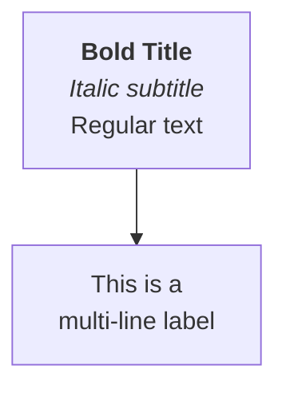

### Supported Formatting

| Markdown | Rendered As |
|----------|-------------|
| `**text**` | **Bold** |
| `*text*` | _Italic_ |
| Newline characters | Line breaks |

### Important Notes

- Only labels wrapped with `` "` `` and `` `" `` are processed as Markdown
- Labels without this delimiter are treated as plain text
- Markdown strings automatically wrap text when it becomes too long
- Applicable to: node labels, edge labels, and subgraph labels

**Source:** [Flowcharts Syntax | Mermaid](https://mermaid.js.org/syntax/flowchart.html), [Diagram Syntax | Mermaid](https://mermaid.js.org/intro/syntax-reference.html)

---

## 6. Multi-line Labels

### Using Markdown Strings (Preferred)

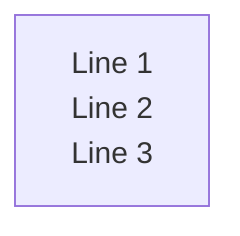

Simply use actual newline characters within the markdown-delimited label.

### Using HTML (with htmlLabels enabled)

When `htmlLabels: true` is set in configuration:


### Edge Labels with Line Breaks

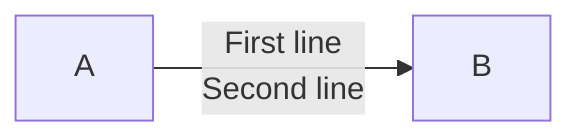

### Subgraph Labels

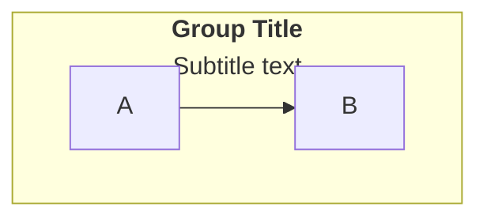

**Source:** [Flowcharts Syntax | Mermaid](https://mermaid.js.org/syntax/flowchart.html)

---

## 7. Subgraph Nesting and Direction Control

### Basic Subgraph Nesting

Subgraphs can be nested to arbitrary depth:

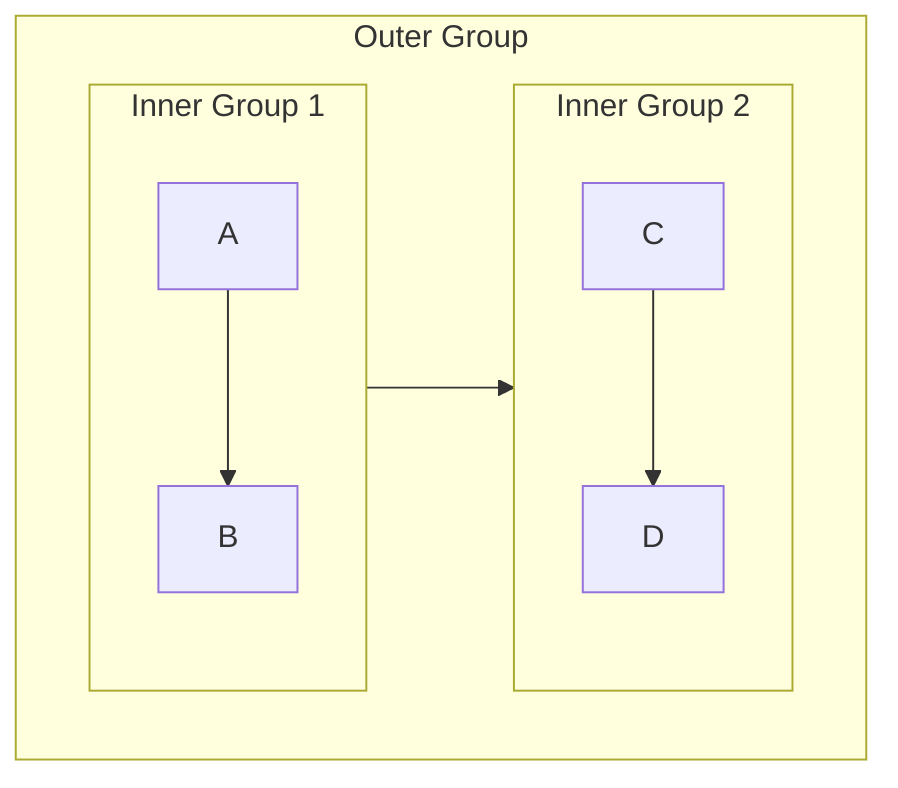

### Per-Subgraph Direction Override

Each subgraph can declare its own layout direction:

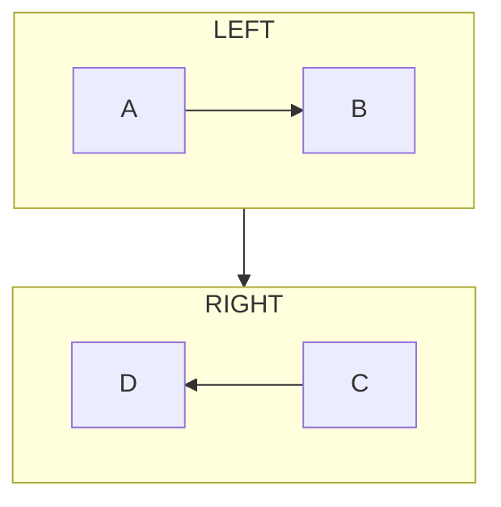

Supported direction values: `TB` (top-bottom), `TD` (top-down, same as TB), `BT` (bottom-top), `LR` (left-right), `RL` (right-left).

### Critical Limitation

**If any node within a subgraph has an edge connecting to a node outside that subgraph, the subgraph's `direction` is ignored and it inherits the parent graph's direction.** This is a fundamental constraint of the layout engine and is the most common source of confusion with this feature.

### Edges Between Subgraphs

You can create edges between subgraphs themselves (not just between their internal nodes):

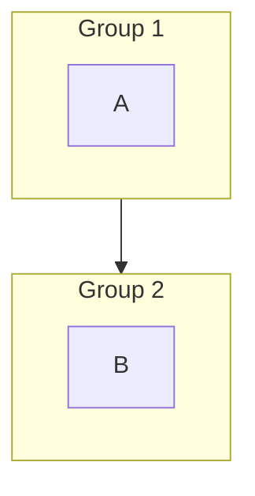

**Source:** [Flowcharts Syntax | Mermaid](https://mermaid.js.org/syntax/flowchart.html)

---

## 8. Node Styling: classDef and CSS Classes

### Defining Style Classes

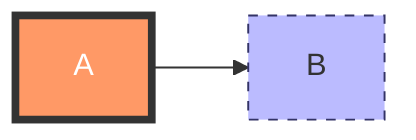

### Syntax Patterns

```
classDef className property1:value1,property2:value2;
```

Common CSS properties: `fill`, `stroke`, `stroke-width`, `stroke-dasharray`, `color` (text), `font-weight`, `font-size`.

### Applying Classes to Nodes

**Inline with `:::` operator:**
```
A:::className[Label]
```

**Using `class` statement:**
```
class nodeA,nodeB className
```

**Multiple classes per node:**
```
A:::class1:::class2[Label]
```

### Default Class

If a class is named `default`, it applies to all nodes without an explicit class assignment:

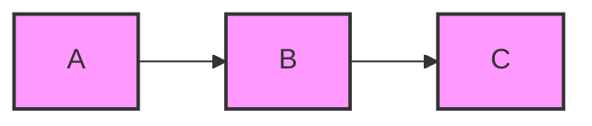

### Inline Style (Per-Node)

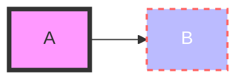

**Source:** [Flowcharts Syntax | Mermaid](https://mermaid.js.org/syntax/flowchart.html)

---

## 9. Link/Edge Styling

### linkStyle by Index

Links are numbered starting from 0 in the order they appear:

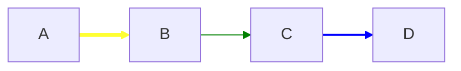

### Multiple Links in One Statement

```
linkStyle 0,1,2 stroke:#ff3,stroke-width:2px;
```

### Default Link Style

```
linkStyle default stroke:#333,stroke-width:2px;
```

### Edge Curve Types

Configure the interpolation curve via `init` directive or `mermaid.initialize()`:

```
%%{ init: { 'flowchart': { 'curve': 'stepBefore' } } }%%
```

Available curve types: `basis`, `bumpX`, `bumpY`, `cardinal`, `catmullRom`, `linear`, `monotoneX`, `monotoneY`, `natural`, `step`, `stepAfter`, `stepBefore`.

### Animating Edges

You can assign classes to edges and define animation properties via classDef.

### Escaping in Style Values

When using `stroke-dasharray`, escape internal commas: `stroke-dasharray: 5\,5` (since commas delimit style properties in Mermaid).

**Source:** [Flowcharts Syntax | Mermaid](https://mermaid.js.org/syntax/flowchart.html)

---

## 10. Accessibility

Mermaid provides built-in accessibility support through title and description metadata.

### accTitle (Accessible Title)

Single-line title for screen readers:

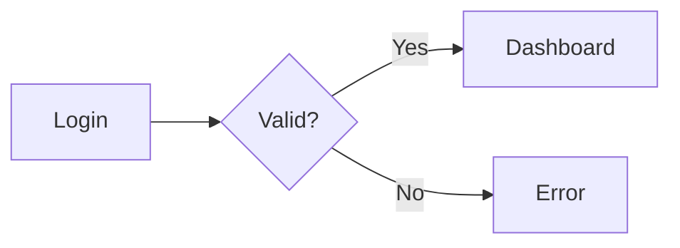

### accDescr (Accessible Description)

**Single-line:**
```
accDescr: Shows the login validation process with success and failure paths
```

**Multi-line:**
```
accDescr {
    This diagram shows the user authentication flow.
    Users enter credentials, which are validated.
    Valid credentials lead to the dashboard.
    Invalid credentials show an error message.
}
```

### HTML Output

These keywords produce the following in the generated SVG:

```html
<svg aria-roledescription="flowchart-v2"
     aria-labelledby="chart-title-graphDiv"
     aria-describedby="chart-desc-graphDiv"
     role="graphics-document document">
    <title id="chart-title-graphDiv">User Authentication Flow</title>
    <desc id="chart-desc-graphDiv">Shows the login validation process...</desc>
    <!-- diagram content -->
</svg>
```

### Automatic Behavior

- `aria-roledescription` is automatically set to the diagram type (e.g., `flowchart-v2`, `sequence`, `stateDiagram`)
- Works across all diagram types (flowcharts, sequence, state, class, ER, gantt, etc.)

### Known Limitations

- Some newer diagram types (e.g., `block-beta`) may have incomplete `accTitle`/`accDescr` support
- Screen readers do not currently announce connected nodes or direction of connections within the diagram itself

**Source:** [Accessibility Options | Mermaid](https://mermaid.js.org/config/accessibility.html), [Diagram Syntax | Mermaid](https://mermaid.js.org/intro/syntax-reference.html)

---

## 11. Configuration API

### mermaid.initialize()

The primary configuration entry point. Call before any rendering occurs.

```javascript
mermaid.initialize({
    // General
    startOnLoad: true,           // Auto-render on page load (default: true)
    securityLevel: 'loose',      // 'strict' | 'loose' | 'antiscript' | 'sandbox'
    theme: 'default',            // 'default' | 'dark' | 'forest' | 'neutral' | 'base'
    logLevel: 'fatal',           // 'trace' | 'debug' | 'info' | 'warn' | 'error' | 'fatal'
    
    // Performance limits
    maxTextSize: 50000,          // Max diagram text size (default: 50000)
    maxEdges: 500,               // Max edges in a graph (default: 500)
    
    // Rendering
    fontFamily: '"trebuchet ms", verdana, arial, sans-serif',
    fontSize: 16,
    htmlLabels: true,            // Use HTML labels (vs SVG text)
    
    // Security
    secure: ['secure', 'securityLevel', 'startOnLoad', 'maxTextSize'],
    
    // Diagram-specific overrides
    flowchart: {
        useMaxWidth: true,
        htmlLabels: true,
        curve: 'basis',
        padding: 15,
        nodeSpacing: 50,
        rankSpacing: 50,
        diagramPadding: 8,
    },
    sequence: {
        mirrorActors: true,
        bottomMarginAdj: 1,
        actorFontSize: 14,
        noteFontSize: 14,
        messageFontSize: 16,
    },
    gantt: {
        titleTopMargin: 25,
        barHeight: 20,
        barGap: 4,
        topPadding: 50,
        sidePadding: 75,
    },
    // ... additional diagram-specific configs
});
```

### Security Level Options

| Level | HTML Tags | Click Events | Rendering |
|-------|-----------|-------------|-----------|
| `strict` | Stripped | Disabled | Normal |
| `antiscript` | Allowed (scripts removed) | Enabled | Normal |
| `loose` | Allowed | Enabled | Normal |
| `sandbox` | Allowed | Enabled | Sandboxed iframe |

### Key API Methods

| Method | Description |
|--------|-------------|
| `mermaid.initialize(config)` | Set global configuration |
| `mermaid.render(id, text, element?)` | Render diagram, returns `Promise<{svg, bindFunctions}>` |
| `mermaid.run(options?)` | Find and render all `.mermaid` elements in DOM |
| `mermaid.parse(text, parseOptions?)` | Validate diagram syntax without rendering |
| `mermaid.registerIconPacks(packs)` | Register custom icon packs |

### mermaid.render() Usage

```javascript
const { svg, bindFunctions } = await mermaid.render('uniqueId', diagramDefinition);
document.getElementById('container').innerHTML = svg;
if (bindFunctions) {
    bindFunctions(document.getElementById('container'));
}
```

### mermaid.run() Usage (Replacement for deprecated mermaid.init)

```javascript
await mermaid.run({
    querySelector: '.mermaid',    // CSS selector for diagram containers
    suppressErrors: false,
});
```

### mermaid.parse() Usage

```javascript
// Throws on invalid syntax
try {
    const result = await mermaid.parse(diagramText);
    console.log('Diagram type:', result.diagramType);
} catch (error) {
    console.error('Invalid syntax:', error);
}

// Suppresses errors, returns false on failure
const result = await mermaid.parse(diagramText, { suppressErrors: true });
if (result === false) {
    console.log('Invalid diagram');
}
```

**Source:** [Usage | Mermaid](https://mermaid.js.org/config/usage.html), [Mermaid Config Schema](https://mermaid.js.org/config/schema-docs/config.html), [Configuration | Mermaid](https://mermaid.js.org/config/configuration.html)

---

## 12. Directives and Frontmatter

### Frontmatter (Preferred Method, v10.5.0+)

Directives via `%%{ init: ... }%%` are deprecated as of v10.5.0. Use YAML frontmatter instead:

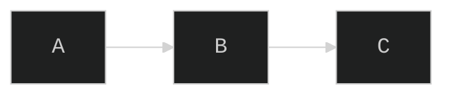

### Legacy Directive Syntax (Deprecated)

Still functional but not recommended:

```mermaid
%%{ init: { "theme": "dark", "fontFamily": "monospace", "flowchart": { "htmlLabels": true, "curve": "linear" } } }%%
flowchart LR
    A --> B --> C
```

### Configuration Hierarchy (Precedence)

1. **Site-wide config** via `mermaid.initialize()` (highest base priority)
2. **Frontmatter/Directive config** per diagram (overrides site-wide for that diagram)
3. **Default values** from Mermaid source (lowest priority)

### Security Restrictions

Certain keys (defined in the `secure` array) cannot be overridden by frontmatter/directives — only by `mermaid.initialize()`. Default secure keys: `secure`, `securityLevel`, `startOnLoad`, `maxTextSize`.

**Source:** [Directives | Mermaid](https://mermaid.js.org/config/directives.html), [Configuration | Mermaid](https://mermaid.js.org/config/configuration.html)

---

## 13. Theming

### Built-in Themes

| Theme | Description |
|-------|-------------|
| `default` | Standard colors, good for light backgrounds |
| `dark` | Dark mode with light text |
| `forest` | Green-toned natural palette |
| `neutral` | Grayscale, print-friendly |
| `base` | Minimal theme designed for customization via themeVariables |

### Custom Theme Variables

The `base` theme is the only theme that supports variable customization:

```javascript
mermaid.initialize({
    theme: 'base',
    themeVariables: {
        primaryColor: '#6B2D8B',
        primaryTextColor: '#FFFFFF',
        primaryBorderColor: '#4A1D6B',
        lineColor: '#333333',
        secondaryColor: '#E8D5F5',
        tertiaryColor: '#F5F5F5',
        fontFamily: '"Segoe UI", sans-serif',
        fontSize: '16px',
        // Flowchart-specific
        nodeBorder: '#4A1D6B',
        mainBkg: '#6B2D8B',
        // Sequence-specific
        actorBkg: '#6B2D8B',
        actorTextColor: '#FFFFFF',
        // Timeline-specific
        cScale0: '#6B2D8B',
        cScale1: '#8B4DAB',
        cScale2: '#AB6DCB',
        // ... cScale0 through cScale11
    },
});
```

### Frontmatter Theme Configuration

```mermaid
---
config:
    theme: base
    themeVariables:
        primaryColor: "#6B2D8B"
        primaryTextColor: "#fff"
        lineColor: "#333"
---
flowchart LR
    A --> B
```

### CSS Override

You can also use `themeCSS` for raw CSS injection:

```javascript
mermaid.initialize({
    theme: 'base',
    themeCSS: '.node rect { rx: 10; ry: 10; }',
});
```

**Source:** [Theme Configuration | Mermaid](https://mermaid.js.org/config/theming.html)

---

## 14. Error Handling

### Overriding parseError

```javascript
mermaid.parseError = function (err, hash) {
    console.error('Mermaid parse error:', err);
    // Display error in UI
    document.getElementById('error-container').textContent = err;
};
```

### Validate Before Rendering

```javascript
const textStr = getTextFromEditor();

// Option 1: Try-catch
try {
    await mermaid.parse(textStr);
    // Safe to render
    const { svg } = await mermaid.render('graph', textStr);
    container.innerHTML = svg;
} catch (error) {
    showError(error.message);
}

// Option 2: Suppress errors
const result = await mermaid.parse(textStr, { suppressErrors: true });
if (result) {
    const { svg } = await mermaid.render('graph', textStr);
    container.innerHTML = svg;
} else {
    showError('Invalid diagram syntax');
}
```

### Graceful Fallback Pattern

```javascript
async function renderDiagram(containerEl, diagramText) {
    try {
        const { svg, bindFunctions } = await mermaid.render(
            'diagram-' + Date.now(),
            diagramText
        );
        containerEl.innerHTML = svg;
        if (bindFunctions) bindFunctions(containerEl);
    } catch (error) {
        containerEl.innerHTML = `
            <pre class="mermaid-error">
                Could not render diagram: ${error.message}
            </pre>
        `;
        // Optionally show the raw source
        const code = document.createElement('code');
        code.textContent = diagramText;
        containerEl.appendChild(code);
    }
}
```

### React Error Handling

```jsx
mermaid.parseError = (error, hash) => {
    console.error('Mermaid error:', error);
    this.setState({ mermaidError: error.str });
};
```

**Source:** [Usage | Mermaid](https://mermaid.js.org/config/usage.html)

---

## 15. Performance

### Configuration Limits

| Parameter | Default | Description |
|-----------|---------|-------------|
| `maxTextSize` | 50,000 | Maximum characters in diagram source |
| `maxEdges` | 500 | Maximum number of edges before rendering is refused |

### Increasing Limits for Large Diagrams

```javascript
mermaid.initialize({
    startOnLoad: true,
    maxTextSize: 500000,   // 10x default
    maxEdges: 2000,        // 4x default
});
```

### Why Limits Exist

- The browser tab will hang or crash when edge count is too high
- Large SVG rendering blocks the main thread
- Memory consumption scales with diagram complexity

### Practical Guidelines

- Diagrams with 700-800 edges require `maxEdges` to be raised to at least 1000
- Users have successfully rendered diagrams with `maxTextSize: 5000000` for dependency visualization
- Consider splitting very large diagrams into multiple smaller ones linked via click events
- Use `useMaxWidth: true` (default) to constrain SVG width to container

### Performance Optimization Strategies

1. **Reduce node count:** Collapse detail into subgraphs
2. **Simplify edge styles:** Default styles render faster than custom-styled edges
3. **Use `elk` layout engine:** For large graphs, the ELK layout engine (`%%{ init: { 'flowchart': { 'defaultRenderer': 'elk' } } }%%`) can handle complex layouts better
4. **Lazy rendering:** Use `startOnLoad: false` and call `mermaid.run()` only when the diagram container is visible

**Source:** [Mermaid Config Schema](https://mermaid.js.org/config/schema-docs/config.html)

---

## 16. Integration Patterns

### HTML Script Tag with ESM (CDN)

The simplest integration for static HTML pages:

```html
<!DOCTYPE html>
<html>
<head>
    <meta charset="utf-8">
</head>
<body>
    <pre class="mermaid">
        flowchart LR
            A --> B --> C
    </pre>

    <script type="module">
        import mermaid from 'https://cdn.jsdelivr.net/npm/mermaid@11/dist/mermaid.esm.min.mjs';
        mermaid.initialize({ startOnLoad: true });
    </script>
</body>
</html>
```

### ESM Import (Bundler)

```javascript
import mermaid from 'mermaid';

mermaid.initialize({
    startOnLoad: false,
    theme: 'default',
});

// Render programmatically
const { svg, bindFunctions } = await mermaid.render('myDiagram', diagramCode);
```

### CDN URL Format

```
https://cdn.jsdelivr.net/npm/mermaid@<version>/dist/mermaid.esm.min.mjs
```

Replace `<version>` with a specific version (e.g., `11`, `11.4.0`). Use major version for latest within that major.

### Dynamic/Deferred Rendering

When diagram containers load asynchronously:

```javascript
import mermaid from 'https://cdn.jsdelivr.net/npm/mermaid@11/dist/mermaid.esm.min.mjs';

mermaid.initialize({ startOnLoad: false });

// Call after new .mermaid elements are added to DOM
async function renderNewDiagrams() {
    await mermaid.run({ querySelector: '.mermaid:not([data-processed])' });
}
```

### npm Installation

```bash
npm install mermaid
# or
yarn add mermaid
```

**Source:** [Usage | Mermaid](https://mermaid.js.org/config/usage.html), [Getting Started | Mermaid](https://mermaid.js.org/intro/getting-started.html)

---

## 17. Export: SVG, PNG, PDF

### mermaid-cli (mmdc)

The official CLI tool for converting `.mmd` files to image formats.

**Installation:**

```bash
npm install -g @mermaid-js/mermaid-cli
# or use npx
npx -p @mermaid-js/mermaid-cli mmdc --help
```

**Basic Usage:**

```bash
# SVG output
mmdc -i diagram.mmd -o diagram.svg

# PNG output
mmdc -i diagram.mmd -o diagram.png

# PDF output
mmdc -i diagram.mmd -o diagram.pdf

# With theme and background options
mmdc -i diagram.mmd -o diagram.png -t dark -b transparent

# With custom CSS
mmdc -i diagram.mmd -o diagram.svg --cssFile custom.css

# With custom config
mmdc -i diagram.mmd -o diagram.svg -c config.json
```

**Piping from stdin:**

```bash
cat <<EOF | mmdc --input -
flowchart LR
    A --> B --> C
EOF
```

**Markdown processing:**

The CLI can find mermaid code blocks in Markdown files, render them to SVG, and replace the code blocks with image references:

```bash
mmdc -i README.md -o README-rendered.md
```

**Config file (config.json):**

```json
{
    "theme": "dark",
    "flowchart": {
        "curve": "basis"
    },
    "maxTextSize": 500000,
    "maxEdges": 2000
}
```

### Programmatic SVG Export

```javascript
const { svg } = await mermaid.render('exportDiagram', diagramText);
// svg is a string containing the full <svg> element
// Save or manipulate as needed
```

### PNG Export (Browser)

Use a canvas-based approach to convert the SVG:

```javascript
const { svg } = await mermaid.render('exportDiagram', diagramText);
const svgBlob = new Blob([svg], { type: 'image/svg+xml;charset=utf-8' });
const url = URL.createObjectURL(svgBlob);

const img = new Image();
img.onload = function () {
    const canvas = document.createElement('canvas');
    canvas.width = img.width;
    canvas.height = img.height;
    const ctx = canvas.getContext('2d');
    ctx.drawImage(img, 0, 0);
    const pngUrl = canvas.toDataURL('image/png');
    // Download or display pngUrl
    URL.revokeObjectURL(url);
};
img.src = url;
```

**Source:** [mermaid CLI | Mermaid](https://mermaid.js.org/config/mermaidCLI.html), [mermaid-cli GitHub](https://github.com/mermaid-js/mermaid-cli)

---

## 18. Architecture Diagrams (v11.1.0+)

A newer diagram type for system architecture visualization with explicit spatial positioning.

### Basic Syntax

```mermaid
architecture-beta
    group api(logos:aws-lambda)[API Layer]

    service db(logos:postgresql)[Database] in api
    service auth(logos:auth0)[Auth Service] in api
    service gateway(logos:aws-api-gateway)[API Gateway] in api

    gateway:R --> L:auth
    auth:R --> L:db
```

### Components

| Component | Description |
|-----------|-------------|
| `group` | Container for related services |
| `service` | A node representing a service/component |
| `junction` | A 4-way split point for edges |
| `edge` | Connection between services |

### Edge Direction Specification

Edges specify which side they connect to using `L` (left), `R` (right), `T` (top), `B` (bottom):

```
service1:R --> L:service2
service1:B --> T:service3
```

### Icons and Labels

- Icons: Declared in parentheses `(icon-pack:icon-name)`
- Labels: Declared in brackets `[Label Text]`

### Group Membership

Services are placed in groups with the `in` keyword:

```
service myService(icon)[Label] in groupId
```

### Limitations

- `groupId` cannot be used in edge definitions
- The `{group}` modifier can only be used for services within a group

**Source:** [Architecture Diagrams | Mermaid](https://mermaid.js.org/syntax/architecture.html)

---

## 19. New Shape Syntax (v11+)

Mermaid v11 introduced 30 new shapes and a generalized `@{ }` syntax for shape definitions.

### General Shape Syntax

```mermaid
flowchart LR
    A@{ shape: diamond, label: "Decision" }
    B@{ shape: rect, label: "Process" }
    A --> B
```

### Categories of New Shapes

**Process shapes:** Rectangle variants, rounded rectangles, subroutine shapes
**Decision shapes:** Diamond, hexagon, lean shapes
**Data shapes:** Cylinder, parallelogram, trapezoid variants
**Event shapes:** Stadium, circle variants
**Storage shapes:** Various storage-oriented shapes
**Special shapes:** Bow-tie rectangle, wave rectangle, trapezoidal pentagon

### Special Shapes

**Icon shape:**
```
A@{ icon: "fa:fa-gear", form: "circle", label: "Settings", pos: "b" }
```

**Image shape:**
```
A@{ img: "https://example.com/img.png", label: "Photo", w: 80, h: 80 }
```

### Custom SVG Shapes

Mermaid also supports a custom SVG shapes library for extending beyond built-in shapes.

**Source:** [Flowcharts Syntax | Mermaid](https://mermaid.js.org/syntax/flowchart.html), [Custom SVG Shapes Library | Mermaid](https://mermaid.js.org/adding-new-shape.html)

---

## Quick Reference: Feature Availability by Diagram Type

| Feature | Flowchart | Sequence | State | Class | ER | Gantt | Architecture |
|---------|-----------|----------|-------|-------|-----|-------|--------------|
| Click events | Yes | No | Yes (v11+) | Yes | No | Yes | No |
| Tooltips | Yes | No | No | Yes | No | No | No |
| FontAwesome icons | Yes | No | No | No | No | No | No |
| Icon/Image shapes | Yes | No | No | No | No | No | Yes (icons) |
| Markdown labels | Yes | Yes | Yes | Yes | No | No | No |
| classDef styling | Yes | No | Yes | No | No | No | No |
| linkStyle | Yes | No | No | No | No | No | No |
| Subgraphs | Yes | No | No | No | No | No | Yes (groups) |
| accTitle/accDescr | Yes | Yes | Yes | Yes | Yes | Yes | Yes |

---

## Source URLs

- [Flowcharts Syntax | Mermaid](https://mermaid.js.org/syntax/flowchart.html)
- [Usage | Mermaid](https://mermaid.js.org/config/usage.html)
- [Accessibility Options | Mermaid](https://mermaid.js.org/config/accessibility.html)
- [Theme Configuration | Mermaid](https://mermaid.js.org/config/theming.html)
- [Directives | Mermaid](https://mermaid.js.org/config/directives.html)
- [Configuration | Mermaid](https://mermaid.js.org/config/configuration.html)
- [Mermaid Config Schema](https://mermaid.js.org/config/schema-docs/config.html)
- [Registering Icon Packs | Mermaid](https://mermaid.js.org/config/icons.html)
- [mermaid CLI | Mermaid](https://mermaid.js.org/config/mermaidCLI.html)
- [Architecture Diagrams | Mermaid](https://mermaid.js.org/syntax/architecture.html)
- [Custom SVG Shapes Library | Mermaid](https://mermaid.js.org/adding-new-shape.html)
- [Diagram Syntax Reference | Mermaid](https://mermaid.js.org/intro/syntax-reference.html)
- [Getting Started | Mermaid](https://mermaid.js.org/intro/getting-started.html)
- [mermaid-cli GitHub](https://github.com/mermaid-js/mermaid-cli)
