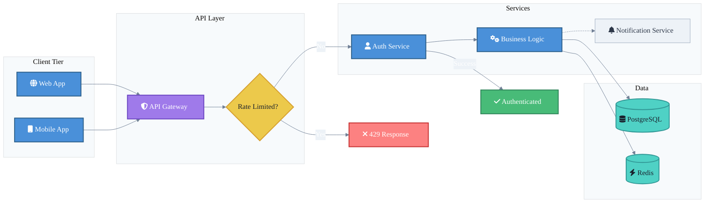

# Mermaid.js Professional Examples and Design Patterns --- Comprehensive Reference

**Source:** Web research --- official examples, GitHub, blogs, documentation sites
**Date:** 2026-04-13
**Focus:** Real-world examples of professional mermaid diagrams and the techniques that make them effective

---

## 1. Styling Fundamentals

### 1.1 The Three Layers of Mermaid Styling

Professional mermaid diagrams use three complementary styling mechanisms, layered for maximum control:

| Layer | Mechanism | Scope | Best For |
|-------|-----------|-------|----------|
| **Theme** | `%%{init: {'theme': '...'}}%%` or frontmatter `config:` | Entire diagram | Baseline palette, font, dark/light mode |
| **classDef** | `classDef name fill:#hex,stroke:#hex,color:#hex` | Named groups of nodes | Semantic coloring (success, error, external) |
| **Inline style** | `style nodeId fill:#hex` | Single node | One-off exceptions only |

**Key rule:** The only theme you can customize with `themeVariables` is the `base` theme. The built-in `default`, `dark`, `neutral`, and `forest` themes are not modifiable.

### 1.2 Theme Configuration via Frontmatter (Recommended Modern Approach)

```yaml
---
config:
  theme: base
  themeVariables:
    primaryColor: '#4A5568'
    primaryTextColor: '#FFFFFF'
    primaryBorderColor: '#2D3748'
    lineColor: '#718096'
    secondaryColor: '#EDF2F7'
    tertiaryColor: '#F7FAFC'
    fontFamily: 'Inter, Segoe UI, sans-serif'
    fontSize: '14px'
---
```

**Critical detail:** The theming engine only recognizes hex color codes (e.g., `#FF0000`), not CSS color names (e.g., `red`). Many derived colors (like `primaryBorderColor`) auto-calculate from `primaryColor` --- Mermaid may invert hue, darken by 10%, etc.

### 1.3 classDef --- The Workhorse of Professional Styling

The `classDef` keyword defines reusable style classes. Properties map directly to CSS:

```
classDef primary fill:#4A90D9,stroke:#2C5F8A,color:#FFFFFF,stroke-width:2px;
classDef success fill:#48BB78,stroke:#2F855A,color:#FFFFFF,stroke-width:2px;
classDef warning fill:#ECC94B,stroke:#D69E2E,color:#1A202C,stroke-width:2px;
classDef danger  fill:#FC8181,stroke:#C53030,color:#1A202C,stroke-width:2px;
classDef neutral fill:#EDF2F7,stroke:#A0AEC0,color:#2D3748,stroke-width:1px;
```

**Assigning classes to nodes:**

```
%% Method 1: Inline with triple-colon
A:::primary --> B:::success

%% Method 2: Batch assignment
class A,C,E primary
class B,D,F success
```

**Default class:** If you name a class `default`, it applies to all nodes without an explicit class --- useful for establishing a baseline.

Source: [Styling MermaidJS | Heaton.dev](https://www.heaton.dev/2022/05/styling-mermaidjs/), [Flowcharts Syntax | Mermaid](https://mermaid.js.org/syntax/flowchart.html)

---

## 2. Professional Color Palettes

### 2.1 Semantic Color System (Recommended)

The strongest pattern across professional diagrams is **semantic coloring** --- colors encode meaning, not decoration:

| Semantic Role | Recommended Hex | Usage |
|---------------|-----------------|-------|
| Primary / Core Process | `#4A90D9` (corporate blue) | Main flow, core services |
| Success / Complete | `#48BB78` (green) | Success paths, healthy states |
| Warning / Attention | `#ECC94B` (amber) | Caution, pending states |
| Error / Critical | `#FC8181` (coral red) | Error paths, failures |
| External / Third-party | `#9F7AEA` (purple) | External services, APIs |
| Data / Storage | `#4FD1C5` (teal) | Databases, caches, queues |
| Neutral / Background | `#EDF2F7` (light gray) | Supporting nodes, optional |
| Disabled / Inactive | `#CBD5E0` (medium gray) | Deprecated, inactive |

### 2.2 Corporate / Consulting Palette (Purple-Anchored)

Suitable for BayOne-style deliverables with a Big Four aesthetic:

```
classDef brand    fill:#6B46C1,stroke:#553C9A,color:#FFFFFF,stroke-width:2px;
classDef accent   fill:#805AD5,stroke:#6B46C1,color:#FFFFFF,stroke-width:2px;
classDef light    fill:#E9D8FD,stroke:#B794F4,color:#44337A,stroke-width:1px;
classDef neutral  fill:#F7FAFC,stroke:#CBD5E0,color:#2D3748,stroke-width:1px;
classDef highlight fill:#FBD38D,stroke:#ED8936,color:#7B341E,stroke-width:2px;
classDef data     fill:#BEE3F8,stroke:#3182CE,color:#2A4365,stroke-width:1px;
```

### 2.3 Colorblind-Safe Palette

When accessibility matters (and it should), use palettes verified against protanopia, deuteranopia, and tritanopia:

```
classDef cbBlue    fill:#0077BB,stroke:#005588,color:#FFFFFF,stroke-width:2px;
classDef cbOrange  fill:#EE7733,stroke:#CC5500,color:#FFFFFF,stroke-width:2px;
classDef cbCyan    fill:#33BBEE,stroke:#0099CC,color:#1A202C,stroke-width:2px;
classDef cbMagenta fill:#EE3377,stroke:#CC1155,color:#FFFFFF,stroke-width:2px;
classDef cbGray    fill:#BBBBBB,stroke:#888888,color:#1A202C,stroke-width:1px;
```

**Accessibility rule:** Never rely on color alone to convey information. Pair color with shape differences, labels, or icons (`fa:fa-check`, `fa:fa-times`).

Source: [Accessible Mermaid charts in Github Markdown](https://pulibrary.github.io/2023-03-29-accessible-mermaid), [Color Blind Friendly Palette Guide](https://rgblind.com/blog/color-blind-friendly-palette)

---

## 3. Layout Optimization

### 3.1 Layout Engine Selection

| Engine | Syntax | Best For | Trade-offs |
|--------|--------|----------|------------|
| **Dagre** (default) | No config needed | Simple flows, < 20 nodes | Struggles with complex nesting |
| **ELK** | `layout: elk` in frontmatter | Complex architectures, nested subgraphs | Requires `@mermaid-js/layout-elk` package; not available everywhere |

**ELK configuration example:**

```yaml
---
config:
  layout: elk
  elk:
    mergeEdges: true
    nodePlacementStrategy: LINEAR_SEGMENTS
---
```

**Important caveat:** ELK is not available in all Mermaid rendering environments. GitHub Markdown, for example, does not support ELK as of 2026. The Mermaid Live Editor does support it.

### 3.2 Direction Selection

| Direction | Syntax | Best For |
|-----------|--------|----------|
| Top-Down | `graph TD` or `graph TB` | Hierarchies, org charts, decision trees |
| Left-Right | `graph LR` | Processes, pipelines, timelines, data flows |
| Bottom-Up | `graph BT` | Dependency trees (what depends on what) |
| Right-Left | `graph RL` | Reverse flows (rare) |

**Professional pattern:** Most consulting-quality flowcharts use `LR` (left-to-right) for processes and `TD` (top-down) for hierarchies. Mixing directions within subgraphs is supported but fragile --- if any node in a subgraph links to an outside node, the subgraph direction is overridden by the parent graph's direction.

### 3.3 Invisible Links for Spacing Control

The tilde operator (`~~~`) creates invisible links that influence layout without visible connections:

```
A ~~~ B
```

This forces nodes A and B closer together in the layout. Professional diagrams use this to:
- Align nodes that share no logical connection but should appear at the same rank
- Create spacing between dense clusters
- Force a particular reading order

### 3.4 Link Length for Rank Control

Extra dashes in link definitions span additional ranks:

```
A --> B       %% Normal: 1 rank apart
A ---> C      %% Longer: 2 ranks apart
A ----> D     %% Even longer: 3 ranks apart
```

Source: [Mermaid Layouts | GitLab Handbook](https://handbook.gitlab.com/handbook/tools-and-tips/mermaid/), [Revisiting Mermaid.js | Korny's Blog](https://blog.korny.info/2025/03/14/mermaid-js-revisited)

---

## 4. Subgraph Organization

### 4.1 Subgraphs as Architectural Boundaries

The strongest professional pattern is using subgraphs to mirror real system boundaries:

```
graph LR
    subgraph "Client Layer"
        A[Web App] --> B[Mobile App]
    end
    subgraph "API Gateway"
        C[Load Balancer] --> D[Auth Service]
    end
    subgraph "Backend Services"
        E[User Service] --> F[Order Service]
        F --> G[Payment Service]
    end
    subgraph "Data Layer"
        H[(PostgreSQL)] --> I[(Redis Cache)]
    end
    A --> C
    B --> C
    D --> E
    G --> H
    E --> I
```

### 4.2 Subgraph Styling

Subgraph styling uses the `style` keyword with the subgraph's ID:

```
style "Client Layer" fill:#EBF8FF,stroke:#3182CE,stroke-width:2px,color:#2C5282
style "Data Layer" fill:#F0FFF4,stroke:#38A169,stroke-width:2px,color:#276749
```

**Important limitation:** `classDef` only works on subgraphs if the subgraph is also used as a node elsewhere in the diagram. For standalone subgraphs, use the `style` keyword directly.

### 4.3 Nesting Subgraphs

Subgraphs can nest to represent hierarchical structures:

```
graph TD
    subgraph "AWS us-east-1"
        subgraph "VPC"
            subgraph "Public Subnet"
                ALB[Application Load Balancer]
            end
            subgraph "Private Subnet"
                ECS[ECS Cluster]
                RDS[(RDS PostgreSQL)]
            end
        end
    end
    ALB --> ECS --> RDS
```

**Professional tip:** Limit nesting to 2-3 levels. Deeper nesting becomes unreadable and layout engines struggle with it.

### 4.4 Invisible Subgraphs for Clustering

You can use subgraphs purely for layout control by giving them empty or minimal labels and styling them to be nearly invisible:

```
subgraph " "
    direction LR
    A --> B --> C
end
style " " fill:none,stroke:none
```

Source: [Flowcharts Syntax | Mermaid](https://mermaid.ai/open-source/syntax/flowchart.html), [Mermaid subgraph styling | GitHub Issue #391](https://github.com/mermaid-js/mermaid/issues/391)

---

## 5. Label Clarity and Text Formatting

### 5.1 Markdown Strings

Mermaid supports "Markdown Strings" enclosed in double-quote backtick pairs (`` "` `` and `` `" ``), enabling:

- **Bold**: `**text**`
- **Italic**: `*text*`
- Automatic text wrapping
- Newlines via actual line breaks (no `<br>` needed)

```
A["`**User Service**
Handles authentication
and profile management`"]
```

**Limitation:** Only bold and italic are supported. Links, code blocks, lists, and other Markdown features cause errors.

### 5.2 Label Best Practices

| Practice | Example | Why |
|----------|---------|-----|
| Use descriptive node IDs | `userService[User Service]` not `A[User Service]` | Readable source code |
| Keep labels under 4-5 words | `Auth Gateway` not `Authentication and Authorization Gateway Service` | Visual clarity |
| Use consistent casing | Title Case for services, lowercase for actions | Professional appearance |
| Add context in tooltips | Not widely supported; use notes instead | Avoids label overload |
| Use icons for quick scanning | `fa:fa-database Database` | Visual hierarchy |

### 5.3 Font Awesome Icons

Mermaid supports Font Awesome icons in node labels:

```
A[fa:fa-user User] --> B[fa:fa-server API Server]
B --> C[fa:fa-database Database]
B --> D[fa:fa-cloud CDN]
```

This adds professional visual hierarchy without relying solely on color.

Source: [Mermaid Automatic Text Wrapping](https://docs.mermaidchart.com/blog/posts/automatic-text-wrapping-in-flowcharts-is-here), [Flowcharts Syntax | Mermaid](https://mermaid.js.org/syntax/flowchart.html)

---

## 6. Node Shape Semantics

### 6.1 Shape Selection Guide

Professional diagrams use shapes consistently to encode meaning:

| Shape | Syntax | Semantic Meaning |
|-------|--------|------------------|
| Rectangle | `A[Text]` | Process, action, service |
| Rounded rectangle | `A(Text)` | Event, milestone, start/end |
| Stadium | `A([Text])` | Terminal, I/O operation |
| Diamond | `A{Text}` | Decision, branch point |
| Hexagon | `A{{Text}}` | Preparation, condition check |
| Cylinder | `A[(Text)]` | Database, data store |
| Circle | `A((Text))` | Start/end point, connector |
| Parallelogram | `A[/Text/]` | Input/output |
| Trapezoid | `A[/Text\]` | Manual operation |
| Double circle | `A(((Text)))` | Important junction, API endpoint |
| Subroutine | `A[[Text]]` | Predefined process, external call |

### 6.2 The "Three Shape" Rule

For most professional diagrams, you only need three shapes:
1. **Rectangles** for processes and services
2. **Diamonds** for decisions
3. **Cylinders** for databases

Everything else is refinement. Overusing shapes creates visual noise.

Source: [Expanding Mermaid Flowcharts: 30 New Shapes](https://docs.mermaidchart.com/blog/posts/expanding-the-horizons-of-mermaid-flowcharts-introducing-30-new-shapes), [Mermaid Flowcharts Syntax](https://mermaid.js.org/syntax/flowchart.html)

---

## 7. Diagram-Type-Specific Patterns

### 7.1 Sequence Diagrams

**Professional configuration:**

```yaml
---
config:
  theme: base
  themeVariables:
    actorBkg: '#4A5568'
    actorTextColor: '#FFFFFF'
    actorBorder: '#2D3748'
    signalColor: '#4A90D9'
    noteBkgColor: '#FEFCBF'
    noteTextColor: '#744210'
    fontFamily: 'Inter, sans-serif'
  sequence:
    mirrorActors: false
    rightAngles: true
---
```

**Key patterns:**
- Use `participant` aliases for readable source: `participant U as User`
- Group related messages with `rect` (colored backgrounds)
- Use `Note over` for context annotations
- Set `mirrorActors: false` to avoid duplicating actors at the bottom
- Set `rightAngles: true` for cleaner arrow routing

### 7.2 Entity Relationship Diagrams

**Styling ER diagrams:**

```
erDiagram
    CUSTOMER ||--o{ ORDER : places
    ORDER ||--|{ LINE-ITEM : contains
    PRODUCT ||--o{ LINE-ITEM : "is in"

    CUSTOMER {
        int id PK
        string name
        string email UK
    }
    ORDER {
        int id PK
        int customer_id FK
        date created_at
    }
```

Style ER nodes with `fill` and `stroke` properties. Keys accept `PK`, `FK`, and `UK` designators. Multiple key constraints can be comma-separated on a single attribute.

### 7.3 State Diagrams

**classDef in state diagrams:**

```
stateDiagram-v2
    classDef active fill:#48BB78,stroke:#2F855A,color:#FFFFFF
    classDef error fill:#FC8181,stroke:#C53030,color:#FFFFFF

    [*] --> Idle
    Idle --> Processing:::active
    Processing --> Complete:::active
    Processing --> Failed:::error
    Complete --> [*]
    Failed --> Idle
```

### 7.4 Gantt Charts

**Professional Gantt styling:**

```yaml
---
config:
  theme: base
  themeVariables:
    sectionBkgColor: '#EBF8FF'
    altSectionBkgColor: '#F7FAFC'
    taskBkgColor: '#4A90D9'
    taskBorderColor: '#2C5F8A'
    taskTextColor: '#FFFFFF'
    doneTaskBkgColor: '#48BB78'
    critTaskBkgColor: '#FC8181'
---
```

Valid task tags: `active`, `done`, `crit`, `milestone`. The `vert` keyword adds vertical marker lines for key dates.

### 7.5 C4 Architecture Diagrams

**Best practices for C4:**
- Maximum 6-8 elements per diagram
- Tree-shaped topology renders best (1 in, 1-2 out per node)
- Always apply `UpdateRelStyle` to every `Rel()` for consistent relationship line coloring
- C4 syntax is compatible with PlantUML

Source: [Making Mermaid Sequence Diagrams Prettier](https://notepad.onghu.com/2024/making-mermaid-sequence-diagrams-prettier-part1/), [C4 Diagrams | Mermaid](https://mermaid.js.org/syntax/c4.html), [State Diagrams | Mermaid](https://mermaid.ai/open-source/syntax/stateDiagram.html)

---

## 8. Complete Professional Flowchart Example

This example combines all the patterns above into a single production-quality diagram:



**What makes this professional:**
- Semantic classDef palette (colors mean something)
- Subgraphs mirror real architecture layers
- Font Awesome icons add visual hierarchy
- Descriptive node IDs (not A, B, C)
- Consistent stroke-width and color temperature
- Decision diamond with labeled paths
- Dashed line (`-.->`) for optional/async flows
- Theme variables set baseline fonts and colors

---

## 9. Anti-Patterns to Avoid

### 9.1 Visual Anti-Patterns

| Anti-Pattern | Problem | Fix |
|--------------|---------|-----|
| **Too many nodes** (> 30-40) | Unreadable, layout engine struggles | Split into multiple diagrams |
| **Rainbow coloring** | No semantic meaning, visual noise | Use 3-5 purposeful colors |
| **Generic node IDs** (`A --> B --> C`) | Unreadable source, hard to maintain | Use descriptive IDs: `userService --> authGateway` |
| **Inconsistent styling** | Some nodes styled, others default | Define a `default` classDef, apply consistently |
| **No subgraph grouping** | Flat sea of nodes with no hierarchy | Group by layer, team, or boundary |
| **Overly long labels** | Labels overflow, break layout | 4-5 words max; move detail to notes |
| **Too many shapes** | Every node a different shape | Stick to 3 shapes: rect, diamond, cylinder |
| **Deep nesting** (4+ levels) | Layout engines break, unreadable | Limit to 2-3 nesting levels |
| **Mixing directions** in linked subgraphs | Direction gets ignored silently | Keep direction consistent, or isolate subgraphs |

### 9.2 Technical Anti-Patterns

| Anti-Pattern | Problem | Fix |
|--------------|---------|-----|
| Using CSS color names | Theme engine ignores them | Always use hex codes: `#FF0000` not `red` |
| Specifying a theme + themeVariables with non-base theme | Variables are ignored | Only the `base` theme accepts custom `themeVariables` |
| Relying on ELK layout in GitHub | ELK is not available | Test in the target rendering environment |
| Styling subgraphs with classDef | Only works if subgraph is also a node | Use `style SubgraphId fill:...` instead |
| Color-only semantics | Inaccessible to colorblind users | Pair color with shape, icons, or labels |

Source: [Mermaid Architecture Diagram Pros and Limits | Revision](https://revision.app/blog/mermaid-architecture-diagram), [Mastering Diagramming as Code](https://www.kallemarjokorpi.fi/blog/mastering-diagramming-as-code-essential-mermaid-flowchart-tips-and-tricks-2/)

---

## 10. Tools and Resources

### 10.1 Editors and Renderers

| Tool | URL | Best For |
|------|-----|----------|
| **Mermaid Live Editor** | [mermaid.live](https://mermaid.live/) | Quick prototyping, sharing via URL |
| **Modern Mermaid** | [modern-mermaid.live](https://modern-mermaid.live/examples/) | Gallery of examples, theme previews |
| **Mermaid Flow** | [mermaidflow.app](https://www.mermaidflow.app/) | Visual (drag-and-drop) editing |
| **VS Code Extension** | Mermaid Preview | Real-time preview while coding |
| **beautiful-mermaid** | [GitHub](https://github.com/lukilabs/beautiful-mermaid) | SVG/ASCII rendering, 15 themes |
| **modern_mermaid** | [GitHub](https://github.com/gotoailab/modern_mermaid) | 10+ themes (Linear, Industrial, Hand Drawn, Ghibli) |

### 10.2 Official Documentation

| Resource | URL |
|----------|-----|
| Syntax Reference | [mermaid.js.org/intro/syntax-reference](https://mermaid.js.org/intro/syntax-reference.html) |
| Theme Configuration | [mermaid.js.org/config/theming](https://mermaid.js.org/config/theming.html) |
| Flowchart Syntax | [mermaid.js.org/syntax/flowchart](https://mermaid.js.org/syntax/flowchart.html) |
| Examples | [mermaid.ai/open-source/syntax/examples](https://mermaid.ai/open-source/syntax/examples.html) |
| Layout Configuration | [mermaid.ai/open-source/config/layouts](https://mermaid.ai/open-source/config/layouts.html) |
| Accessibility | [docs.mermaidchart.com accessibility](https://docs.mermaidchart.com/mermaid-oss/config/accessibility.html) |

### 10.3 Learning Resources

| Resource | URL | Focus |
|----------|-----|-------|
| Mastering Mermaid.js Guide | [antoinegriffard.com](https://antoinegriffard.com/posts/mermaid-js-comprehensive-guide/) | Comprehensive tutorial |
| Mermaid.js Guide 2026 | [w3resource.com](https://www.w3resource.com/javascript/mermaid-js-guide-to-create-diagrams-as-code.php) | Full tutorial |
| Mermaid Tutorial 2026 | [blog.starmorph.com](https://blog.starmorph.com/blog/mermaid-js-tutorial) | Syntax guide |
| Korny's Mermaid Revisited | [blog.korny.info](https://blog.korny.info/2025/03/14/mermaid-js-revisited) | Practical styling tips |
| Agent Mermaid | [blog.korny.info](https://blog.korny.info/2025/10/10/agent-mermaid-reporting-for-duty) | AI-assisted mermaid |
| Styling MermaidJS | [heaton.dev](https://www.heaton.dev/2022/05/styling-mermaidjs/) | classDef deep dive |
| Prettier Sequence Diagrams | [notepad.onghu.com](https://notepad.onghu.com/2024/making-mermaid-sequence-diagrams-prettier-part1/) | Sequence diagram styling |
| Custom-themed Mermaid | [traveling-coderman.net](https://traveling-coderman.net/code/eleventy-mermaid/) | Eleventy integration |
| DEV Community Guide | [dev.to](https://dev.to/leonards/customising-mermaid-diagram-font-and-colors-4pm9) | Colors and fonts |
| Mermaid GitHub Examples Gist | [gist.github.com](https://gist.github.com/ChristopherA/bffddfdf7b1502215e44cec9fb766dfd) | GitHub rendering examples |
| GitHub Theming Experiments | [github.com/Gordonby](https://github.com/Gordonby/MermaidTheming) | Theme experiments |

---

## 11. Quick Reference: Professional Diagram Checklist

Before finalizing any mermaid diagram for a client deliverable:

- [ ] **Semantic colors**: Every color choice encodes meaning (not decorative)
- [ ] **3-5 color palette**: No rainbow; purposeful, limited palette
- [ ] **classDef not inline**: Reusable classes, not per-node `style` statements
- [ ] **Descriptive node IDs**: `authService` not `A`
- [ ] **Short labels**: 4-5 words maximum per node
- [ ] **Subgraph boundaries**: Nodes grouped by layer, team, or system boundary
- [ ] **Consistent shapes**: 3 shape types maximum (rect, diamond, cylinder)
- [ ] **Direction matches content**: LR for processes, TD for hierarchies
- [ ] **Icons where helpful**: Font Awesome for quick visual scanning
- [ ] **Accessibility**: Not relying on color alone; sufficient contrast
- [ ] **Node count**: Under 30-40 per diagram; split if larger
- [ ] **Nesting depth**: 2-3 levels maximum
- [ ] **Hex colors only**: No CSS color names in theme or classDef
- [ ] **Tested in target renderer**: GitHub, Obsidian, MkDocs all render differently
- [ ] **accDescr provided**: Accessibility description for screen readers

---

## 12. Rendering Environment Compatibility

Professional diagrams must account for where they will be displayed:

| Environment | ELK Support | Custom Fonts | Theme Variables | Notes |
|-------------|-------------|--------------|-----------------|-------|
| GitHub Markdown | No | Limited | Yes | Dark mode auto-detection works well |
| GitLab Markdown | No | Limited | Yes | Similar to GitHub |
| Obsidian | Plugin-dependent | Yes | Yes | beautiful-mermaid-obsidian plugin available |
| MkDocs Material | No | Via CSS | Yes | May override Mermaid CSS |
| Mermaid Live Editor | Yes | Yes | Yes | Best for prototyping |
| Docusaurus | Plugin-dependent | Yes | Yes | Good support |
| VS Code Preview | Plugin-dependent | Yes | Yes | Real-time preview |
| HTML (self-hosted) | Yes (with package) | Yes | Yes | Full control |

**Professional tip from GitHub's dark mode handling:** Unless you are willing to do serious customization to make your theme work in both light and dark modes, do not specify a theme in the `%%{init}%%` block. Let the host environment auto-detect. If you must customize, test in both modes.

Source: [Accessible Mermaid charts in Github Markdown](https://pulibrary.github.io/2023-03-29-accessible-mermaid), [Material for MkDocs Diagrams](https://squidfunk.github.io/mkdocs-material/reference/diagrams/)

---

## 13. Key Insight: Know Mermaid's Limits

Multiple sources emphasize that Mermaid excels at certain use cases and falls short at others:

**Where Mermaid shines:**
- Quick documentation flows embedded in Markdown
- Version-controlled diagrams that live with code
- Simple to moderately complex architectures (< 30 nodes)
- Sequence diagrams for API documentation
- ER diagrams for database schema documentation
- Gantt charts for project timelines

**Where Mermaid struggles:**
- Pixel-perfect layout control
- Large, complex architecture diagrams (50+ nodes)
- Consistent rendering across different environments
- Advanced typography and spacing
- Interactive or animated diagrams

**The professional response:** Accept these constraints. Use Mermaid for documentation-grade diagrams. For client-facing presentation slides or marketing materials, export Mermaid SVGs and refine them, or use a dedicated tool like Figma or draw.io for the final polish.

Source: [Mermaid Architecture Diagram: Pros and Limits | Revision](https://revision.app/blog/mermaid-architecture-diagram), [Architecture diagrams as code: Mermaid vs AaC | Medium](https://medium.com/@koshea-il/architecture-diagrams-as-code-mermaid-vs-architecture-as-code-d7f200842712)
