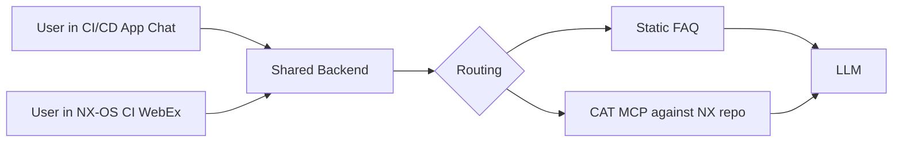

# Two-Document Content Map — Srinivas-Facing + Internal Companion

**Date prepared:** 2026-04-27 (Monday morning, pre-draft)
**Purpose:** Lay out the content for both documents with source citations so Colin can sign off on classification before either document is drafted. Replaces the prior session's incorrect drafts.

**Two-document plan, locked:**
- **Document A — Srinivas-facing.** Five sections, mapped to Srinivas's exact ask in the Friday Apr 24 transcript. GitHub markdown in `cisco/cicd/deliverables/weekly_status_<date>.md`, Mermaid as supplemental visual. Cisco-visible.
- **Document B — Internal companion.** Three states (Delivered cumulative, In progress this week, Planned to start this week). Originally framed as four states; "Completed this week" dropped on Colin's call — does not make sense as a Monday-morning state and the Friday-to-Monday window held no shipped BayOne deliverables justifying the section. Internal-only, lives in the session folder or `cisco/cicd/team/planning/`. Never shared with Cisco.

**Exclusion rules from `10_exclusion_rules.md` apply to Document A. All four rules. No cross-engagement reference (no Guhan Raman in Document A), no internal personnel observations, no internal politics, no BayOne policy mention.**

---

## Document A — Srinivas-Facing, Mapped to His Five-Item Ask

### Section 1 — Current work, status, and dependencies

Source: `cisco/cicd/team/planning/internal_week_tracker_2026-04-27.md` targets A through F. Combines the original "tasks the team is working on" and "current status" items from Srinivas's ask into a single bird's-eye table with a Dependencies column, which is the cleanest way to surface what is gating each workstream without repeating dependency information across multiple sections. Em dashes intentionally avoided in cell content.

Proposed table:

| Workstream | Status | Dependencies |
|---|---|---|
| CI/CD application on ADS | Cisco-side deployment expected Monday. BayOne fallback on Temp ADS ready. | Cisco platform team deployment. Temp ADS provisioning if fallback path. |
| Backend (Service Application Platform style, two pluggable frontends) | Architecture in flight. Backend designed to feed the chat in the CI/CD application and the WebEx bot on the NX-OS CI pipeline from one shared source. | None blocking. |
| Static FAQ wiring | Source corpus identified. Extraction starts this week. | Backend availability. |
| CAT MCP dynamic answer path | Installed. Four tools identified. OAuth resolved. Live execution begins after team sign-on completes. | Each BayOne team member completes first sign-on to the NX GitHub server. |
| WebEx bot deployment on the NX-OS CI pipeline | Bot built and tested. Deployment scheduled this week. | ADS environment access. LLM credential path through DeepSight. |
| Skills on main CI/CD repository | Three skills committed: NxOS-Issue-Categorizer, WebEx-Bot-Builder, WebEx-Solution-Architect. Inventory documentation and ds agent init pattern validation this week. | None blocking. |
| Build dependency graph for commits and PRs | Current approach understood and documented from Justin last week. Deeper mapping framework being finalized and shared this week. | None blocking. |

### Section 2 — What we are marching toward (next delivery milestone)

Source: `cisco/cicd/research/15_meeting_access_unblocked_and_deliverables_2026-04-24.md`, "Next-Friday Deployment Target Definition."

Future tense. The Friday May 1 deployment.

Proposed content:

> The CI/CD application will run on ADS with a chat interface that handles both static and dynamic question paths. Static FAQ entries will cover environmental issues and recurring questions for which answers already exist. Dynamic answers will be handled by the CAT MCP, which will query the NX repository at request time. Both routes will feed the same chat interface. A WebEx bot deployed on the NX-OS CI pipeline will share the same backend so users can ask the same questions from either surface. LLM access will run through DeepSight credentials once issued.

Mermaid diagram (supplemental, placed at end of document per A4 in `05a_answers_and_redirects.md`):

### Section 3 — Folded into Section 1

Status now lives in the Section 1 table as its own column, alongside Dependencies. Keeping a separate Section 3 would duplicate content and add prose where Srinivas asked for a glanceable view. Per Colin's direction: cleaner structure, less prose, dependencies as their own column.

### Section 4 — New items added this week

Source: Friday Apr 24 transcript lines ~229-258. Srinivas added the regression-protection workstream on the call.

Proposed content:

- **Regression protection framework.** UI automation (Playwright-based) plus backend validation of the pipeline and business logic. Modular and adapter-based so the core is reusable across other Cisco applications. Framework derived from prior BayOne work; adapter layer built specifically for the CI/CD application.

**Note on Guhan Raman:** the transcript reference is replaced by "prior BayOne work" per Exclusion Rule 1. No cross-engagement attribution on Cisco-visible artifacts.

### Section 5 — Open items and access

Source: Wednesday Apr 22 MOM Srikar item 6 (`cisco/cicd/team/source/week_2026-04-20/day_2026-04-24/srini_MOM.txt`); cross-referenced against `08_chat_findings.md` A1 and `internal_week_tracker_2026-04-27.md` Section 4.

Proposed table (three columns: Item, Status, Dependency or Unblock):

| Item | Status | Dependency or Unblock |
|---|---|---|
| NX repository lead-only access for the team | User identifiers posted last Friday. First sign-on to the NX GitHub server is the gating step before access can be granted. | Each BayOne team member completes first sign-on. |
| Permanent ADS provisioning | Standard onboarding request submitted Friday April 24. Escalation in flight. | Cisco access provisioning workflow. |
| CN-SJC-STANDALONE bundle membership | Submitted Friday April 24. In the standard provisioning window. | Cisco provisioning. |
| MCP viewer playground | Coming soon per the Cisco team. Will be used for external MCP validation before integration. | Cisco platform team launch. |
| DeepSight credentials | Issuance gated on the team operating from an ADS environment. | ADS environment access (Permanent or Temp). |
| Asynchronous unblocking via the engagement chat | Active. Either side may post blockers between meetings. | None. |

### Recent closures (strikethrough per A3 in 05a)

Items resolved between the last Srinivas meeting (Friday Apr 24) and the current update.

Proposed content:

- ~~NX repository access path defined and committed~~ (resolved Friday)
- ~~CI/CD repository destination clarified between main and SME-KB~~ (resolved Friday; main repository confirmed as destination for all skills)
- ~~Deployment form decided~~ (resolved Friday; on-demand pull plus low-frequency dashboard refresh, no central poller, user-session personalization with the group concept for managers)
- ~~Next-Friday target defined and scoped~~ (resolved Friday)
- ~~Monday weekly cadence and format decided~~ (resolved Friday; GitHub markdown plus Mermaid in the CI/CD repository)

---

## Document B — Internal Companion (Three-State Structural View)

**Internal-only.** Never shared with Cisco. Lives in the session folder or `cisco/cicd/team/planning/`. The Delivered inventory below is the part the prior session got most wrong; it is also the part Colin will most want to scrutinize.

Three states: Delivered cumulative, In progress this week, Planned to start this week. (Originally proposed as four states; "Completed this week" dropped — does not apply to a Monday-morning artifact.)

### Delivered (cumulative across the engagement, categorized by workstream)

A "deliverable" here means a concrete artifact, code, or capability that BayOne has shipped that Srinivas could plausibly inspect or use. Submitted access requests, architectural decisions made in meetings, repository-destination clarifications, and sign-offs on plans are NOT included — those are decisions or open-item resolutions, not deliverables.

#### WebEx and bot track (Saurav primary)

| Item | Source |
|---|---|
| WebEx scraper PoC and verified-endpoints documentation, completed 2026-04-10 | `14b_expectations_and_outstanding_actions_2026-04-24.md` items 17, 18 (DELIVERED) |
| Wally POC bot — built and tested Apr 10 (scrape, ping, help, DB-status commands operational); code recovered after Cisco-laptop hardware failure; rebuilt and in Saurav's hands; deployment to ADS pending environment access and LLM credential path | `08_chat_findings.md` B2; `14b` items 86, 102; Friday Apr 24 transcript line 318 ("the next one there is a bot that is being pending deploy") |
| WebEx scraper as decoupled service-layer architecture | `14b` item 51 (DELIVERED) |
| WebEx architecture refactor: bot → service-app + MCP + bot, with blast-radius security framing | `14b` item 79 (DELIVERED) |
| Friday architecture deliverable to Srinivas (three-slide framework, Apr 17 / Apr 18 timeframe) | `14b` items 78, 88 (DELIVERED) |
| WebEx bot complete on the webex-skills branch | `15_meeting_summary_2026-04-24.md` "Status of the Main Workstreams After Set 15"; `14b` items 80, 89, 99 |
| Mermaid + Singularity polish on architecture diagrams | `14b` items 80, 89, 99, 107, 113 (DELIVERED) |

#### Logs and build attribution track (Namita primary)

| Item | Source |
|---|---|
| Build log analysis PDF, shared 2026-04-10 | `14b` items 1, 9 (DELIVERED) |
| Log type mapping document (`02b_namita_log_type_mapping_2026-04-16.md`) | `14b` item 56 (PARTIAL but artifact shipped) |
| Star-schema architecture proposal for CI/CD traceability (`04e_namita_proposed_architecture_2026-04-16.md`) | `14b` item 61 (DELIVERED NARROW; artifact shipped) |
| Architecture and approach document for log processing | `14b` item 62 (COLIN-COMPLETED but artifact shipped) |
| Single-commit attribution working code | `15_meeting_summary_2026-04-24.md` "Build log commit attribution: working for single-commit" |
| Bazel out-of-box dependency graph command in hand and validated | `08_chat_findings.md` A4 |
| Knowledge graph reframe presentation, Monday Apr 20 | `14b` items 115, 119 (DELIVERED) |

#### Issue categorization and dashboard track (Srikar primary)

| Item | Source |
|---|---|
| NxOS CI chat scraper rework with time-based pagination | `14b` item 36 (DELIVERED) |
| 4231-message NXOS-CI-Workflow scrape (CSV) | `08_chat_findings.md` F5 |
| Issue classification taxonomy (25+ categories from the scrape) | `14b` item 37 (DELIVERED) |
| Pain-point dashboard with 78-category drill-down (eCharts) | `14b` item 117 (DELIVERED NARROW; expanded scope) |
| Parquet conversion of scraped chat with parent-child hierarchy | `14b` item 38 (DELIVERED) |

#### CAT MCP integration

| Item | Source |
|---|---|
| CAT MCP installed in VS Code with four tools identified, OAuth resolved | `14b` item 123; `15_meeting_summary_2026-04-24.md` |
| BayOne user identifiers posted to Anupma for NX repo lead-only group add (Friday Apr 24 5:21 PM) | `08_chat_findings.md` A1 |

#### Cross-cutting architecture and integration design

| Item | Source |
|---|---|
| Mermaid architecture diagrams for WebEx and logs tracks (Friday Apr 17/18 deliverables) | `14b` items 89, 99, 107 |
| "Open Items and Access" Friday Apr 24 one-pager delivered to Srinivas | `14b` item 127; deliverables folder `open_items_and_access_2026-04-24_2.html` |
| Singularity-prepared briefing materials for Srinivas (cumulative) | `14b` item 26 (DELIVERED); `cisco/cicd/deliverables/srinivas_primer_2026-04-16.md` and HTML |

#### Skills repository

| Item | Source |
|---|---|
| Apache eCharts skill (on CI/CD repository, webex-skills branch) | Friday Apr 24 transcript line 225 |
| WebEx bot creation skill | Friday Apr 24 transcript line 225 |
| NXOS issue categorization skill | Friday Apr 24 transcript line 225 |
| Fourth skill named on the call but not identified in the moment | Friday Apr 24 transcript line 225-226 — **Colin to identify before the inventory is final** |

### In progress this week

Source: `internal_week_tracker_2026-04-27.md` Section 2 (per-target dependency map). Consume, do not invent.

- CI/CD application stand-up on ADS (Cisco-deployed Monday OR BayOne fallback on Temp ADS)
- Skills inventory documentation and branch merge from `webex-skills` into main
- Service-Application-Platform-style backend design
- Git LFS error resolution on NX-OS repository (Srikar, item 124)
- WebEx bot deployment to Temp ADS (Podman container build for RHEL8 + LLM credential path resolution)

### Planned to start this week

Source: same.

- Static FAQ extraction from the existing answer corpus
- CAT MCP integration as the dynamic answer path (gated on NX login → Anupma adds)
- WebEx bot deployment on Temp ADS via Podman
- ds agent init pattern validation
- Regression protection framework adaptation
- PR-to-PR dependency mapping (stretch target if main targets land early; substrate is the Bazel command from Justin)

### Completed this week — DROPPED

Originally proposed as the fourth state. Dropped on Colin's call. Reasons: (1) does not apply to a Monday-morning artifact since the week has not yet begun; (2) the Friday-afternoon-to-Monday-morning window held no shipped BayOne deliverables that would justify the section. Decision-events from the Friday meeting live in Document A's "Recent closures" strikethrough section, not here. Internal-only Sunday work (week tracker, chat attachment organization, exclusion rules) stays internal and is not surfaced as engagement deliverables.

---

## Cross-Reference: Document A versus Document B

| Document A section | Document B mapping |
|---|---|
| Section 1 — What the team is working on | In progress this week + Planned to start this week, collapsed and de-dated for the bird's-eye view |
| Section 2 — What we are marching toward | The Friday May 1 target description + Mermaid; informed by but not quoting the dependency map |
| Section 3 — Current status | Status snapshot of the Section 1 items |
| Section 4 — New items added this week | Drawn from In progress this week if newly added by Srinivas in the most recent meeting |
| Section 5 — Open items and access | Drawn from "Carried-forward open items" (week tracker Section 4) plus the policy gate, filtered for Cisco-relevant items only |
| Recent closures (Document A) | Decision-events resolved between last Srinivas meeting and current update. No counterpart in Document B. |

The Delivered cumulative inventory in Document B does NOT appear in Document A. Srinivas did not ask for it. Document A reads as forward-looking; Document B reads as accountability-and-history.

---

## Items I want Colin's call on before drafting

1. **The fourth skill name.** Friday transcript: three named (eCharts, WebEx bot creation, NXOS issue categorization) plus a fourth that escaped you in the moment. The Set 15 deep-dive guesses build-log-architecture or skill-forge. Which is it, or should the inventory list three and flag the fourth as pending?
2. **Single-commit attribution working code.** I am sourcing this from the Set 15 summary's "Status of the Main Workstreams" line "Build log commit attribution: working for single-commit." If that is a paraphrase of intent rather than a shipped artifact, it does not belong in Delivered. Confirm the code actually exists and is runnable.
3. **Wall-E bot in Delivered.** The bot was operational Apr 10. The 14b catalog notes it is now stranded on a dead Podman container (item 102). I have it in the WebEx-and-bot Delivered list because it shipped and ran. Is that the right call, or should it move to "shipped but not currently runnable"?
4. **Pain-point dashboard scope.** I have it as 78-category. The transcript and Set 15 reference 25+ categories. Which framing should I use — the original Apr 16 25-category, or the expanded Apr 21 78-category?
5. **The Mahaveer ADS provisioning row in Section 5.** I have it as "Standard onboarding request submitted Friday April 24. Escalation in flight." That is true at the BayOne-internal level but the escalation language is yours, internal. Should the Cisco-visible version say only "Standard onboarding request submitted Friday April 24; awaiting provisioning"?
6. **Regression protection framework attribution in Section 4.** I replaced the Guhan Raman reference with "prior BayOne work" to satisfy Exclusion Rule 1. Confirm that wording is acceptable, or propose alternative.
7. **Recent closures — should "Monday weekly cadence and format decided" appear?** It is a meta-item about how we communicate, not about the engagement. Could be redundant on the very document it describes.

---

## What I propose to do once you sign off

- Mark up this file with corrections (in line, or with a short delta in chat).
- I draft Document A first, in `cisco/cicd/deliverables/weekly_status_2026-04-28.md` (Monday's date — confirm; the rejected drafts are dated 2026-04-27 which was Sunday).
- I draft Document B second, in `cisco/cicd/team/planning/internal_companion_weekly_2026-04-28.md` or wherever you direct.
- I show you Document A first. Take correction. Then Document B.
