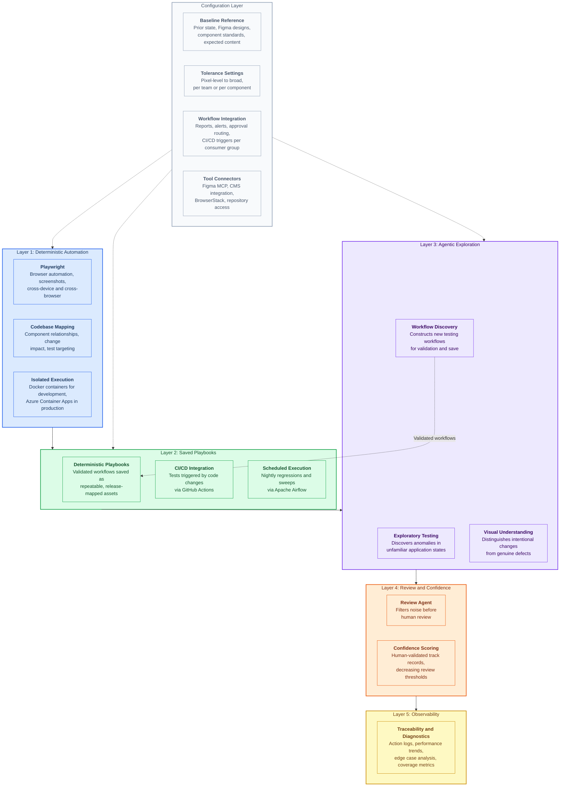

# Architecture Diagram Draft

**Purpose:** Mermaid diagram showing the five-layer platform architecture for embedding in the preliminary approach HTML.
**Palette:** Purple (deliverable documents)
**Direction:** Top-to-bottom (TB), layered architecture

---

## Mermaid Code

## Design Notes

- **Layer colors follow the mermaid design standards semantic palette:**
  - Layer 1 (Deterministic): Blue (Code/Source category, foundational)
  - Layer 2 (Playbooks): Green (Proposed/New, the assets being built)
  - Layer 3 (Agentic): Purple (AI/Intelligence)
  - Layer 4 (Review): Orange (External/Integration, the human-system boundary)
  - Layer 5 (Observability): Yellow (Observability/Monitoring)
  - Configuration: Gray (cross-cutting, applies to multiple layers)

- **The dashed arrow from Discover to Playbook** shows the key feedback loop: AI-discovered workflows becoming deterministic assets

- **The dashed arrows from Configuration** show that the config layer feeds into the lower three layers (how tests run, what playbooks target, what agents explore)

- **Reading direction is bottom-up** conceptually (foundation at bottom, observability at top) but the graph renders top-to-bottom per mermaid conventions. The layer numbering makes the intended order clear.

## Integration Plan

This diagram will be rendered inline in Section 02 of the HTML deliverable using the mermaid.js async rendering pattern with the purple palette theme initialization, per the mermaid design standards.
